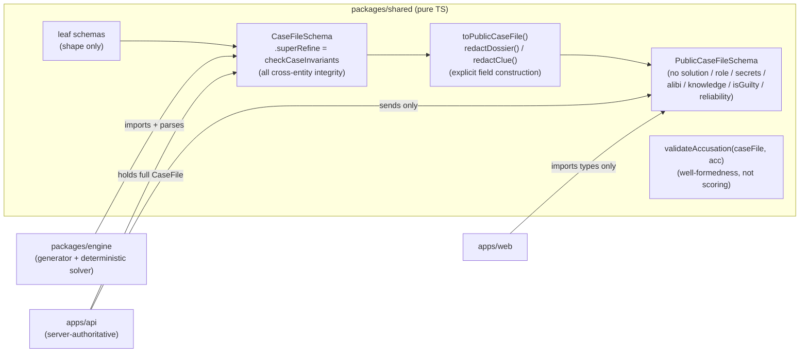

# Final Plan — `packages/shared`: pure-TS Zod schemas + refinements for the finite evidentiary core

**Issue #1 · PLAN ONLY (no code) · Pipeline: `engine` · Synthesized from refined-a + refined-b**

`packages/shared` is the **evidentiary contract** every other package imports (`apps/api`,
`apps/web`, `packages/engine`). Its value is not the field lists — it is the **refinements**
(cross-dossier consistency, exactly-one-culprit, referential integrity, knowledge coherence,
solvability preconditions) and the **client-safe projection** (server-authoritative redaction),
all under a 100% line+branch + mutation + adversary regime. Those are the deliverable.

---

## 0. Synthesis note (how this plan was assembled, and why)

This document is the judged merge of two refined designs. The spine is **refined Design A**
(top-down, catalog-envelope, stable error codes). Selected wins from **refined Design B** (bottom-up)
are grafted where they strictly improve correctness without compromising A's clean redaction story.
Every graft and every rejection is called out so the delta is auditable.

| Source | Adopted | Why |
|--------|---------|-----|
| **A (spine)** | Stable `CaseIssueCode` enum per refinement | Directly serves `code.md`/`test-author.md`: tests assert the *specific* code, not bare `success===false` — this is what kills code-swap mutants. Highest-value testing affordance in either design. |
| **A** | Separate `VictimId` / `SuspectId` brands | Already resolves critique-B's **F4** at compile time: `Accusation.accusedSuspectId: SuspectId` structurally cannot hold a `VictimId` → "victim can't be accused" is a *type* guarantee, not a runtime hope. |
| **A** | `victim` as a single declared object + `weapons[]`/`locations[]`/`timeline[]`/`suspects[]`/`clues[]` catalogs; integrity at `CaseFile.superRefine` | Cleanest "finite evidentiary core." `suspects[]` **are** the dossiers → no separate cast registry → the dossier↔suspect bijection critique-B's **F2** wanted is structural, not a refinement. |
| **A** | Free-string facts in `knownFacts`/`knows`/`doesNotKnow`/`secret.fact`/`alibi.truth`; `ifLeaked` as prose | Keeps the headline **redaction** clean (no shared fact catalog that could leak secret-fact *statements* to the client). Honors the issue's literal field shapes. |
| **A** | `PublicDossier`/`PublicClue`/`PublicCaseFile` via **explicit field construction** + denylist **and** allowlist scan; `role`+`reliability` redacted | A's refined design already fixed critique-A's CRITICAL C1/C2 leaks. This is the package's headline deliverable; keep it intact. |
| **B (graft)** | **Three-tier knowledge semantics** (Decision 8) | Resolves critique-B's **F3** ambiguity. Operates on A's string facts → pure win, zero redaction cost. Drives R8/R9 below. |
| **B (graft)** | **`validateAccusation(caseFile, acc)`** pure helper + `caseId` on `Accusation` (F9) | Well-formedness-of-an-accusation-against-a-case is deterministic, pure, and useful to engine/api. Explicitly **not** scoring (that stays in engine). |
| **B (graft)** | **Culprit-alibi-breakable** solvability precondition (B's R10) | Cheap (`breaksWhen` already exists), catches a degenerate unsolvable class structurally. Kept as *necessary-but-not-sufficient*; full solvability proof stays in engine. |
| **B (graft)** | **`PersonId = SuspectId ∪ VictimId`** union brand for `relationship.to` | Lets a suspect relate to the **victim** (motive!) while keeping victim/suspect distinct. Honest resolution of the F4 boundary without collapsing the brand split. |
| **B (graft)** | Step-0 **zod-v4 API probe** (F7); explicit-key-inclusion under EOPT (F8) | Both are real implementation hazards under the strict base tsconfig; surfaced as coder obligations. |
| **B — REJECTED** | Global `FactId` registry (`facts[]` catalog) | Credited but rejected: it would force every **secret-fact statement** into a shared catalog that `PublicCaseFile` must then filter, muddying the package's core redaction guarantee and expanding scope. Grounding-by-fact-identity at runtime is `engine`/`api`'s job; `shared` enforces the *structural* knowledge preconditions (R7–R9) on strings. |
| **B — REJECTED** | Structured `Consequence` object for `ifLeaked` + clue-reaches-culprit reachability (B's R11) | `ifLeaked` stays prose per the issue's literal `secrets[]{fact,leakTrigger,ifLeaked}`. R11 reachability is not decidable in `shared` without structuring `ifLeaked`; that boundary belongs to engine. Noted as a deliberate deferral. |

**Ownership note (README split-brain).** README lists a "Zod dossier schema" under *both* `engine`
and `shared`. **Issue #1 is authoritative: `shared` owns all schemas; `engine` imports them** and
adds the generator + deterministic solver. `engine` MUST NOT redeclare these shapes.

**Scope guard.** The issue names four entities (solution graph, dossier, clue, accusation). To make
referential-integrity refinements decidable, the `CaseFile` envelope additionally declares the
**finite catalogs** those entities reference — `victim`, `weapons[]`, `locations[]`, `timeline[]`,
`suspects[]` (dossiers), `clues[]`. Without declared catalogs, `killer`/`weapon`/`location`/`time`
are dangling strings nothing can validate. This is the "finite evidentiary core," not scope creep.

---

## 0a. Design decisions (resolving the six open items from `spec-gaps.md`)

These are the binding architectural choices for the package — the six questions `spec-gaps.md`
left to the architect, each resolved here with its rationale. Sections 1–10 implement them.

| # | Open question | **Decision** | Why |
|---|---------------|--------------|-----|
| 1 | **Reference strategy** | **Branded string IDs** (`z.string().min(1).brand<'SuspectId'>()`, etc.). Leaf schemas validate *shape only*; **referential integrity is enforced on the `CaseFile` envelope** via `.superRefine` (§4), never on a lone leaf. `VictimId`/`SuspectId` stay distinct brands; `PersonId = SuspectId ∪ VictimId` is used only for `relationship.to`. | Leaf schemas stay composable + independently parseable; integrity needs the whole closed world in scope. Brands stop cross-type id confusion at compile time, and the `Victim`/`Suspect` split makes "the victim can't be accused" a *type* guarantee (`Accusation.accusedSuspectId: SuspectId`). |
| 2 | **`time` representation** | A declared, **ordered `TimeSlot[]` timeline** on the `CaseFile`; every temporal field is a `TimeSlotId` resolving into it, with an integer `order` whose values are unique (R15). | A finite evidentiary core needs a closed, enumerable, totally-ordered slot set so alibi/clue-timeline checks are decidable integer comparisons — not date math or NLP. |
| 3 | **`relationships` shape** | Per-dossier **array of typed directed edges** `{ to: PersonId, kind: RelationshipKind, descriptor }`. Envelope refinement: `to` resolves to a suspect or the victim, and no self-edge (R10). Symmetry is **not** required. | Directed edges model asymmetric relationships (resentment, debt) honestly; a map keyed by id loses the kind taxonomy; free text is uncheckable. |
| 4 | **`leakTrigger` / `breaksWhen` typing** | A structured **`Trigger` discriminated union** (`clue-presented` carrying a cross-checked `ClueId`; `fact-confronted` carrying opaque prose `shared` does not cross-check; `contradiction-exposed`). **`ifLeaked` and `alibi.truth` stay prose** (issue-literal), **not** structured. | The machine-evaluable part (does clue X exist?) must be cross-checkable by the engine; the consequence/whereabouts text stays human prose. Structuring `ifLeaked` would pull clue→culprit reachability into `shared`, which belongs to engine. |
| 5 | **Cross-cutting refinements** | Enumerated explicitly in §4 (R1a–R16 + A1a–A1e), each carrying a stable `CaseIssueCode`, each a coverage obligation **and** a mutation-probe target. | Makes the contract auditable and the 100% test matrix mechanical: tests assert the *specific* code, which is what kills code-swap mutants. |
| 6 | **Server-authoritative boundary** | `shared` exports **both** the full schemas **and** a derived client-safe projection (`PublicDossier`/`PublicClue`/`PublicCaseFile`) plus pure `redactDossier`/`redactClue`/`toPublicCaseFile` built by **explicit field construction** (§5). `role` and `reliability` are redacted alongside `secrets`/`alibi`/`knowledge`/`isGuilty`/`solution`. | `apps/web` imports `shared`; giving it a typed public projection makes leakage a *type* error and gives one source of truth for "what is safe to send." Explicit construction (not Zod-strip) leaves real logic for Stryker to mutate. |

The §0 synthesis table above records which design each decision was drawn from and which
alternatives were rejected (e.g. the global `FactId` registry and structured `Consequence`).

---

## 1. Deliverable 1 — Mermaid diagrams

### 1.1 ER diagram of schema relationships

```mermaid
erDiagram
    CASE_FILE   ||--|| SOLUTION_GRAPH : "has solution"
    CASE_FILE   ||--|| VICTIM         : declares
    CASE_FILE   ||--o{ WEAPON         : "catalog"
    CASE_FILE   ||--o{ LOCATION       : "catalog"
    CASE_FILE   ||--|{ TIME_SLOT      : "ordered timeline"
    CASE_FILE   ||--|{ DOSSIER        : "suspects (= dossiers)"
    CASE_FILE   ||--o{ CLUE           : "evidence set"

    DOSSIER     ||--o{ SECRET         : guards
    DOSSIER     ||--|| ALIBI          : claims
    DOSSIER     ||--|| KNOWLEDGE      : "knows / doesNotKnow"
    DOSSIER     ||--o{ RELATIONSHIP   : "directed edges"

    SOLUTION_GRAPH }o--|| VICTIM      : "victimId (== victim.id)"
    SOLUTION_GRAPH }o--|| DOSSIER     : "killerId (the culprit)"
    SOLUTION_GRAPH }o--|| WEAPON      : weaponId
    SOLUTION_GRAPH }o--|| LOCATION    : locationId
    SOLUTION_GRAPH }o--|| TIME_SLOT   : timeSlotId

    SECRET        }o--|| TRIGGER      : leakTrigger
    ALIBI         }o--o| TRIGGER      : "breaksWhen (absent = unbreakable)"
    RELATIONSHIP  }o--|| PERSON       : "to (suspect OR victim, not self)"
    CLUE          }o--o| DOSSIER      : "refersTo.suspectId"
    CLUE          }o--o| WEAPON       : "refersTo.weaponId"
    CLUE          }o--o| LOCATION     : "refersTo.locationId"
    CLUE          }o--o| TIME_SLOT    : "refersTo.timeSlotId"

    ACCUSATION    }o--|| DOSSIER      : "accusedSuspectId"
    ACCUSATION    }o--o| WEAPON       : weaponId
    ACCUSATION    }o--o| LOCATION     : locationId
    ACCUSATION    }o--o| TIME_SLOT    : timeSlotId

    PUBLIC_CASE_FILE ||--|{ PUBLIC_DOSSIER : "redacted suspects"
    PUBLIC_CASE_FILE ||--o{ PUBLIC_CLUE    : "redacted clues"
    CASE_FILE ..|> PUBLIC_CASE_FILE : "toPublicCaseFile() — drops solution; redacts role/secrets/alibi/knowledge/isGuilty/reliability"
    DOSSIER   ..|> PUBLIC_DOSSIER  : "redactDossier() — omits secrets, alibi, knowledge, isGuilty, role"
    CLUE      ..|> PUBLIC_CLUE     : "redactClue() — omits reliability"
```

### 1.2 Data-flow (who validates, who redacts, who sees what)



---

## 2. Deliverable 2 — interface / type sketch

> Plan-only sketch — illustrative Zod shape, **not** the implementation. Exact Zod-4 API
> (`z.brand`, `z.discriminatedUnion`, `.superRefine` vs `.check`) is pinned by the coder in
> §9 Step 0 against the installed minor.

### 2.1 Branded IDs (`ids.ts`)

```ts
export const SuspectId  = z.string().min(1).brand<'SuspectId'>();
export const VictimId   = z.string().min(1).brand<'VictimId'>();
export const WeaponId   = z.string().min(1).brand<'WeaponId'>();
export const LocationId = z.string().min(1).brand<'LocationId'>();
export const TimeSlotId = z.string().min(1).brand<'TimeSlotId'>();
export const ClueId     = z.string().min(1).brand<'ClueId'>();

// PersonId = anyone in the cast (a suspect OR the victim) — for relationship targets.
// Keeps SuspectId/VictimId distinct (Accusation cannot accuse the victim) while letting
// a suspect relate to the victim (motive). [graft: resolves critique-B F4 honestly]
export const PersonId = z.union([SuspectId, VictimId]);

export type SuspectId = z.infer<typeof SuspectId>; // …one inferred type per brand
```

### 2.2 Enums (`enums.ts`)

```ts
export const Role = z.enum(['culprit', 'red-herring', 'witness']); // SERVER-ONLY truth
export const RelationshipKind = z.enum([
  'spouse','sibling','colleague','rival','friend','employer','creditor','stranger',
]);
export const ClueReliability = z.enum(['truthful', 'misleading']); // SERVER-ONLY — misleading ⇒ red herring
```

### 2.3 Trigger union (`trigger.ts`)

```ts
export const Trigger = z.discriminatedUnion('kind', [
  z.object({ kind: z.literal('clue-presented'),       clueId: ClueId }), // cross-checked R11/R12
  // `fact` is opaque prose — shared does NOT cross-check it (no fact catalog by design). [A N3]
  z.object({ kind: z.literal('fact-confronted'),      fact: z.string().min(1) }),
  z.object({ kind: z.literal('contradiction-exposed') }),
]);
```

### 2.4 Solution graph (`solution-graph.ts`)

```ts
export const SolutionGraph = z.object({
  victimId:   VictimId,
  killerId:   SuspectId,
  weaponId:   WeaponId,
  locationId: LocationId,
  timeSlotId: TimeSlotId,
});
```

### 2.5 Dossier + parts (`dossier.ts`)

**Three-tier knowledge model [graft: resolves critique-B F3].** For each suspect:
`knowledge.knows` = the character's **full closed world** (every fact they could assert, incl.
secret facts); `knownFacts ⊆ knows` = the **freely-offered** subset (volunteered without prompting);
`secrets[].fact ∈ knows \ knownFacts` = facts the character will not offer freely but *can* reveal
under a trigger. The runtime grounding boundary (engine/api) is `knowledge.knows`.

```ts
export const Secret = z.object({
  fact:        z.string().min(1), // ∈ knows, ∉ knownFacts (enforced at envelope, R9)
  leakTrigger: Trigger,           // SERVER-ONLY — when the suspect reveals it
  ifLeaked:    z.string().min(1), // in-character consequence prose (issue-literal; NOT structured)
});

export const Alibi = z.object({
  claim:      z.string().min(1), // public assertion (surfaces via api interrogation prose)
  truth:      z.string().min(1), // SERVER-ONLY — the real whereabouts
  // absent ⇒ unbreakable / true alibi (never `null` — exactOptionalPropertyTypes)
  breaksWhen: Trigger,
}).partial({ breaksWhen: true });

export const Relationship = z.object({
  to:         PersonId,            // a suspect OR the victim; resolved + no-self-edge at envelope (R10)
  kind:       RelationshipKind,
  descriptor: z.string().min(1),
});

export const Knowledge = z.object({ // SERVER-ONLY
  knows:       z.array(z.string().min(1)), // full closed world (grounding boundary)
  doesNotKnow: z.array(z.string().min(1)),
});

export const Dossier = z.object({
  id:            SuspectId,
  publicPersona: z.string().min(1),
  knownFacts:    z.array(z.string().min(1)), // freely-offered subset of knows (R8)
  secrets:       z.array(Secret),            // SERVER-ONLY
  alibi:         Alibi,                      // .truth SERVER-ONLY
  relationships: z.array(Relationship),
  knowledge:     Knowledge,                  // SERVER-ONLY
  isGuilty:      z.boolean(),                // SERVER-ONLY
  role:          Role,                       // SERVER-ONLY — culprit ⟺ isGuilty (R3)
});
```

### 2.6 Clue & accusation (`clue.ts`, `accusation.ts`)

```ts
// each ref field .optional(); the refersTo object itself .optional(); NO .partial() [critique-A N1]
export const Clue = z.object({
  id:          ClueId,
  statement:   z.string().min(1),
  reliability: ClueReliability,            // SERVER-ONLY — omitted in PublicClue
  refersTo: z.object({
    suspectId:  SuspectId.optional(),
    weaponId:   WeaponId.optional(),
    locationId: LocationId.optional(),
    timeSlotId: TimeSlotId.optional(),
  }).optional(),
});

export const Accusation = z.object({       // player's guess — shape only; correctness is engine's
  caseId:           z.string().min(1),     // binds the accusation to a case (validateAccusation, A1) [graft B F9]
  accusedSuspectId: SuspectId,             // brand makes accusing the VictimId a compile error [A]
  weaponId:   WeaponId.optional(),
  locationId: LocationId.optional(),
  timeSlotId: TimeSlotId.optional(),
});
```

### 2.7 Catalogs + envelope (`case-file.ts`)

```ts
export const Victim   = z.object({ id: VictimId,   name:  z.string().min(1) });
export const Weapon   = z.object({ id: WeaponId,   label: z.string().min(1) });
export const Location = z.object({ id: LocationId, label: z.string().min(1) });
export const TimeSlot = z.object({ id: TimeSlotId, label: z.string().min(1), order: z.number().int().nonnegative() });

export const CaseFile = z.object({
  id:        z.string().min(1),
  victim:    Victim,
  weapons:   z.array(Weapon).nonempty(),
  locations: z.array(Location).nonempty(),
  timeline:  z.array(TimeSlot).nonempty(),
  suspects:  z.array(Dossier).nonempty(),   // suspects ARE dossiers → bijection is structural [resolves B F2]
  clues:     z.array(Clue),
  solution:  SolutionGraph,
}).superRefine(checkCaseInvariants);        // §4 — all cross-entity refinements live here
```

### 2.8 Public projection + accusation validator (`redaction.ts`, `accusation.ts`)

```ts
// PublicDossier: no secrets, no alibi (incl. .claim), no knowledge, no isGuilty, no role
export const PublicDossier = z.object({
  id:            SuspectId,
  publicPersona: z.string().min(1),
  knownFacts:    z.array(z.string().min(1)),
  relationships: z.array(Relationship),
});

export const PublicClue = z.object({ // no reliability
  id:        ClueId,
  statement: z.string().min(1),
  refersTo: z.object({
    suspectId:  SuspectId.optional(),
    weaponId:   WeaponId.optional(),
    locationId: LocationId.optional(),
    timeSlotId: TimeSlotId.optional(),
  }).optional(),
});

export const PublicCaseFile = z.object({ // no solution
  id: z.string().min(1), victim: Victim,
  weapons: z.array(Weapon), locations: z.array(Location), timeline: z.array(TimeSlot),
  suspects: z.array(PublicDossier), clues: z.array(PublicClue),
});

// All three pure; built by EXPLICIT field construction (not Zod-strip / delete) so Stryker
// has real logic to mutate and "forgot a field" is a killable mutant. [critique-A M1, B F8]
export function redactDossier(d: Dossier): PublicDossier;
export function redactClue(c: Clue): PublicClue;
export function toPublicCaseFile(cf: CaseFile): PublicCaseFile;

// Well-formedness of an accusation AGAINST a case — NOT scoring/correctness. [graft B]
export interface AccusationValidity { ok: boolean; issues: CaseIssueCode[]; }
export function validateAccusation(cf: CaseFile, acc: Accusation): AccusationValidity;
```

---

## 3. Deliverable 3 — exact file list under `packages/shared`

> **Ownership (per `code.md` + `skills/code.md`):** the **coder** writes all `src/*.ts` production
> + `package.json`/`tsconfig*`/`eslint.config.js` scaffold + `coverage-handoff.md`, and writes
> **zero tests**. The **test_author** owns every `*.test.ts`/`*.test-d.ts`, the `tests/` tree, the
> **threshold-bearing configs** (`vitest.config.ts`, `stryker.conf.json`), and `mutation-ledger.md`.

```
packages/shared/
├── package.json                 # coder — name "@ai-whodunit/shared", type:module, deps zod; scripts build/typecheck/lint/test/test:mutation
├── tsconfig.json                # coder — extends ../../tsconfig.base.json; rootDir src, outDir dist
├── tsconfig.build.json          # coder — build-only (excludes *.test.ts / tests)
├── eslint.config.js             # coder — flat config (typescript-eslint), clean at --max-warnings 0
├── vitest.config.ts             # TEST_AUTHOR — coverage v8, thresholds line=100 branch=100 func=100 stmt=100
├── stryker.conf.json            # TEST_AUTHOR — vitest runner; thresholds.break: 100
├── README.md                    # coder — what shared owns; the projection contract; CI-vs-architect mutation note
└── src/
    ├── index.ts                 # coder — barrel: schemas, types, redaction fns, validateAccusation, CaseIssueCode
    ├── ids.ts                   # coder — branded id schemas (incl. PersonId union) + inferred types
    ├── enums.ts                 # coder — Role, RelationshipKind, ClueReliability
    ├── trigger.ts               # coder — Trigger discriminated union
    ├── solution-graph.ts        # coder — SolutionGraph
    ├── dossier.ts               # coder — Dossier, Secret, Alibi, Relationship, Knowledge
    ├── clue.ts                  # coder — Clue
    ├── accusation.ts            # coder — Accusation + validateAccusation(caseFile, acc)
    ├── case-file.ts             # coder — Victim/Weapon/Location/TimeSlot catalogs + CaseFile envelope
    ├── refinements.ts           # coder — checkCaseInvariants() + per-invariant helpers (§4)
    ├── errors.ts                # coder — CaseIssueCode enum (one stable code per refinement)
    └── redaction.ts             # coder — PublicDossier, PublicClue, PublicCaseFile, redactDossier, redactClue, toPublicCaseFile
```

**Test_author-owned test tree:**

```
packages/shared/
├── src/*.test.ts                # one per src module with logic (ids, trigger, solution-graph, dossier,
│                                #   clue, accusation, case-file, refinements, redaction)
├── src/brands.test-d.ts         # type-level: WeaponId-where-LocationId, VictimId-where-SuspectId = compile errors
└── tests/
    ├── fixtures/validCase.ts    # makeValidCase(overrides) builder — one known-valid CaseFile;
    │                            #   contains ≥1 Trigger of every kind (clue-presented/fact-confronted/
    │                            #   contradiction-exposed) so every positive Trigger branch is reachable [B F6]
    ├── fixtures/mutate.ts       # mutate(valid, k) — produces each refinement's one-field-invalid case
    └── helpers.ts               # recursive key-scan, allowlist-keyset assertions
```

`index.ts` and `enums.ts` are pure re-exports/enums — covered transitively; no dedicated branch logic.
Session-dir artifacts: `coverage-handoff.md` (coder), `mutation-ledger.md` (test_author).

---

## 4. Deliverable 4a — refinement catalogue (the heart of the package)

All live in `refinements.ts:checkCaseInvariants`, attached via `CaseFile.superRefine`. Each emits a
Zod issue carrying a stable `CaseIssueCode` (in `errors.ts`). Each row is a **coverage obligation**
(pass-arm silent + fail-arm fires) **and** a **mutation-probe target**.

**Branch-structuring rule (`code.md`: "an unreachable line means the design is wrong").** Every
helper is written *collect violations → if (any) ctx.addIssue* so both arms are reachable. Compound
checks (R5, R6, R10, R13) are **data-driven loops** so the all-present/pass arm and each
one-missing/fail arm are independently reachable. No defensive guards over values Zod already narrowed.

| # | `CaseIssueCode` | Invariant | Fail-arm fixture(s) — one mutation from valid |
|---|-----------------|-----------|-----------------------------------------------|
| R1a | `DUP_SUSPECT_ID` | `suspects[].id` unique | duplicate a suspect id |
| R1b | `DUP_WEAPON_ID` | `weapons[].id` unique | duplicate a weapon id |
| R1c | `DUP_LOCATION_ID` | `locations[].id` unique | duplicate a location id |
| R1d | `DUP_TIMESLOT_ID` | `timeline[].id` unique | duplicate a timeslot id |
| R1e | `DUP_CLUE_ID` | `clues[].id` unique | duplicate a clue id |
| R2 | `EXACTLY_ONE_CULPRIT` | exactly one suspect with `role==='culprit'` | (a) zero culprits; (b) two culprits |
| R3 | `GUILT_ROLE_COHERENT` | `isGuilty===true` ⟺ `role==='culprit'`, every suspect | (a) guilty witness; (b) non-guilty culprit |
| R4 | `VICTIM_NOT_SUSPECT` | `victim.id` is not also a `suspects[].id` | victim id collides with a suspect id |
| R5a | `KILLER_RESOLVES` | `solution.killerId` is a known suspect id | killerId not in `suspects[]` |
| R5b | `KILLER_IS_CULPRIT` | that suspect has `role==='culprit'` | killerId resolves to a red-herring |
| R6a | `SOLUTION_VICTIM_MATCHES` | `solution.victimId === victim.id` (equality, not `.some`) [A N4] | victimId differs from `victim.id` |
| R6b | `SOLUTION_WEAPON_RESOLVES` | `solution.weaponId ∈ weapons[].id` | weaponId not in `weapons[]` |
| R6c | `SOLUTION_LOCATION_RESOLVES` | `solution.locationId ∈ locations[].id` | locationId not in `locations[]` |
| R6d | `SOLUTION_TIMESLOT_RESOLVES` | `solution.timeSlotId ∈ timeline[].id` | timeSlotId not in `timeline[]` |
| R7 | `KNOWLEDGE_DISJOINT` | per dossier, `knows ∩ doesNotKnow === ∅` | same fact in both lists |
| R8 | `KNOWN_FACTS_SUBSET` | per dossier, `knownFacts ⊆ knows` [three-tier] | a `knownFacts` entry not in `knows` |
| R9 | `SECRET_FACT_COHERENT` | per secret, `fact ∈ knows ∧ fact ∉ knownFacts` [three-tier] | (a) secret fact not in `knows`; (b) secret fact also in `knownFacts` |
| R10a | `RELATIONSHIP_TARGET_RESOLVES` | every `relationships[].to` ∈ `suspects[].id ∪ {victim.id}` | edge to unknown person id |
| R10b | `RELATIONSHIP_NO_SELF_EDGE` | `to !== owning suspect's id` | self-edge |
| R11 | `SECRET_TRIGGER_RESOLVES` | every `clue-presented` `leakTrigger.clueId ∈ clues[]` | trigger → unknown clueId |
| R12 | `ALIBI_TRIGGER_RESOLVES` | `alibi.breaksWhen` (when present, `clue-presented`) `clueId ∈ clues[]` | breaksWhen → unknown clueId |
| R13a | `CLUE_REFS_SUSPECT_RESOLVES` | `clue.refersTo.suspectId` (present) ∈ `suspects[].id` | refers to unknown suspectId |
| R13b | `CLUE_REFS_WEAPON_RESOLVES` | `clue.refersTo.weaponId` (present) ∈ `weapons[].id` | refers to unknown weaponId |
| R13c | `CLUE_REFS_LOCATION_RESOLVES` | `clue.refersTo.locationId` (present) ∈ `locations[].id` | refers to unknown locationId |
| R13d | `CLUE_REFS_TIMESLOT_RESOLVES` | `clue.refersTo.timeSlotId` (present) ∈ `timeline[].id` | refers to unknown timeSlotId |
| R14 | `WITNESS_OR_HERRING_PRESENT` | ≥1 non-culprit suspect (a one-suspect case is unsolvable) | single-suspect case |
| R15 | `TIMESLOT_ORDER_UNIQUE` | `timeline[].order` values all distinct (so engine can sort) [critique-A M4] | two timeslots share an `order` |
| R16 | `CULPRIT_ALIBI_BREAKABLE` | the culprit's `alibi.breaksWhen` is **present** (the lie must be breakable) [graft B R10] | culprit alibi has no `breaksWhen` |

**`validateAccusation` (pure fn in `accusation.ts`, not a `superRefine`).** Returns
`{ ok, issues: CaseIssueCode[] }` — **well-formedness against a case, never correctness/scoring**:

| # | `CaseIssueCode` | Check |
|---|-----------------|-------|
| A1a | `ACCUSATION_CASE_MISMATCH` | `acc.caseId === cf.id` [graft B F9] |
| A1b | `ACCUSED_NOT_SUSPECT` | `acc.accusedSuspectId ∈ cf.suspects[].id` |
| A1c | `ACCUSED_WEAPON_RESOLVES` | `acc.weaponId` (present) ∈ `cf.weapons[].id` |
| A1d | `ACCUSED_LOCATION_RESOLVES` | `acc.locationId` (present) ∈ `cf.locations[].id` |
| A1e | `ACCUSED_TIMESLOT_RESOLVES` | `acc.timeSlotId` (present) ∈ `cf.timeline[].id` |

> **`Accusation` scope (state explicitly so the test-author doesn't invent it).** Whether an
> accusation is *correct* is the **engine's** scoring job. `shared` only guarantees the accusation is
> well-formed and resolves against the case. No "correct accusation" refinement belongs here.

> **Deferred to engine (deliberate non-goals):** the full deterministic **solvability proof**,
> **accusation scoring**, runtime **grounding enforcement** over LLM utterances, and any
> clue→culprit *reachability* refinement (not decidable in `shared` without structuring `ifLeaked`,
> which we keep as prose per the issue). R14/R16 are *necessary-but-not-sufficient* structural gates.

---

## 5. Deliverable 4b — server-authoritative projection (redaction) design + test contract

### 5.1 Redaction implementation (pinned: explicit field construction)

`redactDossier`/`redactClue`/`toPublicCaseFile` are **pure** and built by **explicitly picking safe
fields** — not Zod `.parse()` strip, not `delete`. This keeps mutable logic for Stryker to attack and
makes "forgot a field" a killable mutant. Under `exactOptionalPropertyTypes`, optional keys are
included by **conditional spread** (`...(c.refersTo !== undefined ? { refersTo: c.refersTo } : {})`),
never `{ refersTo: undefined }`. [critique-A M1, critique-B F8]

```ts
function redactDossier(d) { return { id: d.id, publicPersona: d.publicPersona,
  knownFacts: d.knownFacts, relationships: d.relationships }; } // OMITS secrets, alibi, knowledge, isGuilty, role
function redactClue(c)    { return { id: c.id, statement: c.statement,
  ...(c.refersTo !== undefined ? { refersTo: c.refersTo } : {}) }; }            // OMITS reliability
function toPublicCaseFile(cf) { return { id: cf.id, victim: cf.victim, weapons: cf.weapons,
  locations: cf.locations, timeline: cf.timeline,
  suspects: cf.suspects.map(redactDossier), clues: cf.clues.map(redactClue) }; } // OMITS solution
```

### 5.2 Guarantees the test-author must pin (`redaction.test.ts`)

1. **Denylist key-scan** — JSON-serialize `toPublicCaseFile(fullCase)`; recursively assert **none**
   of these keys appear at any depth: `secrets`, `knowledge`, `isGuilty`, `truth`, `solution`,
   `killerId`, `doesNotKnow`, `role`, `reliability`, `breaksWhen`, `leakTrigger`, `ifLeaked`, `alibi`.
   (`role` + `reliability` are the C1/C2 leaks critique-A caught — they MUST be here and MUST be
   probed.) This is a **structural key** check, not a value check.
2. **Allowlist key-set** — assert the *exact* top-level key-set of `PublicCaseFile` is
   `{id, victim, weapons, locations, timeline, suspects, clues}`; each `PublicDossier` is exactly
   `{id, publicPersona, knownFacts, relationships}`; each `PublicClue` is `{id, statement}` or
   `{id, statement, refersTo}`. A newly-added sensitive field is caught **unless deliberately
   allowlisted** — this is the primary (suspenders) guard; the denylist is the belt.
3. **Totality** — N suspects in → N public suspects out; M clues in → M public clues out; no throw,
   no `undefined` leak.
4. **String-content scan (scoped)** — a known `Secret.fact` / `alibi.truth` string from the input
   must **not** appear anywhere in the serialized `PublicCaseFile`. (Safe here precisely because we
   rejected the global fact registry: `knownFacts` strings are public; secret/truth strings are not
   shared with any public-facing catalog, so a value match is a genuine leak — this avoids
   critique-B's **F1** false-positive entirely.)

> **Enforcement boundary.** The real wire payload-scan (SSE/tRPC) lives in `apps/api` contract tests
> per `code.md`. `shared` provides the projection types, the redaction functions, and the structural
> guarantees above. The test-author must **not** attempt a network payload-scan in this pure-TS package.

---

## 6. 100%-coverage test strategy (honoring `code.md` + `test-author.md`)

### 6.1 Mechanism #1 — coder ≠ test-author split

The **`code` step** writes all `src/*.ts` + scaffold configs and produces
`{{SESSION_DIR}}/coverage-handoff.md`: one row per function / branch / exit path. The coder writes
**NO tests** and records anything plan-mentioned-as-test as an obligation. Example rows:

```
| kind | target | obligation |
|------|--------|------------|
| code | refinements.ts:checkCaseInvariants | R1a..R16: each fires its CaseIssueCode on its mutated fixture; silent on valid |
| code | refinements.ts:<each helper>       | pass-arm (no issue) + fail-arm (exact CaseIssueCode) |
| code | accusation.ts:validateAccusation   | A1a..A1e: each issue fires; ok=true on a well-formed accusation |
| code | redaction.ts:redactDossier         | omits role/secrets/alibi/knowledge/isGuilty; total over suspects |
| code | redaction.ts:redactClue            | omits reliability; preserves id/statement/refersTo |
| code | redaction.ts:toPublicCaseFile      | drops solution; maps redactDossier/redactClue; denylist+allowlist clean |
| code | trigger.ts:Trigger                 | all 3 variants parse; wrong discriminant rejected |
| code | dossier.ts / clue.ts               | required-field rejection; min(1)/nonempty boundaries |
| code | ids.ts                             | empty string rejected; brand assignability (type-level) |
```

### 6.2 What the test_author writes (deterministic → 100% line+branch)

- **Refinement tests (R1a–R16):** `tests/fixtures/validCase.ts` builder + `mutate(valid, k)`. For
  each row: valid `.parse` succeeds; mutated `.safeParse` fails **with the specific `CaseIssueCode`**
  (never bare `success===false` — that survives a code-swap mutant). Assert on structural
  `issues[].path` / stable `code`, **never** on message prose [adversary target]. Compound rows
  (R5a/b, R6a–d, R9a/b, R10a/b, R13a–d) each get their own `mutate` call; R2/R3 get two fixtures each.
- **`validateAccusation` tests (A1a–A1e):** a well-formed accusation → `ok:true, issues:[]`; one
  mutation per row → `ok:false` with the specific code in `issues`.
- **Leaf-schema tests:** required-field omission rejected; `min(1)`/`nonempty()` boundaries (empty
  string, empty array) hit both arms; `Trigger` exercises all 3 variants + a bad discriminant;
  branded ids reject `''`. The valid fixture contains ≥1 Trigger of every kind so positive Trigger
  branches are reachable [critique-B F6].
- **Redaction tests:** all four §5.2 guarantees (denylist scan, allowlist key-set, totality,
  scoped string-content scan).
- **Type-level checks (`brands.test-d.ts`):** `WeaponId`-where-`LocationId` and
  `VictimId`-where-`SuspectId` are *compile* errors — `// @ts-expect-error` + `expectTypeOf`. These
  don't count toward runtime coverage but guard the brand design (incl. the F4 victim/suspect split).

### 6.3 Mechanism #2 — mutation-probe every test (`mutation-ledger.md`)

For each guarded behavior the test-author records a real RED→GREEN probe — corrupt the guarded line
(flip `===1`→`>=1`; delete an explicit field pick; re-add `role` to the return object), run just that
test → confirm **RED (exit≠0)**; restore → **GREEN**. A probe that stays GREEN = vacuous test →
tighten (usually: assert the exact `CaseIssueCode` / exact omitted key). One line per R1a–R16, each
A1 row, each Trigger variant, and each redaction guarantee, e.g.:

```
PROBE refinements.test.ts > R2 EXACTLY_ONE_CULPRIT fires on 2-culprit case:        RED exit=1 / GREEN exit=0
PROBE refinements.test.ts > R5b KILLER_IS_CULPRIT rejects killer=red-herring:      RED exit=1 / GREEN exit=0
PROBE refinements.test.ts > R16 CULPRIT_ALIBI_BREAKABLE fires on unbreakable culprit: RED exit=1 / GREEN exit=0
PROBE redaction.test.ts   > denylist scan catches leaked `role`:                    RED exit=1 / GREEN exit=0
PROBE redaction.test.ts   > denylist scan catches leaked `reliability`:             RED exit=1 / GREEN exit=0
PROBE redaction.test.ts   > allowlist catches extra key in PublicDossier:           RED exit=1 / GREEN exit=0
PROBE accusation.test.ts  > A1a ACCUSATION_CASE_MISMATCH fires on wrong caseId:     RED exit=1 / GREEN exit=0
```

Then the suite-wide **Stryker** gate (`pnpm test:mutation`) must meet `thresholds.break: 100` — pure
schema logic has no excusable survivors. Expected mutants: boolean flips (`===`/`!==`, `&&`/`||`),
array-method swaps (`.some`/`.every`), the count check (`===1`/`>=1`), removed `addIssue` calls, and
`CaseIssueCode` string-literal mutations. Each must be killed by a targeted assertion. **Never lower
the threshold, never add a Stryker exclusion or `/* c8 ignore */`/`.skip` to pass** (CRITICAL per
`code.md` + adversary skill).

### 6.4 No LLM evals here (explicit non-obligation)

`shared` has **no LLM call site, no prompt, no DB, no network**. Therefore **no recorded-fixture
replay, no FAIL→PASS evals, no wire payload-scan** belong in this package — the test-author must not
hallucinate them (doing so = a vacuous, non-load-bearing test the adversary flags). The only analogue
that *does* belong is the structural redaction key-scan (§5.2).

### 6.5 Mechanism #3 — standing adversary

After review, the adversary argues against the suite, specifically checking: (a) each refinement test
asserts the **specific code**, not bare failure; (b) the denylist scan actually catches a leaked
field — `role` and `reliability` included and probed; (c) the allowlist scan is also probed; (d) no
`.skip`/coverage-ignore/lowered threshold; (e) no "correct accusation" or LLM eval smuggled in; (f)
each fail fixture is *one* mutation from valid (a double-invalid fixture can pass R-x's test while R-x
is broken). BLOCK on any CRITICAL.

---

## 7. Public API surface (`index.ts` exports)

- **Schemas:** `CaseFile`, `SolutionGraph`, `Dossier`, `Secret`, `Alibi`, `Relationship`,
  `Knowledge`, `Clue`, `Accusation`, `Trigger`, `Victim`, `Weapon`, `Location`, `TimeSlot`,
  `PublicCaseFile`, `PublicDossier`, `PublicClue`, and all branded id schemas (incl. `PersonId`).
- **Inferred types:** a `z.infer` companion type for each, plus the brand types.
- **Functions:** `redactDossier`, `redactClue`, `toPublicCaseFile`, `validateAccusation`.
- **Error codes:** `CaseIssueCode` (consumers switch on failure kind).
- No runtime side effects; tree-shakeable; ESM-only (`type: module`, `verbatimModuleSyntax`).

---

## 8. Toolchain & dependencies (this is the first package)

No `packages/` exist yet; this PR stands up the deterministic-package toolchain the `engine` pipeline
depends on.

- **`packages/shared/package.json`** — `dependencies: zod` (v4); `devDependencies: vitest`,
  `@vitest/coverage-v8`, `@stryker-mutator/core`, `@stryker-mutator/vitest-runner`, `eslint`,
  `@eslint/js`, `typescript-eslint`, `typescript`. **scripts:** `build` (`tsc -p tsconfig.build.json`),
  `typecheck` (`tsc --noEmit`), `lint` (`eslint . --max-warnings 0`), `test` (`vitest run --coverage`),
  `test:mutation` (`stryker run`).
- **`vitest.config.ts`** — `coverage.provider='v8'`, `thresholds {lines:100, branches:100,
  functions:100, statements:100}`, `coverage.include=['src/**']` (do **not** exclude `index.ts`/
  `enums.ts` to dodge — they're hit transitively). **`stryker.conf.json`** — vitest runner, mutate
  `src/**`, ignore `*.test.ts`/`tests/`, `thresholds.break: 100`.
- **CI note [critique-A N5 / critique-B F8].** `.github/workflows/ci.yml` runs `format:check`,
  `lint`, `typecheck`, `test` — it does **not** invoke `test:mutation`. The Stryker break gate runs
  only in the architect pipeline (Stryker is slow/expensive for every push). Document this in the README
  and `stryker.conf.json` so contributors know mutation coverage is enforced at architect/PR-review level.
  Adding the `lint` script here is what first makes `pnpm lint` (= `turbo run lint`) real — ensure the
  flat eslint config is warning-clean from the start.

---

## 9. Build-order (sequence for the coder)

0. **Resolve the zod-v4 refinement API [critique-B F7].** `pnpm add zod@^4`; verify `.superRefine`
   vs `.check()` + the `ctx.addIssue({ code:'custom', path, message })` shape against the installed
   minor (under strict `lint --max-warnings 0`, a deprecated `.superRefine` may warn). Record the
   resolved form in a comment above the first refinement so the test_author sees it.
1. `errors.ts` (`CaseIssueCode`) → `ids.ts` (incl. `PersonId`) → `enums.ts` (no logic deps).
2. `trigger.ts`.
3. `dossier.ts` (Secret, Alibi, Relationship, Knowledge, Dossier), `solution-graph.ts`, `clue.ts`,
   `accusation.ts` (shape only first).
4. `refinements.ts` helpers → `case-file.ts` (`checkCaseInvariants`, R1a–R16).
5. `accusation.ts` — add `validateAccusation` (A1a–A1e).
6. `redaction.ts` (explicit field construction), then `index.ts` barrel.
7. `tests/fixtures/validCase.ts` is **coder-authored as a production helper** only if reused by
   `src` — otherwise it is test_author-owned. (Decision: keep the valid-case builder under
   `tests/fixtures/` owned by **test_author**, so the coder ships zero test-coupled code.)
8. Write `coverage-handoff.md`. Run `pnpm format && lint && typecheck`. Hand off to test_author.

Pipeline after handoff: `test_author` (all tests + ledger) → `format → lint → typecheck → test (100%)
→ mutation (break 100) → code_review → adversary → report → create_pr`.

---

## 10. Risks, non-goals, sequencing

- **Non-goals (engine, not shared):** accusation *scoring/solving*, case *generation*, runtime
  grounding enforcement over LLM utterances, the full deterministic solvability proof, prompt
  templates. R14/R16 are *necessary-but-not-sufficient* structural gates only.
- **Risk — Zod-4 refinement API drift.** `.superRefine` vs `.check`/`z.core` differs by minor.
  Mitigation: Step 0 pins the version; all refinements isolated in `refinements.ts`.
- **Risk — branch unreachability.** If a refinement helper has a branch no fixture can hit, the 100%
  gate fails *by design* — fix the design (remove the dead branch), never an ignore comment. The
  all-kinds Trigger fixture (§6.2) keeps positive Trigger branches reachable.
- **Risk — projection drift.** A future sensitive field added to `Dossier`/`Clue` but not to the
  redaction denylist could leak. Mitigation: the **allowlist key-set** assertion (§5.2 item 2) is the
  primary guard — any field not on the explicit allowlist fails the test unless deliberately added.
- **Risk — `PersonId` union ergonomics.** `z.union([SuspectId, VictimId])` must still reject `''` and
  must let `relationships[].to` resolve against `suspects[].id ∪ {victim.id}` in R10a. Verified by the
  R10a pass/fail fixtures and a `brands.test-d.ts` assertion that a `WeaponId` is not assignable to
  `PersonId`.
```
