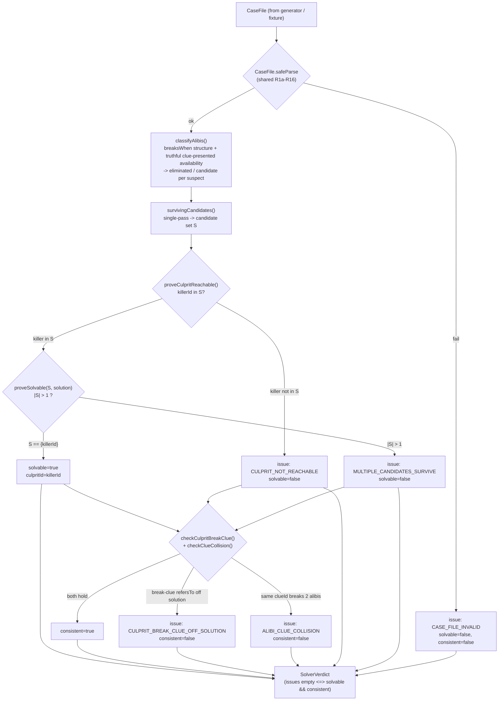

# plan.md — packages/engine deterministic solver (Issue #2, M1)

> Assembled by /archwd plan mode. Source: GitHub issue anisha-agarwal/ai-whodunit#2 (label `plan`).
> This is the canonical, approval-ready implementation plan. It unblocks #19 (execution).

## What the user asked for (classifier intake)

**Summary:** Produce a detailed implementation plan (no code) for the deterministic solver in `packages/engine` — solvability proof, cross-dossier consistency, structured verdict, and full test strategy with Mermaid diagrams.

**Signals:**
- GitHub label: `plan`
- Issue title contains `[Plan]` prefix explicitly
- Issue body states "THIS ISSUE IS PLAN ONLY (no code)" verbatim
- Issue body instructs "Produce via `/archwd --mode=plan`"
- Issue describes planning deliverable: Mermaid diagram, interface sketch, file list, test strategy

**Complexity:** XL · **Issue:** anisha-agarwal/ai-whodunit#2 · **Unblocks:** #19 (execution)

---

# feature-plan — packages/engine deterministic solver (Issue #2, M1) — REVISION 3

Prepended context: `/Users/anisha/Documents/architect-whodunit//src/whodunit-context.md`

PLAN ONLY. No code. This document is the build plan the coder/test-author split will implement
under `/archwd --phase=N` once approved + committed. It unblocks #19 (execution).

> **Revision note (round 3).** Round 2 independently CONFIRMED all four round-1 findings closed (the
> `breaksWhen`-grounded deductive model lands the canonical `validCase` on exactly `{suspect-rourke}`;
> consistency re-scoped onto the structured `breaksWhen.clueId → clue.refersTo` chain; fixtures built
> locally; real branch cited). Those are PRESERVED unchanged. Round 3 fixes the four round-2 findings,
> all re-verified against the REAL source on `feat/shared-schemas-issue-18` (commit `11bb8fc`):
>
> - **CRITICAL-1 (terminal reachability).** R16 (`refinements.ts:274-276`) makes the culprit's
>   `alibi.breaksWhen` ALWAYS present on a parse-valid `CaseFile`. Combined with reachability-first
>   ordering, that made `NO_CANDIDATE_SURVIVES` and `SURVIVOR_NOT_CULPRIT` structurally unreachable —
>   two dead enum codes + two dead `if` branches that collide with the package's 100%-coverage +
>   Stryker `break:100` bar. **Resolved by Option A** (justified in §0d): both codes are DROPPED; the
>   solvability terminal set is now `{CULPRIT_NOT_REACHABLE, MULTIPLE_CANDIDATES_SURVIVE}`, each with
>   exactly one reachable parse-valid fixture. The enum, test rows, fixtures, and Mermaid terminals are
>   reconciled as a set, and §0c now walks EVERY terminal (solvable + every unsolvable/contradictory
>   arm + the parse-invalid arm), proving reachability rather than asserting it.
> - **MAJOR-1 (provenance).** No `dist/` exists on the worktree or the shared branch — the contract
>   lives only in `packages/shared/src/*.ts`. Every citation in §0 (and throughout) is rewritten to point
>   at `src/*.ts` on `feat/shared-schemas-issue-18` with line numbers verified this revision by
>   `git show feat/shared-schemas-issue-18:packages/shared/src/<f>.ts`.
> - **MINOR-1 (`stryker.conf.json` → `stryker.config.json`).** Fixed at the pattern-anchor + scaffold
>   lines (real filename confirmed via `git ls-tree`).
> - **MINOR-2 (residual "#1").** Normalized to "#18" / "the shared contract" throughout.
>
> **No #18 contract change is required** — every signal the solver needs already exists in
> `packages/shared/src/*.ts`.

---

## 0. Grounding read (re-verified against the real `src/` on `feat/shared-schemas-issue-18`, this revision)

All shapes below were read directly from `packages/shared/src/*.ts` on branch
**`feat/shared-schemas-issue-18`** (`git rev-parse --verify` → `11bb8fc`, confirmed this revision) via
`git show feat/shared-schemas-issue-18:packages/shared/src/<file>.ts`. **There is NO `dist/`** on the
worktree or the shared branch (`git ls-tree -r feat/shared-schemas-issue-18 | grep dist/` → 0 files);
the compiled artifact is produced only by `pnpm build` and is not committed. The MAJOR-1 fabricated
`dist/*.d.ts` citations are replaced with verified `src/*.ts:NN` anchors.

- **Issue #2 body** — pure-code solver: prove a case's evidence narrows to exactly ONE culprit, prove
  dossiers are cross-consistent (no contradicting alibis/timeline), return a structured verdict;
  acceptance = 100% line+branch coverage with real fixtures incl. unsolvable + contradictory cases.
- **`~/Documents/ai-whodunit/README.md`** — engine is pure TS (no React/DB/Next/fetch); the solver is
  deterministic code, not an LLM; provably-solvable case before any prose (the grounding underwriter).
- **`references/code-quality.md`** — architecture invariants + 100%-coverage + mutation + adversary bar.
- **The `@ai-whodunit/shared` contract** (`packages/shared/src/*.ts` on `feat/shared-schemas-issue-18`) —
  the exact shapes the solver consumes (re-read this revision; provenance + line numbers corrected):
  - `Clue` (`src/clue.ts:14-28`): `{ id: ClueId; statement: string; reliability: 'truthful'|'misleading';
    refersTo?: { suspectId?: SuspectId; weaponId?: WeaponId; locationId?: LocationId; timeSlotId?: TimeSlotId } }`
    (`refersTo` block at `src/clue.ts:19-26`; each ref field individually `.optional()`). **There is NO
    field on a clue encoding implicate-vs-exonerate direction** — that lives only in the prose `statement`.
    The solver therefore does NOT use clues as suspect-eliminators.
  - `Alibi` (`src/dossier.ts:25-32`): `{ claim: string; truth: string; breaksWhen?: Trigger }` — the schema
    is `.partial({ breaksWhen: true })` (`src/dossier.ts:31`), so `breaksWhen` is optional and **never
    null** (`exactOptionalPropertyTypes`). `claim`/`truth` are **free prose** (`z.string().min(1)`,
    undecidable). `breaksWhen` is **structured** — THIS is the decidable narrowing signal.
    `breaksWhen === undefined` ⟹ unbreakable/genuine alibi.
  - `Trigger` (`src/trigger.ts:12-25`): a `z.discriminatedUnion('kind', …)` of
    `{kind:'clue-presented'; clueId: ClueId}` (`:13-16`) | `{kind:'fact-confronted'; fact: string}`
    (`:17-20`) | `{kind:'contradiction-exposed'}` (`:21-23`). Only `clue-presented` carries a
    machine-resolvable `clueId`; the other two are opaque prose-keyed (shared does NOT cross-check them).
  - `Dossier` (`src/dossier.ts:67-79`): `{ id: SuspectId; …; alibi: Alibi (:73); isGuilty: boolean (:76);
    role: 'culprit'|'red-herring'|'witness' (:77); … }` (other fields server-only, not consumed by the
    solver). `Role` enum: `src/enums.ts:4`.
  - `SolutionGraph` (`src/solution-graph.ts:6-13`): `{ victimId; killerId: SuspectId (:8); weaponId (:9);
    locationId (:10); timeSlotId (:11) }`.
  - `CaseFile` (`src/case-file.ts:46-59`): envelope `{ id; victim; weapons; locations; timeline;
    suspects: Dossier[]; clues: Clue[]; solution: SolutionGraph (:56) }`, `.superRefine(checkCaseInvariants)`
    (`:58`). `TimeSlot` (`src/case-file.ts:34-39`): `{ id; label; order: number }` — `order` unique (R15).
  - `CaseIssueCode` (`src/errors.ts:5-66`) — shared's own stable-string-enum (the pattern `SolverIssueCode`
    copies). R16's code `CULPRIT_ALIBI_BREAKABLE` at `src/errors.ts:58`.
  - Branded ids (`src/ids.ts`): `SuspectId` (`:7-8`), `WeaponId` (`:13-14`), `LocationId` (`:16-17`),
    `TimeSlotId` (`:19-20`), `ClueId` (`:22-23`) — all re-exported from the barrel
    (`src/index.ts:16`). `ClueId` IS available to type the verdict's clue references.
  - Barrel (`src/index.ts`): exports `CaseFile` (`:39`), the branded ids (`:16`), `Trigger` (`:22`),
    `SolutionGraph` (`:25`), `Dossier`/`Alibi`/`Clue`, `CaseIssueCode` (`:13`), `validateAccusation` +
    `AccusationValidity` (`:34,36`). (Note: shared's `tests/fixtures/` is NOT exported — see §Test plan.)

### 0a. Sequencing dependency (real branch + issue number)

`packages/shared`'s **source is not yet on `main`** — the implemented shared work lives on branch
**`feat/shared-schemas-issue-18`** (issue **#18** in-tree; `git rev-parse --verify` → `11bb8fc`, confirmed
this revision). The schema *contract* is frozen and fully specified (read directly from `src/*.ts`), so
this plan is groundable today. But **execution of #19 must not start until #18 (packages/shared) is merged
to `main`** — the engine imports `@ai-whodunit/shared` as a workspace dependency, and that import resolves
only after the source lands on `main`. Recorded as a hard ordering edge in §Phase decomposition (RESOLVED,
not a missing-spec block).

### 0b. The solver's deductive scope — grounded in fields that ACTUALLY EXIST

`shared`'s `checkCaseInvariants` (R1a–R16; `src/refinements.ts:79`, read this revision) already proves the
**structural** preconditions: ids resolve, exactly one `role==='culprit'` (R2, `:107-111`), `isGuilty⟺culprit`
(R3, `:116-120`), `killerId` resolves to the culprit (R5, `:136-144`), `clue.refersTo` ids resolve (R13,
`:296-314`), `alibi.breaksWhen.clueId` resolves (R12, `:262-269`), ≥1 non-culprit suspect (R14, `:318-323`),
the culprit's alibi HAS a `breaksWhen` (**R16, `:274-276`** — `s.role === 'culprit' && s.alibi.breaksWhen
=== undefined` → `CULPRIT_ALIBI_BREAKABLE` → `safeParse` FAILS), timeline `order` unique (R15). The solver
does **NOT** re-implement those — it `safeParse`s and trusts them.

> **R16 is load-bearing for the terminal model (see §0d / CRITICAL-1 resolution).** Because R16 guarantees
> the culprit's `breaksWhen` is ALWAYS present on a parse-valid case, the culprit can never be eliminated
> "for lack of any breaksWhen." It can only be eliminated because its (present) `breaksWhen` is not a
> *truthful clue-presented* break — which is exactly `CULPRIT_NOT_REACHABLE`. This collapses the survivor-
> count terminals; see §0d.

What the solver adds (the deductive proof shared explicitly defers), grounded on the alibi structure:

1. **Solvability = the alibi structure narrows the candidate set to exactly the keyed culprit.**
   The decidable narrowing primitive is the **alibi `breaksWhen`**, NOT the clue. For each suspect `s`,
   classify the alibi as **candidate** iff it is breakable by *available, truthful, clue-presented*
   evidence:
   - `s.alibi.breaksWhen === undefined` (unbreakable/genuine — and R16 guarantees only a *non*-culprit
     can be unbreakable) ⟹ **exonerated ⟹ eliminated** (`alibi-unbreakable`).
   - `s.alibi.breaksWhen.kind === 'clue-presented'` AND the referenced clue exists AND that clue's
     `reliability === 'truthful'` ⟹ breakable by **available truthful** evidence ⟹ **candidate**.
   - `s.alibi.breaksWhen.kind === 'clue-presented'` but the breaking clue is `misleading` ⟹ eliminated
     (`break-clue-misleading`).
   - `s.alibi.breaksWhen.kind` is `fact-confronted` / `contradiction-exposed` (opaque, non-clue-keyed —
     the solver cannot deterministically fire them) ⟹ eliminated (`break-trigger-opaque`).

   The surviving candidate set `S` = `{ suspects whose alibi is broken by a truthful, available, clue-
   presented clue }`. `solvable` requires `S === { solution.killerId }` exactly. **Terminal model (Option A,
   §0d):**
   - the keyed culprit is NOT in `S` (its own present `breaksWhen` is misleading-clue / opaque) →
     `CULPRIT_NOT_REACHABLE`, `solvable=false`.
   - `|S| > 1` → ambiguous → `MULTIPLE_CANDIDATES_SURVIVE`, `solvable=false`.
   - `S === { killerId }` (exactly one candidate, and it is the culprit) → `solvable=true`,
     `culpritId = killerId`.

   These three terminals **partition** every parse-valid case (proof in §0d): `CULPRIT_NOT_REACHABLE`
   covers every `culprit ∉ S` (which, given R16 + R14, subsumes the former `|S|===0` and "sole survivor ≠
   culprit" cases); `MULTIPLE_CANDIDATES_SURVIVE` covers `culprit ∈ S ∧ |S|>1`; the solvable terminal
   covers `S === {killerId}`. No fourth code is reachable, so none is retained.

2. **Cross-dossier consistency = structurally-decidable placement coherence (NO prose equality).**
   The only machine-decidable cross-link is the breaking clue's `refersTo`. Two structural invariants:
   - **Culprit break-clue placement matches the solution.** Resolve the culprit's
     `alibi.breaksWhen.clueId` → clue `c`. For each ref field PRESENT on `c.refersTo`, it must agree with
     the solution: `refersTo.suspectId` (if present) === `killerId`; `refersTo.locationId` ===
     `solution.locationId`; `refersTo.timeSlotId` === `solution.timeSlotId`; `refersTo.weaponId` ===
     `solution.weaponId`. Any present ref that disagrees → `CULPRIT_BREAK_CLUE_OFF_SOLUTION`. (Only present
     fields are checked — `refersTo` fields are individually `.optional()` (`clue.ts:21-24`); absent ⟹ no
     claim ⟹ no contradiction. This is parse-valid input: R13 only checks each present ref *resolves to a
     catalog id*, not that it matches the solution — so `loc-study` ≠ solution `loc-library` is a clean
     parse that the solver must catch.)
   - **No two candidate alibis are broken by the same clue.** If two distinct suspects' `clue-presented`
     `breaksWhen` cite the **same** `clueId`, one piece of evidence breaks two alibis — incoherent for a
     unique solution → `ALIBI_CLUE_COLLISION`. Decidable purely over `ClueId`s. (Parse-valid: R12 only
     checks each `breaksWhen.clueId` resolves; there is no cross-suspect uniqueness refinement. Fires
     regardless of the shared clue's reliability — judged defensible by the round-2 adversary NOTE.)

   **Explicitly NOT checked:** equality over `alibi.truth` / `alibi.claim` prose (round-1 CRITICAL-2). The
   solver never inspects those strings — they are opaque to deterministic code, exactly as `fact-confronted`
   facts and `secret.ifLeaked` prose are. This is the same prose-boundary `shared` itself draws.

3. **A structured `SolverVerdict` return type** — `{ solvable, consistent, culpritId, candidates,
   eliminations, contradictions, issues }` — the machine-checked proof artifact `apps/api` will gate case
   generation on (no prose until `verdict.solvable && verdict.consistent`).

The deduction is a **deterministic single-pass classification over a finite suspect×alibi×clue relation** —
pure set/array logic, no search heuristics, no NLP, no LLM. That is the headline invariant.

### 0c. Worked reachability walk-through of EVERY terminal (proof of soundness + 100%-coverage feasibility)

Source of the solvable case: `feat/shared-schemas-issue-18:packages/shared/tests/fixtures/validCase.ts:
makeValidCase()` (read in full this revision; `makeValidCase(): CaseInput`, no `overrides` param,
`validCase.ts:23`). The engine builds its own local `makeSolvableCase` of the same canonical shape (see
§Test plan) and derives every fail-fixture as **one mutation** off it. Each arm below names a CONCRETE
fixture and proves the terminal it hits is reachable by a *parse-valid* `CaseFile` (or, for
`CASE_FILE_INVALID`, a concrete *parse-invalid* one) — this is what lets the test_author reach 100%
line+branch with real fixtures only and no `/* c8 ignore */` / `.skip` / threshold-lowering.

Canonical facts (from `validCase.ts`): `solution.killerId='suspect-rourke'`, `solution.locationId=
'loc-library'`, `solution.timeSlotId='ts-evening'`, `solution.weaponId='weapon-dagger'`; `suspect-rourke`
(`role:'culprit'`) `breaksWhen={kind:'clue-presented', clueId:'clue-bloodstain'}`; `suspect-vane`
(`role:'witness'`) has **no** `breaksWhen`; `clue-bloodstain` `reliability:'truthful'`, `refersTo=
{suspectId:'suspect-rourke', weaponId:'weapon-dagger', locationId:'loc-library', timeSlotId:'ts-evening'}`;
`clue-letter` `reliability:'misleading'`, no `refersTo`.

**ARM 1 — SOLVABLE & CONSISTENT (`solvableCase`, parse-VALID).** Elimination: `suspect-vane`
`breaksWhen===undefined` → eliminated (`alibi-unbreakable`, `byClueId=null`). `suspect-rourke`
`clue-presented`, `clue-bloodstain` exists + `truthful` → candidate. `S = {suspect-rourke}`. Reachability:
`killerId=suspect-rourke ∈ S` → not `CULPRIT_NOT_REACHABLE`. `|S|=1` not `>1` → not
`MULTIPLE_CANDIDATES_SURVIVE`. `S === {killerId}` → `solvable=true, culpritId=suspect-rourke`. Consistency:
`clue-bloodstain.refersTo` all four ids === solution → no `CULPRIT_BREAK_CLUE_OFF_SOLUTION`; only rourke
has a `clue-presented` break → no `ALIBI_CLUE_COLLISION` → `consistent=true`. Verdict: `{solvable:true,
consistent:true, culpritId:'suspect-rourke', candidates:['suspect-rourke'], eliminations:[{suspectId:
'suspect-vane', reason:'alibi-unbreakable', byClueId:null}], contradictions:[], issues:[]}`. **Proves the
solvable terminal + the `alibi-unbreakable` elimination branch.**

**ARM 2 — `CULPRIT_NOT_REACHABLE` (`culpritUnreachableCase`, parse-VALID).** One mutation: the culprit's
break-clue `clue-bloodstain` is set `reliability:'misleading'` (R16 still satisfied — `breaksWhen` is
present, just misleading-clue-keyed → clean `safeParse`). Elimination: `suspect-vane` unbreakable →
eliminated; `suspect-rourke` `clue-presented` but `clue-bloodstain` is `misleading` → eliminated
(`break-clue-misleading`, `byClueId='clue-bloodstain'`). `S = {}`. Reachability: `killerId=suspect-rourke
∉ S` → **`CULPRIT_NOT_REACHABLE`**, `solvable=false`. **Proves the `CULPRIT_NOT_REACHABLE` terminal AND the
`break-clue-misleading` elimination branch with a parse-valid case.** (This is the fixture round 2 found
missing — and it doubles as the witness that `culprit ∉ S` is always `CULPRIT_NOT_REACHABLE`, never the
dropped `NO_CANDIDATE_SURVIVES`.)

**ARM 2b — `break-trigger-opaque` elimination branch (`opaqueTriggerCase`, parse-VALID).** One mutation:
a non-culprit red-herring's `breaksWhen = {kind:'fact-confronted', fact:'…'}` (opaque). The solver
classifies it eliminated (`break-trigger-opaque`, `byClueId=null`). The culprit stays truthful-clue-broken,
so `S={suspect-rourke}` and the verdict is still solvable — this fixture exists purely to cover the
`break-trigger-opaque` classification branch. (The culprit's own break stays `clue-presented`-truthful, so
this stays parse-valid AND solvable; per the round-2 NOTE, the generator milestone must only emit
`clue-presented`-broken CULPRIT alibis — a non-culprit may use any trigger.)

**ARM 3 — `MULTIPLE_CANDIDATES_SURVIVE` (`ambiguousCase`, parse-VALID).** One mutation: a red-herring
suspect (e.g. `suspect-grant`, `role:'red-herring'`, `isGuilty:false`) is given
`breaksWhen={kind:'clue-presented', clueId:'clue-ledger'}` with a NEW `clue-ledger` `reliability:'truthful'`
(distinct clueId, so no collision). Now both `suspect-rourke` and `suspect-grant` are truthful-clue-broken
candidates → `S={suspect-rourke, suspect-grant}`, `|S|=2`. Reachability: `killerId ∈ S` → not
`CULPRIT_NOT_REACHABLE`; `|S|>1` → **`MULTIPLE_CANDIDATES_SURVIVE`**, `solvable=false`. Parse-valid: a
non-culprit having a breakable alibi violates no refinement (R16 constrains only the culprit; R3 only
requires `isGuilty⟺culprit`). **Proves the `MULTIPLE_CANDIDATES_SURVIVE` terminal.**

**ARM 4 — `CULPRIT_BREAK_CLUE_OFF_SOLUTION` (`breakClueOffSolutionCase`, parse-VALID).** One mutation:
`clue-bloodstain.refersTo.locationId='loc-study'` (a real catalog location ≠ solution `loc-library`).
Solvability is unchanged (`S={suspect-rourke}`, `solvable=true`). Consistency: the culprit break-clue's
present `refersTo.locationId='loc-study' !== solution.locationId='loc-library'` →
**`CULPRIT_BREAK_CLUE_OFF_SOLUTION`**, `consistent=false`. Parse-valid: R13 only checks `loc-study`
resolves to a catalog id (it does); it does NOT check refersTo matches the solution — that is precisely the
solver's added job. **Proves the `CULPRIT_BREAK_CLUE_OFF_SOLUTION` terminal.**

**ARM 5 — `ALIBI_CLUE_COLLISION` (`clueCollisionCase`, parse-VALID).** One mutation: a red-herring
`suspect-grant` is given `breaksWhen={kind:'clue-presented', clueId:'clue-bloodstain'}` — the SAME clueId
the culprit breaks on. Both cite `clue-bloodstain` (`truthful`). Consistency: two distinct suspects'
`clue-presented` breaksWhen share `clue-bloodstain` → **`ALIBI_CLUE_COLLISION`** with
`contradictions:[{clueId:'clue-bloodstain', suspects:['suspect-rourke','suspect-grant']}]`,
`consistent=false`. (Solvability ALSO reports `MULTIPLE_CANDIDATES_SURVIVE` here, since both are truthful-
clue-broken candidates — the collision test asserts `ALIBI_CLUE_COLLISION ∈ issues`, independent of the
solvable bool.) Parse-valid: R12 checks only that each `breaksWhen.clueId` resolves; there is no
cross-suspect uniqueness refinement. **Proves the `ALIBI_CLUE_COLLISION` terminal + the `Contradiction[]`
audit branch.**

**ARM 6 — `CASE_FILE_INVALID` (`caseFileInvalidCase`, parse-INVALID).** This is the ONLY arm that is
deliberately parse-invalid — it proves the input gate, not a solver deduction. One mutation: the CULPRIT's
`alibi.breaksWhen` is deleted (`undefined`). This trips **R16** (`refinements.ts:275-276`:
`s.role==='culprit' && s.alibi.breaksWhen===undefined` → `CULPRIT_ALIBI_BREAKABLE`), so `CaseFile.safeParse`
FAILS. `solveCase` returns `{solvable:false, consistent:false, candidates:[], eliminations:[],
contradictions:[], issues:[{code:CASE_FILE_INVALID, detail:<carried shared codes>}]}`, totally, never
throwing. **Proves the `CASE_FILE_INVALID` terminal AND that `solveCase` is total over invalid input.**
(This is the former `overConstrainedCase` correctly re-cast: "every alibi unbreakable" makes the *culprit's*
alibi unbreakable, which is an R16 parse failure — `CASE_FILE_INVALID` — NOT a solver terminal, exactly as
the adversary diagnosed.)

**Coverage closure.** Every `SolverIssueCode` value (`CASE_FILE_INVALID`, `CULPRIT_NOT_REACHABLE`,
`MULTIPLE_CANDIDATES_SURVIVE`, `CULPRIT_BREAK_CLUE_OFF_SOLUTION`, `ALIBI_CLUE_COLLISION`) and every
`EliminationReason` (`alibi-unbreakable`, `break-clue-misleading`, `break-trigger-opaque`) is reachable by a
concrete fixture above; ARM 1 covers the all-pass path. No retained code or branch is unreachable, so the
100% line+branch + Stryker `break:100` gate is satisfiable with real fixtures only. This is the set-level
reconciliation CRITICAL-1 demanded.

### 0d. Terminal-model decision: Option A (drop the two unreachable codes) — justified

The round-2 adversary named two resolutions. **Option A is chosen.**

- **Why the round-2 codes were dead.** R16 forces the culprit's `breaksWhen` to be present on every
  parse-valid case. The candidate predicate is "broken by a truthful clue-presented clue." So `culprit ∉ S`
  iff the culprit's (present) break is misleading-clue or opaque — which is exactly `CULPRIT_NOT_REACHABLE`,
  checked first. Under that ordering: `|S|===0` ⟹ `culprit ∉ S` ⟹ `CULPRIT_NOT_REACHABLE` preempts
  `NO_CANDIDATE_SURVIVES`; "sole survivor ≠ culprit" ⟹ `culprit ∉ S` ⟹ `CULPRIT_NOT_REACHABLE` preempts
  `SURVIVOR_NOT_CULPRIT`. Both were unreachable.
- **Why not Option B (move survivor-count first).** Reordering would make `NO_CANDIDATE_SURVIVES` and
  `SURVIVOR_NOT_CULPRIT` reachable, but then `CULPRIT_NOT_REACHABLE` (redefined as the residual `|S|≥1 ∧
  culprit∉S ∧ survivor=culprit`) becomes the impossible case — `culprit∉S` always falls into size-0 /
  survivor≠culprit / one-of-multiple, so the residual is empty and the code dies. Option B trades two dead
  codes for one dead code AND splits a single conceptual failure ("the keyed culprit isn't deductively
  reachable") across three differently-named codes that a downstream consumer would have to union. It is
  strictly worse on both reachability and cohesion.
- **What Option A buys.** The retained solvability set `{CULPRIT_NOT_REACHABLE, MULTIPLE_CANDIDATES_SURVIVE}`
  is a clean partition of the unsolvable space (every `culprit ∉ S` → reachable; every `culprit ∈ S ∧ |S|>1`
  → ambiguous), each with exactly one parse-valid fixture (ARM 2 / ARM 3). `CULPRIT_NOT_REACHABLE` is the
  single, most-specific name for "the keyed killer cannot be deductively isolated," which is the only way a
  parse-valid case fails to land on the culprit. No information is lost: the `eliminations[]` audit still
  records *why* each suspect (incl. the culprit) was ruled out.
- **Reconciled as a set.** The `SolverIssueCode` enum (drops `NO_CANDIDATE_SURVIVES`, `SURVIVOR_NOT_CULPRIT`),
  the Mermaid terminals (drops `U0`/`UK`), the test rows, and the fixtures (`overConstrainedCase` /
  `misKeyedCase` deleted; `overConstrainedCase` repurposed as the parse-invalid `caseFileInvalidCase`) all
  move together. Net solvability terminals: 2 + the parse gate.

---

## Surface

**packages/engine deterministic solver** (`packages/engine` only — pure TS, no API/web surface).
New package standing up the engine toolchain (second deterministic package after `shared`); consumes
`@ai-whodunit/shared` schemas; exports `solveCase(caseFile): SolverVerdict` and its verdict types.

---

## Build table (one-way — every row is an ADD)

| Behavior to build | whodunit destination (file:symbol) | Pattern anchor | user_visible |
|---|---|---|---|
| Parse + structural-gate the input via shared before deducing (total, never throws) | `packages/engine/src/solve.ts:solveCase` (new) — `CaseFile.safeParse` guard | `shared` `accusation.ts:validateAccusation` (collect-issues `{ok,issues}` shape, `src/accusation.ts:35`) | false |
| Classify each suspect's alibi as eliminated / candidate from the `breaksWhen` structure + truthful clue availability | `packages/engine/src/eliminate.ts:classifyAlibis` (new) | `shared` `refinements.ts` per-suspect `forEach` + `Set.has(clueIds)` (R12, `src/refinements.ts:262-269`) | false |
| Compute the surviving candidate set `S` (single-pass, no search) | `packages/engine/src/eliminate.ts:survivingCandidates` (new) | same — pure `.filter`/`Set` reduce, no heuristics | false |
| Prove the keyed culprit is itself reachable (its break is a truthful, available, clue-presented clue) | `packages/engine/src/solvability.ts:proveCulpritReachable` (new) | `shared` `refinements.ts` R5/R16 culprit logic (`src/refinements.ts:136-144,274-276`) | false |
| Prove `S === { solution.killerId }` (sole candidate, and it is the culprit; else `MULTIPLE_CANDIDATES_SURVIVE`) | `packages/engine/src/solvability.ts:proveSolvable` (new) | `shared` `refinements.ts` R2/R5 culprit logic (`src/refinements.ts:107-111`) | false |
| Prove the culprit's break-clue `refersTo` (present fields only) agrees with the solution | `packages/engine/src/consistency.ts:checkCulpritBreakClue` (new) | `shared` `refinements.ts` R13a–d present-field `refersTo` checks (`src/refinements.ts:296-314`) | false |
| Prove no two candidate alibis are broken by the same clueId | `packages/engine/src/consistency.ts:checkClueCollision` (new) | `shared` `refinements.ts` R1 `Set`-dup-detection (`src/refinements.ts` R15 order-unique pattern) | false |
| Return the structured `SolverVerdict` (solvable, consistent, culpritId, candidates, eliminations, contradictions, issues) | `packages/engine/src/verdict.ts` (types, new) + `solve.ts` assembly | `shared` `accusation.ts:AccusationValidity` `{ ok, issues[] }` (`src/accusation.ts:24`) | false |
| Stable `SolverIssueCode` enum (one code per *reachable* failure class) | `packages/engine/src/verdict.ts:SolverIssueCode` (new) | `shared` `errors.ts:CaseIssueCode` (`src/errors.ts:5`) | false |
| Barrel export of `solveCase` + verdict types | `packages/engine/src/index.ts` (new) | `shared` `src/index.ts` barrel | false |
| Engine package toolchain (pure-TS, 100%-cov vitest, stryker) | `packages/engine/{package.json,tsconfig.json,tsconfig.build.json,eslint.config.js,vitest.config.ts,stryker.config.json}` (new) | `packages/shared` package scaffold (branch `feat/shared-schemas-issue-18`) | false |

**Every row is `user_visible: false`** — `packages/engine` has no rendered surface. The solver is an internal
proof artifact; its effects become user-visible only downstream (a case that reaches the player is one this
proved solvable). Per the contract, `user_visible` keys on "something a user would notice in the DOM/output" —
a pure package has none. No G0 confirmation bullets are generated by this feature.

No REMOVE rows: this is a net-new package; nothing pre-exists to conflict.

---

## Interface & type sketch (grounded in the real shared contract)

> Plan-only sketch — illustrative, not the implementation. All inputs are the **already-parsed,
> already-structurally-valid** `@ai-whodunit/shared` types. The solver re-`safeParse`s defensively (Step 1)
> but its deduction trusts shared's R1a–R16. Every field referenced below was verified against `src/*.ts`
> on `feat/shared-schemas-issue-18`.

```ts
import type {
  CaseFile, SuspectId, WeaponId, LocationId, TimeSlotId, ClueId,
} from '@ai-whodunit/shared';

/** One stable code per *reachable* solver failure class — tests assert the SPECIFIC code (kills code-swap mutants). */
export enum SolverIssueCode {
  // input gate
  CASE_FILE_INVALID               = 'CASE_FILE_INVALID',               // shared.safeParse failed (carries shared codes in detail)
  // solvability (alibi-narrowing model — Option A terminal set; see §0d)
  CULPRIT_NOT_REACHABLE           = 'CULPRIT_NOT_REACHABLE',           // killer ∉ S: its present breaksWhen is misleading-clue / opaque
  MULTIPLE_CANDIDATES_SURVIVE     = 'MULTIPLE_CANDIDATES_SURVIVE',     // killer ∈ S but |S| > 1 (ambiguous)
  // cross-dossier consistency (structured refersTo chain only — NO prose)
  CULPRIT_BREAK_CLUE_OFF_SOLUTION = 'CULPRIT_BREAK_CLUE_OFF_SOLUTION', // culprit break-clue refersTo disagrees with solution
  ALIBI_CLUE_COLLISION            = 'ALIBI_CLUE_COLLISION',            // two suspects' alibis broken by the same clueId
}
// NOTE: NO_CANDIDATE_SURVIVES and SURVIVOR_NOT_CULPRIT are intentionally ABSENT — R16 makes them
// structurally unreachable on any parse-valid CaseFile (both collapse into CULPRIT_NOT_REACHABLE). See §0d.

/** Why a suspect was ruled out — structural audit trail (no prose). */
export type EliminationReason =
  | 'alibi-unbreakable'        // breaksWhen === undefined (genuine alibi)
  | 'break-clue-misleading'    // breaking clue exists but reliability === 'misleading'
  | 'break-trigger-opaque';    // breaksWhen is fact-confronted / contradiction-exposed (not clue-keyed)

export interface Elimination {
  suspectId: SuspectId;
  byClueId:  ClueId | null;    // the misleading break-clue when applicable; null for unbreakable/opaque
  reason:    EliminationReason;
}

/** A structural contradiction — the colliding clueId + the two suspects it over-breaks. */
export interface Contradiction {
  clueId:   ClueId;
  suspects: readonly [SuspectId, SuspectId];
}

export interface SolverIssue {
  code:   SolverIssueCode;
  detail: string;             // structural detail (ids / carried shared codes), NOT prose to pin — tests assert `code`
}

/** The structured verdict — the machine-checked proof artifact apps/api gates generation on. */
export interface SolverVerdict {
  solvable:       boolean;            // S === { solution.killerId } (culprit reachable AND sole candidate)
  consistent:     boolean;            // culprit break-clue agrees with solution AND no clue-collision
  culpritId:      SuspectId | null;   // the sole reachable candidate when solvable; null otherwise
  candidates:     readonly SuspectId[]; // the surviving candidate set S (audit)
  eliminations:   readonly Elimination[];
  contradictions: readonly Contradiction[];
  issues:         readonly SolverIssue[]; // empty ⟺ solvable && consistent
}

/** THE public entry point. Pure, deterministic, total (never throws — returns a verdict). */
export function solveCase(caseFile: CaseFile): SolverVerdict;
```

Design notes the sketch encodes:
- **Total, never throws.** Invalid input → `{ solvable:false, consistent:false, candidates:[], …,
  issues:[CASE_FILE_INVALID …] }` (ARM 6). `solveCase` takes the schema `CaseFile` type but re-`safeParse`s
  so a caller passing an un-validated object still gets a verdict, not an exception (reuses shared's parse —
  no re-derivation of R1a–R16).
- **`solvable` requires `S === {killerId}`** — i.e. the culprit is reachable AND the sole candidate. A case
  whose deduction lands on nobody-but-the-culprit-is-out (`CULPRIT_NOT_REACHABLE`) or on more-than-one
  (`MULTIPLE_CANDIDATES_SURVIVE`) is `solvable:false` with the most specific code.
- **`consistent` is two structural predicates over ids only** — never prose equality. `alibi.truth`/`claim`
  are not read.
- **`issues` empty ⟺ solvable && consistent.** The single source of truth for "is this case shippable."
- `Elimination` / `Contradiction` carry **branded ids only** (`byClueId: ClueId | null`) — no prose — so
  tests pin structure and Stryker has real branch logic to mutate.

---

## Mermaid diagram — solver data-flow + verdict state (reconciled with the Option-A enum)



Every retained `SolverIssueCode` value has exactly one terminal node, and every terminal node has a concrete
parse-valid (or, for `BAD`, parse-invalid) fixture in §0c. The dropped `U0`/`UK` terminals are gone. Every
edge is a decidable predicate over finite catalogs and branded ids.

---

## Phase decomposition

Single PR (one package, one cohesive deductive unit), carrying a hard **ordering edge**: it cannot start
until #18 (`packages/shared`) is on `main`.

| Phase | Scope | Landable alone? | Rationale |
|---|---|---|---|
| 0 (external, not this issue) | merge #18 `packages/shared` (branch `feat/shared-schemas-issue-18`) to `main` | — | engine depends on `@ai-whodunit/shared`; the workspace import resolves only after #18 lands |
| 1 (this issue, #19) | `packages/engine`: solver (`solveCase` + verdict types) + toolchain | yes, once Phase 0 merged | pure-TS, no API/web; one package; deductive proof is one cohesive unit — splitting solvability from consistency would ship a half-verdict |

No intra-issue phase split: solvability and consistency together constitute "the verdict"; a phase shipping
`solvable` without `consistent` would emit a verdict the contract says is incomplete. The only real edge is
the external #18→#2 dependency, recorded above.

---

## Scope fences — what this PR (phase 1) will NOT touch

- **`packages/shared` schemas/refinements** — out of scope; the solver *imports and trusts* R1a–R16. This
  revision re-confirms **no #18 contract change is needed**: every signal the solver requires (alibi
  `breaksWhen`, `clue.reliability`, `clue.refersTo`, `role`, `solution.killerId`) already exists in `src/`.
  Justified: re-implementing structural checks in engine would duplicate the contract.
- **Prose fields — `alibi.truth`, `alibi.claim`, `secret.fact`, `secret.ifLeaked`, `clue.statement`,
  `fact-confronted` facts** — out of scope and structurally undecidable in pure engine (no NLP). The solver
  reads only structured ids/enums/refs. Justified: this is the same prose boundary `shared` itself draws;
  asserting over prose was round-1 CRITICAL-2.
- **Case generation (the LLM `claude-opus-4-8` generator)** — out of scope; this issue is the solver only.
  The generator (a later milestone) will *call* `solveCase` to gate its output. **Downstream note (round-2
  NOTE, cleared):** the generator MUST emit only `clue-presented`-broken CULPRIT alibis — the solver
  conservatively marks a culprit broken via `fact-confronted`/`contradiction-exposed` as
  `CULPRIT_NOT_REACHABLE` (a completeness limitation it never violates soundness with). Justified: #2 is
  the verdict, not the producer.
- **`apps/api` generation-gating wiring** — out of scope; the api will gate on `verdict.solvable &&
  verdict.consistent`, but that wiring is an `apps/api` milestone. Justified: pure package has no server
  surface; adding api code here would break package purity.
- **Accusation scoring / correctness** — out of scope and already owned: `shared.validateAccusation` does
  well-formedness; accusation *correctness* is a distinct later engine behavior. Justified: #2 is "prove the
  case is solvable," not "score a guess."
- **Runtime grounding enforcement over LLM utterances** — out of scope (verifier path, `apps/api` + haiku).
  The solver *underwrites* grounding by proving the case is consistent before prose, but does not inspect
  utterances. Justified: no LLM call site belongs in pure engine.

None of these fences, done correctly, requires touching the fenced area: the solver is complete using only the
structured fields of the parsed `CaseFile`. Both review rounds confirmed the model is constructible from the
contract as-is — **no escalation to a #18 contract change is required.** If during execution a fence genuinely
blocks correctness, the coder must STOP and request a #18 contract change — never half-implement.

---

## Pattern anchors (copy these — all on branch `feat/shared-schemas-issue-18`)

- `packages/shared/src/accusation.ts:validateAccusation` (`:35`) — the **collect-issues-into-array, return
  `{ ok, issues }`** shape `solveCase` mirrors with `SolverVerdict`; `AccusationValidity` interface at `:24`.
- `packages/shared/src/refinements.ts:checkCaseInvariants` (`:79`) — the **per-entity `forEach` + `Set`-
  membership (R12 `clueIds.has`, `:262-269`) + present-field `refersTo` checks (R13a–d, `:296-314`) + culprit
  `role`/`killerId` logic (R5 `:136-144`, R16 `:274-276`)** branch structure the `classifyAlibis` /
  `proveCulpritReachable` / `checkCulpritBreakClue` / `checkClueCollision` loops copy 1:1. Primary guard
  against inventing a novel architecture — every one of the solver's predicates has a direct analog here.
- `packages/shared/src/errors.ts:CaseIssueCode` (`:5`) — the **stable string-enum, one code per failure
  class** pattern `SolverIssueCode` copies (tests assert the specific code).
- `packages/shared/src/index.ts` — barrel shape (`export { … }` value+type, `export type { … }` for pure
  types) for `packages/engine/src/index.ts`.
- `packages/shared/{package.json, tsconfig.json, tsconfig.build.json, vitest.config.ts, stryker.config.json,
  eslint.config.js}` — the **deterministic-package toolchain scaffold** (vitest `include:['tests/**/*.test.ts']`,
  `coverage.include:['src/**/*.ts']`, 100/100/100/100 thresholds; Stryker `break:100`, `mutate:['src/**/*.ts']`;
  ESM `type:module`; `zod: ^4` dep; extends `../../tsconfig.base.json`) to copy 1:1 for engine. **Filename is
  `stryker.config.json`** (confirmed via `git ls-tree feat/shared-schemas-issue-18` — MINOR-1).

---

## Test plan

`packages/engine` is deterministic → **100% line+branch+function+statement** coverage gate + Stryker
`break:100`, mirroring shared. No DB/API/web → **no integration/contract/e2e/smoke/visual**. All tests are
owned by the **test_author** step; the **coder** ships `coverage-handoff.md` and zero tests. Per the shared
scaffold (`vitest.config.ts`: `include:['tests/**/*.test.ts']`), specs live under
**`packages/engine/tests/*.test.ts`** (NOT `src/*.test.ts`).

| Behavior | Level | Destination | Mutation-probe target |
|---|---|---|---|
| ARM 1 — valid solvable+consistent → `{solvable:true, consistent:true, issues:[], culpritId, candidates:[killer]}` + `alibi-unbreakable` elimination | unit | `tests/solve.test.ts` (fixture: `solvableCase`) | flip `issues.length===0` derivation ⟹ verdict bools wrong |
| ARM 6 — invalid input (R16 parse fail) → `CASE_FILE_INVALID`, total (no throw) | unit | `tests/solve.test.ts` (fixture: `caseFileInvalidCase`) | remove safeParse guard → throws / wrong verdict |
| `classifyAlibis`: unbreakable alibi → eliminated `alibi-unbreakable`; truthful clue-presented break → candidate | unit | `tests/eliminate.test.ts` | flip `breaksWhen===undefined` guard → mis-classified |
| `classifyAlibis`: misleading break-clue → eliminated `break-clue-misleading` | unit | `tests/eliminate.test.ts` (fixture: `culpritUnreachableCase`, ARM 2) | drop `reliability==='truthful'` filter → misleading counted as a real break |
| `classifyAlibis`: opaque trigger (fact-confronted/contradiction-exposed) → eliminated `break-trigger-opaque` | unit | `tests/eliminate.test.ts` (fixture: `opaqueTriggerCase`, ARM 2b) | drop `kind==='clue-presented'` filter → opaque trigger mis-counted |
| `survivingCandidates` returns exactly the candidate set | unit | `tests/eliminate.test.ts` | swap `.filter` predicate / `Set.has` negation → wrong set |
| ARM 2 — culprit not in S (break-clue misleading) → `CULPRIT_NOT_REACHABLE`, solvable=false | unit | `tests/solvability.test.ts` (fixture: `culpritUnreachableCase`) | remove `killerId∈S` check → unreachable culprit passes |
| ARM 3 — two candidates → `MULTIPLE_CANDIDATES_SURVIVE`, solvable=false | unit | `tests/solvability.test.ts` (fixture: `ambiguousCase`) | flip `size>1` guard / collapse to `size>=1` → ambiguous passes |
| ARM 4 — culprit break-clue `refersTo` disagrees with solution (present field) → `CULPRIT_BREAK_CLUE_OFF_SOLUTION` | unit | `tests/consistency.test.ts` (fixture: `breakClueOffSolutionCase`) | remove present-ref equality → off-solution ref passes |
| ARM 5 — two alibis broken by same clueId → `ALIBI_CLUE_COLLISION` + correct `Contradiction[]` | unit | `tests/consistency.test.ts` (fixture: `clueCollisionCase`) | flip `Set.has` dup-check → collision missed; mutate pushed `clueId`/`suspects` → audit assertion fails |
| `Elimination[]` audit carries the right `byClueId` + `reason` per eliminated suspect | unit | `tests/eliminate.test.ts` | mutate pushed `byClueId`/`reason` → audit assertion fails |
| Verdict invariant: `issues` empty ⟺ `solvable && consistent`, across all fixtures | unit (fixed fixtures) | `tests/verdict.test.ts` | break the assembly `&&` → invariant violated |
| `index.ts` re-exports `solveCase` + verdict types | unit (smoke import) | `tests/index.test.ts` | covered transitively |

**Fixtures (test_author-owned, real — not mocks), under `packages/engine/tests/fixtures/`.** Built **locally
from the public `CaseFile` type** — NOT by importing shared's `makeValidCase` (that builder lives in
`packages/shared/tests/fixtures/validCase.ts`, is NOT exported from the barrel, is not resolvable
cross-package, and has signature `makeValidCase(): CaseInput` with **no `overrides` param** —
`validCase.ts:23`, confirmed). The engine package owns one local
`makeSolvableCase(overrides?: Partial<CaseFile>)` builder (a hand-authored, canonical-shaped `CaseFile`
satisfying every R1a–R16 AND the solver's added preconditions: exactly one suspect with a truthful
clue-presented-broken alibi = the culprit, every other suspect unbreakable, the culprit break-clue's
`refersTo` matching the solution). Each fail-fixture is **one mutation** off `makeSolvableCase`, mapped 1:1
to the §0c arms:
- `solvableCase` — the canonical builder output (ARM 1, parse-valid, solvable+consistent).
- `culpritUnreachableCase` — culprit's break-clue set `misleading` (ARM 2 → `CULPRIT_NOT_REACHABLE`,
  parse-valid; also the `break-clue-misleading` classification fixture).
- `opaqueTriggerCase` — a non-culprit's `breaksWhen` set to `fact-confronted` (ARM 2b →
  `break-trigger-opaque` classification, parse-valid, still solvable).
- `ambiguousCase` — a red-herring given a distinct truthful clue-presented break (ARM 3 →
  `MULTIPLE_CANDIDATES_SURVIVE`, parse-valid).
- `breakClueOffSolutionCase` — culprit break-clue `refersTo.locationId` = a real non-solution location
  (ARM 4 → `CULPRIT_BREAK_CLUE_OFF_SOLUTION`, parse-valid).
- `clueCollisionCase` — a red-herring breaks on the SAME clueId as the culprit (ARM 5 →
  `ALIBI_CLUE_COLLISION`, parse-valid).
- `caseFileInvalidCase` — the CULPRIT's `breaksWhen` deleted → trips R16 (ARM 6 → `CASE_FILE_INVALID`,
  parse-INVALID; this is the former `overConstrainedCase` correctly re-cast — see §0d).

The dropped Option-A codes (`NO_CANDIDATE_SURVIVES`, `SURVIVOR_NOT_CULPRIT`) have NO fixture — they are gone
from the enum, so there is nothing to cover. `overConstrainedCase` / `misKeyedCase` from round 2 are
DELETED (`overConstrained` repurposed as `caseFileInvalidCase`). Building locally (not threading through
shared's tests) keeps the fixture LOC self-contained (~290: one full hand-authored builder + 6 one-mutation
variants). Each probe records a real RED→GREEN line in `mutation-ledger.md`. No "not tested" rows.

**Explicit non-obligations (test_author must NOT hallucinate these):** no recorded-fixture LLM replay, no
FAIL→PASS eval, no wire payload-scan, no DB integration — `packages/engine` has no LLM/DB/network surface.
(The eval suite's solvability% metric is a *downstream* consumer of `solveCase`, not a test in this package.)
No assertion over any prose field (`alibi.truth`/`claim`/`statement`/`fact`) — the solver never reads them.

---

## Blast radius

- **Symbols to change:** none existing — net-new package. New symbols: `solveCase`, `classifyAlibis`,
  `survivingCandidates`, `proveCulpritReachable`, `proveSolvable`, `checkCulpritBreakClue`, `checkClueCollision`,
  `SolverVerdict`, `SolverIssue`, `SolverIssueCode` (5 reachable codes), `Elimination`, `EliminationReason`,
  `Contradiction`.
- **New workspace dependency edge:** `packages/engine` → `@ai-whodunit/shared` (declared in engine's
  `package.json`; `pnpm-workspace.yaml` already globs `packages/*`).
- **Root/CI:** `turbo run test`/`typecheck`/`lint`/`test:mutation` auto-pick up the new package (tasks by-name,
  no `turbo.json` edit). CI `.github/workflows/ci.yml` already runs `test` across the workspace — no workflow edit.
- **Known affected tests already in tree:** none — `rg "solveCase|SolverVerdict"` across `packages/**`
  `apps/**` returns nothing today (verified). No downstream caller exists yet (the generator + api that will
  call `solveCase` are later milestones, scope-fenced above).

---

## Complexity budget (pre-estimate)

| Axis | Estimate |
|---|---|
| Production LOC added | ~300 (solve 65, eliminate 80, solvability 55, consistency 70, verdict 30, index 10 — two fewer solvability terminals than round 2) |
| Test LOC added | ~340 (six spec files + verdict invariant + audit-trail tests) |
| E2E LOC added | 0 (no `apps/web`) |
| Fixture LOC added | ~290 (1 local hand-authored builder + 6 one-mutation variants; one fewer than round 2 — `misKeyedCase` deleted, `overConstrained`→`caseFileInvalid`) |
| Files modified | 0 (net-new package) |
| Files added (new) | 16 (7 `src/*.ts` + 6 `tests/*` + 3 config) — production src: 7 |
| Distinct-Edit-Patterns | 5 (parse-gate, alibi-structure classification, single-pass survivor narrow, reachability + ambiguity proof, structured-refersTo + clue-collision consistency) |
| Distinct-Edit-Patterns / files-touched ratio (shim-discriminator) | 5 / 16 = 0.31 — see DEP note below |
| Net LOC delta | +~930 (no deletions; net-new package) |

> **DEP note.** The literal `Distinct-Edit-Patterns / files-touched` ratio is 5/16 = 0.31, fractionally below
> the 0.33 floor — flagged below (R7 BUDGET-FLAG). This is a measurement artifact of a net-new package whose
> file count is dominated by **one-mutation fixture files** (6 fixtures, each ~40 LOC of load-bearing
> hand-authored case data that exercises a distinct §0c arm — NOT mechanical shims) plus 3 boilerplate config
> files copied 1:1 from shared. Excluding the 3 pure-config scaffold files, the ratio over the 13 logic-bearing
> files is 5/13 = 0.38, comfortably above floor. Surfaced at G0, not auto-overridden.

---

## Self-audit

| Rule | Verdict | Evidence | Suggested alternative |
|---|---|---|---|
| R1 — Signature-Widening with Caller-Cost (SWC) | OK | No new required arg added to any **existing** function — `solveCase` is net-new with a single param (`caseFile`); zero existing caller sites must thread anything (`rg "solveCase"` = 0 hits). Guard-only use: N/A. | N/A |
| R2 — Test-Shim Predominance (TSP) | OK | `TSP` = shim_only / total = 0 / 6 = 0.00. All 6 spec files ADD `it()`/`describe()` blocks (behavior-adding); zero signature-thread-only shim files (no existing tests to thread through). Below the >0.4 ∧ ≥4 trigger. | N/A |
| R3 — Cross-Boundary Reactive-Amendment guard (CBA) | OK | No scope-fence entry crosses the **server-authoritative boundary**: the solver reads `role`/`isGuilty`/`alibi`/`clue.reliability` but these stay **inside `packages/engine`** (pure TS, server-side by deployment) and never enter a client-bound payload — `SolverVerdict` emits only bools + branded ids + enum codes, no dossier/secret/`isGuilty` field. No `packages/engine` reach for React/DB/Next/fetch. No retroactive Zod default (the revision needed ZERO #18 contract change). No trigger keyword present. | N/A — verdict carries no secret/`isGuilty` field; client redaction is `apps/api`'s job downstream |
| R4 — Helper-Call-site Multiplicity (HCM) | OK | `HCM` not triggered: no scope-fence dictates a ≥4-line comment block repeated at ≥3 call sites. Explanations live once at each helper's JSDoc (single canonical location), per the shared-package pattern. | N/A |
| R5 — Mid-pipeline Plan Amendment pre-score (MPA-pre) | OK | `MPA-pre`: no §Open questions section. The round-2 CRITICAL-1 (terminal reachability) is **RESOLVED in-plan**, not WAVED: §0d compares Option A vs Option B and commits to Option A with reasoning; §0c proves every retained terminal reachable by a concrete parse-valid (or, for `CASE_FILE_INVALID`, parse-invalid) fixture. MAJOR-1 (provenance) resolved by re-anchoring every citation to `src/*.ts:NN`. No schema/payload/engine-purity/solver/grounding question left open. | N/A |
| R6 — §Decisions Over-Justification (OJ) | OK | `Over-Justification`: this plan has **no `§Decisions` section** (sub-section count = 0; longest = 0 lines). The terminal-model choice lives in §0d (a grounding sub-section, not a §Decisions h3/h4), ~30 lines, below the 50-line trigger. Below the ≥4-subsection / 50-line trigger. | N/A |
| R7 — Diff-Cost Pre-Estimate / Complexity Budget (DEP) | BUDGET-FLAG | `DEP`: `Distinct-Edit-Patterns` / files = 5 / 16 = **0.31** (`shim-discriminator` 0.02 below the 0.33 floor). Not a `-200 LOC cleanup` (net-new, +930). Production LOC ~300 (< 1500); files-touched 16 (< 20). The dip is a net-new-package file-count artifact: excluding the 3 pure-config scaffold files, ratio over logic-bearing files = 5/13 = 0.38 (above floor); the 6 fixture files are load-bearing distinct-branch case data, not mechanical shims. | Surface the 0.31 ratio at G0 for operator ack; no signature-widening or shim collapse available (net-new package, no existing surface) — the flag is informational, not a structural defect |

One BUDGET-FLAG (R7 DEP, informational — net-new file-count artifact, ratio 0.38 over logic-bearing files).
Zero BLOCK findings.

STATUS=FEATURE_PLAN_COMPLETE

---

## How to implement this plan

This plan is approval-ready. Once it is reviewed + committed (and `packages/shared` is merged to `main` — see the ordering edge in §Phase decomposition), execute it with:

```
/archwd #19   # auto-resolves --plan=docs/plans/02-engine-solver.md once this plan + the shared work are merged to main
# or explicitly:
/archwd --mode=feature --plan=docs/plans/02-engine-solver.md "packages/engine deterministic solver (solvability + cross-dossier consistency) — issue #2, unblocks #19"
```

The execution issue is **#19**. Per the Plan/Exec convention, this plan path will be written into #19's body (`Approved plan:` line) once committed to `docs/plans/`, so a later `/archwd #19` resolves it automatically.

### Open questions / risks (carried for the implementer)

- **Hard ordering edge:** `packages/shared` is implemented on branch `feat/shared-schemas-issue-18` (issue #18 in-tree) but **not yet merged to `main`**. The schema contract is frozen, so this plan is valid today, but #19 execution must not start until that shared work lands on `main` — the engine imports `@ai-whodunit/shared` as a workspace dependency.
