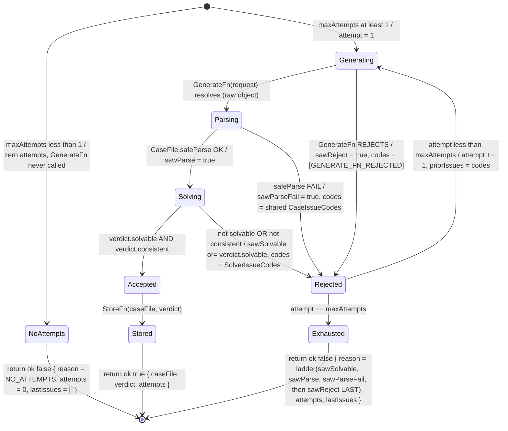

# plan.md — packages/engine Opus 4.8 case generator + generate→solve→regenerate loop (Issue #3, M1)

> Assembled by `/archwd --mode=plan`. Source: GitHub issue anisha-agarwal/ai-whodunit#3 (label `plan`).
> Prepended context: `/Users/anisha/Documents/architect-whodunit//src/whodunit-context.md`.
> PLAN ONLY — no code this run. This document is the build plan the coder/test-author split implements
> under `/archwd --mode=feature --resume` once approved + committed. **It unblocks #20 (execution).**

## What the user asked for (classifier intake)

**Summary:** Plan the `packages/engine` case generator — generate the solution graph + interlocking
dossiers via `claude-opus-4-8` structured output (`output_config.format`, adaptive thinking), reject +
regenerate until the **deterministic solver** (the already-built `solveCase`, issue #2) passes, store the
result. Acceptance: recorded-fixture replay tests (structure + schema-valid, never exact strings);
regenerate path covered.

**Signals:** GitHub label `plan`; title `[M1][Plan]` prefix; body "THIS ISSUE IS PLAN ONLY (no code)";
body "Produce via `/archwd --mode=plan`".

**Complexity:** XL · **Issue:** anisha-agarwal/ai-whodunit#3 · **Unblocks:** #20 (execution).

---

## 0. Grounding read (verified against the real worktree this run)

Read directly from the worktree `/Users/anisha/Documents/ai-whodunit/.worktrees/archwd-engine-case-generator-3`
on branch `plan/engine-case-generator-3` (base SHA `4c31fdf`). Unlike the #2 plan (whose shared work was on
an unmerged branch), **both `packages/shared` AND `packages/engine`'s solver are already on this worktree's tree** —
the schemas and `solveCase` are real, importable today.

### 0a. What already exists (the generator CONSUMES, never redefines)

- **`@ai-whodunit/shared` — the Zod contract** (`packages/shared/src/*.ts`), all read this run:
  - `CaseFile` (`case-file.ts:27-40`): the envelope `z.object({ id, victim, weapons.nonempty(),
    locations.nonempty(), timeline.nonempty(), suspects: Dossier[].nonempty(), clues: Clue[],
    solution: SolutionGraph }).superRefine(checkCaseInvariants)`. **This is the generator's output type.**
  - `SolutionGraph` (`solution-graph.ts:8-14`): `{ victimId, killerId: SuspectId, weaponId, locationId,
    timeSlotId }` — **SERVER-ONLY ground truth** (the file's own docstring: "Never serialized into any
    client-bound payload").
  - `Dossier` (`dossier.ts:44-54`): `{ id, publicPersona, knownFacts[], secrets: Secret[] (SERVER-ONLY),
    alibi: Alibi (.truth + .breaksWhen SERVER-ONLY), relationships[], knowledge (SERVER-ONLY),
    isGuilty: boolean (SERVER-ONLY), role (SERVER-ONLY) }`. `Secret`/`Alibi`/`Knowledge` at `dossier.ts:16-42`.
  - `Trigger` (`trigger.ts:11-15`): `z.discriminatedUnion('kind', [clue-presented{clueId}, fact-confronted{fact},
    contradiction-exposed])`.
  - `Clue` (`clue.ts:10-22`): `{ id, statement, reliability (SERVER-ONLY), refersTo?: {suspectId?, weaponId?,
    locationId?, timeSlotId?} }`.
  - `checkCaseInvariants` (`refinements.ts:79+`): R1a–R16 structural integrity, raised as
    `ctx.addIssue({code:'custom', path, message: CaseIssueCode})`. `CaseFile.safeParse` runs them.
  - Barrel `index.ts`: exports `CaseFile` (`:33`), branded ids, `Trigger`, `SolutionGraph`, `Dossier`/`Alibi`/
    `Clue`/`Secret`, `CaseIssueCode`, and the redaction projection (`toPublicCaseFile`, `:46`).
- **`@ai-whodunit/engine` — the deterministic solver** (issue #2, already on tree):
  - `solveCase(caseFile: CaseFile): SolverVerdict` (`engine/src/solve.ts:19`). **Pure, deterministic, TOTAL
    (never throws)** — invalid input → a verdict carrying `CASE_FILE_INVALID`, not an exception.
  - `SolverVerdict` (`engine/src/verdict.ts:58-66`): `{ solvable, consistent, culpritId, candidates[],
    eliminations[], contradictions[], issues[] }`. The docstring's invariant: **`issues` is empty ⟺
    `solvable && consistent`** — the single "is this case shippable" predicate.
  - `engine/src/index.ts` barrel exports `solveCase` + the verdict types.
- **Engine toolchain already configured** (read this run): `engine/package.json` (deps `@ai-whodunit/shared`,
  `zod ^4.4.3`; scripts `test` = `vitest run --coverage`, `test:mutation` = `stryker run`);
  `engine/vitest.config.ts` (`include: ['src/**/*.test.ts']`, 100/100/100/100 thresholds, `exclude:
  ['src/**/*.test.ts','src/**/*.test-d.ts','src/index.ts','tests/**']`); `engine/stryker.conf.json`
  (`break:100`, `mutate: ['src/**/*.ts', '!*.test.ts', '!*.test-d.ts', '!src/index.ts']`).
  > **Layout fact (corrects the #2 plan's prose):** engine specs live at **`src/*.test.ts`** (co-located),
  > NOT `tests/*.test.ts`. Only **fixtures** live under `tests/fixtures/` (`tests/fixtures/cases.ts` exists today,
  > exporting `RawCase` + `makeSolvableCase(overrides?)`). The test plan below follows the **real on-disk
  > convention**, not the #2 plan's incorrect `tests/*.test.ts` claim.
- **The Opus 4.8 SDK surface** (verified via the `claude-api` skill this run — authoritative over training prior):
  - Model id: **`claude-opus-4-8`** (exact string, no date suffix).
  - Structured output: **`output_config: { format: { type: 'json_schema', schema } }`** on
    `client.messages.create()`; recommended ergonomic path is `client.messages.parse({ ..., output_config:
    { format: zodOutputFormat(Schema) } })` → `response.parsed_output`. The old top-level `output_format` is
    deprecated — do NOT use it.
  - Adaptive thinking: **`thinking: { type: 'adaptive' }`** (offline generation job; `budget_tokens` is
    REMOVED on 4.8 → 400). Optional depth via `output_config: { effort: 'high' }`.
  - TS SDK: **`@anthropic-ai/sdk`**, `new Anthropic()` (key from `ANTHROPIC_API_KEY`). Streaming for large
    `max_tokens` via `client.messages.stream(...).finalMessage()`.
  - JSON-schema structured-output limits (load-bearing for the schema we hand the API): **no recursive
    schemas, no numeric/length constraints (`minimum`/`minLength`), `additionalProperties:false` required.**
    The SDK strips Zod constraints it can't express and validates them client-side — so a `CaseFile`-derived
    JSON schema is acceptable, but the generator MUST re-validate the returned object with the real Zod
    `CaseFile.safeParse` (which it does as Step 1 of the loop anyway).

### 0b. THE load-bearing architectural decision — engine purity vs. an LLM call site (resolved in §Decisions)

This is the single defining tension of issue #3, and it is **resolved before any build row**:

- **The invariant** (`code.md` + prelude, both read this run): "`packages/engine` is pure TS — no React, DB,
  Next, or `fetch`. Runs in a plain script and in CI." Also: "Dossiers, secrets, and `isGuilty` exist only in
  `apps/api`. Anthropic keys are server-side only."
- **The conflict:** `@anthropic-ai/sdk` performs network `fetch` and needs `ANTHROPIC_API_KEY`. Importing it
  into `packages/engine` and calling it there would break engine purity AND put the Anthropic key in a pure
  package — a **double invariant violation**.
- **The resolution (port/adapter — see §Decisions D1):** the engine owns the **pure** parts — the
  generate→solve→regenerate **loop control**, the solve-gate (calls the already-pure `solveCase`), the prompt
  template + the JSON-schema contract, and the stored-result type — **parameterized over an injected async
  generation function** (`GenerateFn`, a port). The engine NEVER imports `@anthropic-ai/sdk`, never calls
  `fetch`, never reads `process.env`. The **impure Opus 4.8 adapter** that satisfies `GenerateFn` (constructs
  `new Anthropic()`, calls `messages.parse` with `output_config.format` + adaptive thinking, holds the key) is
  a **consuming-package** concern that lands in **`apps/api`** at a later milestone — explicitly scope-fenced
  out of #3. This keeps the engine pure AND keeps the Anthropic key server-authoritative, while making the
  loop fully testable here via an injected fake generator (recorded-fixture replay) — which is exactly the
  SDK's own injectable-client testing pattern.

> **The grounding invariant is underwritten, not enforced, here.** The generator's job is to PRODUCE a case
> that the deterministic solver proves solvable + consistent **before any prose ships**; it does not inspect
> LLM utterances at runtime (that is the verifier path, `apps/api` + haiku, a later milestone). By gating
> every stored case on `verdict.solvable && verdict.consistent`, #3 guarantees the "provably-solvable case
> before any prose" headline — the solver is CODE, never an LLM (prelude). No new LLM logic is introduced for
> solving; the generator only PRODUCES candidates and the existing `solveCase` JUDGES them.

### 0c. What #3 ADDS (net-new, all in `packages/engine`, all pure)

1. **A prompt + JSON-schema contract** the Opus 4.8 call is given — derived from the shared `CaseFile` Zod
   schema (the case envelope incl. the SERVER-ONLY solution graph + dossiers), plus the system instructions
   that ask for an interlocking, solvable case.
2. **The `GenerateFn` port** — the injected async function signature the loop calls each attempt:
   `(req: GenerationRequest) => Promise<unknown>` (returns the raw parsed object; the loop re-validates).
3. **The generate→solve→regenerate loop** — `generateCase(deps, opts): Promise<GenerationResult>`:
   pre-loop, guard `maxAttempts < 1` → return `NO_ATTEMPTS` (zero attempts, `GenerateFn` never called — MINOR 1) →
   else call `GenerateFn` (catch a reject → record `sawReject`, carry the `GENERATE_FN_REJECTED` sentinel, no
   `safeParse`) → on resolve, `CaseFile.safeParse` (set `sawParse` on success) → on parse-fail, feed the shared
   issue codes back as a regenerate hint and retry → on parse-ok, `solveCase` (set `sawSolvable` when
   `verdict.solvable`) → if `verdict.solvable && verdict.consistent`, STORE + return success → else feed the
   solver issue codes back as a hint and retry → bounded by `maxAttempts`; on exhaustion select the terminal
   reason by the **history-aggregate ladder** over `sawParse`/`sawParseFail`/`sawSolvable`/`sawReject` with the
   reject branch checked LAST/lowest-priority (MAJOR 1 + MAJOR 1 r2) and return a structured `GenerationFailure`
   (TOTAL, never throws — mirrors `solveCase`).
4. **The `GenerationResult` stored-result type** — the discriminated union the caller (api) persists/gates on.
   Its failure arm carries one of **five** stable `GenerationFailureReason` codes (incl. `GENERATE_FN_REJECTED`
   for the reject-was-sole-signal exhaustion, CRITICAL 1, the LOWEST-priority terminal per MAJOR 1 r2; and
   `NO_ATTEMPTS` for `maxAttempts < 1`, MINOR 1) + `lastIssues: readonly IssueCode[]` (always populated except
   `[]` on `NO_ATTEMPTS`; the `GENERATE_FN_REJECTED` sentinel when the final attempt rejected).
5. **A `StoreFn` port (optional)** — the injected sink the success path writes the accepted `CaseFile` to
   (so persistence stays out of pure engine too). Default = identity (return-only).

The deduction the loop performs is **deterministic single-pass control flow** over the verdict booleans — no
search, no NLP, no second LLM. That is the headline invariant preserved.

---

## Surface

**packages/engine case generator + generate→solve→regenerate loop** (`packages/engine` only — pure TS, no
API/web surface). Net-new module set inside the existing engine package; consumes `@ai-whodunit/shared`
(the `CaseFile` contract) and the already-built `solveCase`; exports `generateCase` + the request/result/port
types. The Opus 4.8 transport adapter is **NOT** in this surface — it is `apps/api`, a later milestone.

---

## Build table (one-way — every row is an ADD)

| Behavior to build | whodunit destination (file:symbol) | Pattern anchor | user_visible |
|---|---|---|---|
| Define the `GenerateFn` port (injected async generation fn — the engine's only seam to the LLM) | `packages/engine/src/generate/ports.ts:GenerateFn` (new) | `engine/src/solve.ts:solveCase` signature shape (pure fn over shared types) | false |
| Define the `StoreFn` port (injected success sink; default identity) | `packages/engine/src/generate/ports.ts:StoreFn` (new) | same — pure injected fn, no side effects in engine | false |
| Build the JSON-schema + system-prompt contract handed to Opus 4.8, derived from the shared `CaseFile` Zod schema | `packages/engine/src/generate/contract.ts` (new) — `caseGenerationFormat`, `caseGenerationSystemPrompt`, `regenerateHint(issues)` | `shared/src/redaction.ts` (consumes `CaseFile`/`SolutionGraph` shapes without redefining) | false |
| Re-validate the raw generated object with the real Zod `CaseFile.safeParse` (parse-gate; total) | `packages/engine/src/generate/generate.ts` — `CaseFile.safeParse` guard | `engine/src/solve.ts:19-36` (`safeParse` then trust R1a–R16) | false |
| Gate the parsed case on the deterministic solver (`solveCase`); accept ⟺ `solvable && consistent` | `packages/engine/src/generate/generate.ts` — solve-gate calling `solveCase` | `engine/src/solve.ts` verdict assembly (`issues empty ⟺ solvable && consistent`) | false |
| The generate→solve→regenerate loop with bounded attempts + structured-hint feedback on each reject | `packages/engine/src/generate/generate.ts:generateCase` (new) | `shared/src/accusation.ts:validateAccusation` collect-issues `{ok, issues}` control shape | false |
| The `GenerationRequest` input + `GenerationResult` discriminated-union output (success carries the accepted `CaseFile` + verdict; failure carries attempts + last issues) | `packages/engine/src/generate/types.ts` (new) | `engine/src/verdict.ts:SolverVerdict` (booleans + branded ids + enum codes; no prose to pin) | false |
| Stable `GenerationFailureReason` enum — one code per reachable terminal: `NEVER_CONSISTENT` / `NEVER_SOLVABLE` / `PARSE_NEVER_VALID` / `GENERATE_FN_REJECTED` (reject-was-sole-signal, CRITICAL 1; LOWEST priority, MAJOR 1 r2) / `NO_ATTEMPTS` (`maxAttempts < 1`, MINOR 1) — plus the `IssueCode` union (`CaseIssueCode \| SolverIssueCode \| GENERATE_FN_REJECTED`) for `priorIssues`/`lastIssues` (MINOR 1) | `packages/engine/src/generate/types.ts:GenerationFailureReason`, `:IssueCode` (new) | `engine/src/verdict.ts:SolverIssueCode` (`as const` string map; tests assert specific code) | false |
| Zero-attempt guard — when `maxAttempts < 1` the loop runs zero attempts (`GenerateFn` never called) and returns `{ok:false, reason:NO_ATTEMPTS, attempts:0, lastIssues:[]}` — NOT `GENERATE_FN_REJECTED` (no reject occurred) (MINOR 1) | `packages/engine/src/generate/generate.ts:generateCase` — pre-loop guard | `engine/src/solve.ts:19-36` (defensive guard before the main path) | false |
| History-aggregate terminal selection — the loop tracks `sawParse`/`sawParseFail`/`sawSolvable`/`sawReject` flags across attempts and picks the exhaustion reason by priority ladder (NOT last-attempt classification) with the reject branch checked LAST (lowest priority) so any MIXED history — incl. reject-mixed-with-a-real-signal — is coded correctly (MAJOR 1 + MAJOR 1 r2) | `packages/engine/src/generate/generate.ts:generateCase` — flag accumulation + terminal selector | `engine/src/verdict.ts` verdict assembly (decide from accumulated structural facts, not the last step) | false |
| Barrel export of `generateCase` + the request/result/port/contract types from the engine package | `packages/engine/src/index.ts` (extend existing barrel) | `engine/src/index.ts` existing barrel shape (`export {} ` value + `export type {}`) | false |

**Every row is `user_visible: false`** — `packages/engine` has no rendered surface; the generator is an
offline producer of a server-only artifact. Its effects become user-visible only downstream (a case that
reaches a player is one this proved solvable). No G0 confirmation bullets are generated by this feature.

**No REMOVE rows:** net-new module set in an existing package; nothing pre-exists to conflict.

---

## Interface & type sketch (grounded in the real shared contract + the verified Opus 4.8 SDK surface)

> Plan-only sketch — illustrative, not the implementation. All structured I/O is the **already-defined**
> `@ai-whodunit/shared` `CaseFile` type and the **already-built** `SolverVerdict`. The engine re-`safeParse`s
> defensively and trusts shared's R1a–R16 + the solver's proof. Every field below was verified against
> `packages/shared/src/*.ts`, `packages/engine/src/*.ts`, and the `claude-api` skill this run.

```ts
import { CaseFile, type CaseIssueCode } from '@ai-whodunit/shared';
import { solveCase, type SolverVerdict, type SolverIssue, type SolverIssueCode } from '@ai-whodunit/engine';
//  ^ within the package, import from the local module paths; barrel form shown for clarity.
//    BOTH code unions are importable on-tree (shared barrel `index.ts:12`; engine barrel `index.ts:16`).

/** The structured-code alphabet the loop threads as reject hints + audit. NEVER prose. (MINOR 1) */
export type IssueCode = CaseIssueCode | SolverIssueCode | typeof GENERATE_FN_REJECTED;
//  ^ a rejecting GenerateFn runs NO safeParse → produces NO CaseIssueCode; the loop synthesizes the
//    single stable GENERATE_FN_REJECTED sentinel so `lastIssues` is always populated (CRITICAL 1).
export const GENERATE_FN_REJECTED = 'GENERATE_FN_REJECTED' as const;

/** One stable code per *reachable* generation terminal — tests assert the SPECIFIC code (kills code-swap mutants). */
export const GenerationFailureReason = {
  NEVER_CONSISTENT:         'NEVER_CONSISTENT',         // solvable on some attempt, but never also consistent (HIGHEST)
  NEVER_SOLVABLE:           'NEVER_SOLVABLE',           // some attempt parsed, none was verdict.solvable
  PARSE_NEVER_VALID:        'PARSE_NEVER_VALID',        // ≥1 attempt RAN safeParse, none passed (sawParse=false)
  GENERATE_FN_REJECTED:     'GENERATE_FN_REJECTED',     // reject was the SOLE signal — no real candidate ever judged (LOWEST, CRITICAL 1 / MAJOR 1 r2)
  NO_ATTEMPTS:              'NO_ATTEMPTS',              // maxAttempts < 1 — loop ran zero attempts; GenerateFn never called (MINOR 1)
} as const;
export type GenerationFailureReason =
  (typeof GenerationFailureReason)[keyof typeof GenerationFailureReason];

/** The injected LLM seam. The engine's ONLY contact with generation. Engine never constructs this. */
export type GenerateFn = (req: GenerationRequest) => Promise<unknown>;
//  ^ returns the RAW parsed object (unknown). The loop re-validates with CaseFile.safeParse — it does NOT
//    trust GenerateFn to return a valid CaseFile, so a recorded fixture (or a real LLM) is interchangeable.
//    A GenerateFn that REJECTS is caught; the attempt records the GENERATE_FN_REJECTED sentinel (no safeParse).

/** The injected success sink — keeps persistence out of pure engine. Default: identity (return-only). */
export type StoreFn = (accepted: CaseFile, verdict: SolverVerdict) => Promise<void> | void;

/** What the loop hands GenerateFn each attempt: the schema/prompt contract + any reject hint from the prior attempt. */
export interface GenerationRequest {
  readonly systemPrompt: string;          // caseGenerationSystemPrompt (static contract)
  readonly format: unknown;               // caseGenerationFormat (json_schema the adapter passes to output_config.format)
  readonly attempt: number;               // 1-based
  readonly priorIssues: readonly IssueCode[]; // stable codes from the last reject; [] on attempt 1. Type-enforced "codes, never prose" (MINOR 1)
}

export interface GenerateOptions {
  readonly maxAttempts: number;           // bound on the loop (caller-supplied; the adapter chooses a value)
  readonly seed?: string;                 // optional opaque scenario seed threaded into the prompt
}

export interface GenerationDeps {
  readonly generate: GenerateFn;          // injected (fake in tests, Opus 4.8 adapter in apps/api)
  readonly store?: StoreFn;               // injected; optional
}

/** Discriminated-union result — the artifact apps/api persists + gates on. Carries the verdict, never prose to pin. */
export type GenerationResult =
  | {
      readonly ok: true;
      readonly caseFile: CaseFile;        // the accepted, parse-valid, proven solvable+consistent case
      readonly verdict: SolverVerdict;    // verdict.solvable && verdict.consistent (issues empty)
      readonly attempts: number;          // how many tries it took (audit)
    }
  | {
      readonly ok: false;
      readonly reason: GenerationFailureReason;
      readonly attempts: number;          // === maxAttempts on exhaustion; 0 when reason === NO_ATTEMPTS (maxAttempts < 1)
      readonly lastIssues: readonly IssueCode[]; // stable codes from the FINAL attempt of the run (audit; NOT prose). Type-enforced (MINOR 1).
                                          //   final attempt rejected → [GENERATE_FN_REJECTED] (the sentinel; safeParse never ran — CRITICAL 1)
                                          //   NO_ATTEMPTS (maxAttempts < 1) → [] (the loop never ran — no signal of any kind)
    };

/** THE public entry point. Pure orchestration, deterministic control flow, TOTAL (never throws — returns a result). */
export function generateCase(
  deps: GenerationDeps,
  opts: GenerateOptions,
): Promise<GenerationResult>;
```

Design notes the sketch encodes:
- **Engine purity preserved.** `generateCase` imports only `@ai-whodunit/shared` (`CaseFile`) and the local
  `solveCase` — **never** `@anthropic-ai/sdk`, `fetch`, `process.env`, React, DB, or Next. The LLM is reached
  only through the injected `GenerateFn`.
- **Total, never throws.** Exhausting `maxAttempts` → `{ ok:false, reason, attempts, lastIssues }`. A
  `GenerateFn` that itself rejects (network error in the real adapter) is caught in a `try/catch` and recorded
  as a **reject attempt** — but it runs NO `safeParse`, so it produces NO `CaseIssueCode`; the loop instead
  marks `sawReject = true` and carries the single stable `GENERATE_FN_REJECTED` sentinel as that attempt's
  codes. The loop stays total. Mirrors `solveCase`'s total contract. (CRITICAL 1 — see §Decisions D3.)
- **Zero-attempt guard FIRST (MINOR 1).** Before the loop, if `maxAttempts < 1` the loop runs ZERO attempts —
  `GenerateFn` is never called — and `generateCase` returns `{ ok:false, reason:NO_ATTEMPTS, attempts:0,
  lastIssues:[] }`. This is its OWN terminal, distinct from `GENERATE_FN_REJECTED`: no reject ever occurred, so
  coding it as a reject would lie. (See §Decisions D5.) The exhaustion ladder below is reached only when
  `maxAttempts >= 1`.
- **Terminal-reason selection is HISTORY-AGGREGATE, never last-attempt — and the reject branch is checked LAST.**
  The loop tracks four monotonic flags across all attempts — `sawParse` (any attempt passed `CaseFile.safeParse`),
  `sawParseFail` (any attempt RAN `safeParse` and it FAILED), `sawSolvable` (any attempt's verdict was
  `solvable`), `sawReject` (any attempt's `GenerateFn` rejected, so `safeParse` never ran for it). On exhaustion
  the reason is selected by the priority ladder over these flags, NOT by the last attempt's verdict (the two
  diverge on a MIXED history — see §Decisions D4) and the reject branch is the LOWEST priority — checked AFTER
  all parse/solve flags (see §Decisions D4 reject-priority note):
  - `sawSolvable` → `NEVER_CONSISTENT` (some attempt was solvable, none also consistent)
  - else `sawParse` → `NEVER_SOLVABLE` (some attempt parsed but none was solvable — they were unsolvable)
  - else `sawParseFail` → `PARSE_NEVER_VALID` (≥1 attempt RAN `safeParse` and it failed — a real malformed case)
  - else → `GENERATE_FN_REJECTED` (reject was the SOLE signal — `!sawParse && !sawParseFail`, so no attempt ever
    produced a real parse/solve result to judge)
  The ladder is total over the flag space: the four reasons partition every reachable exhaustion history. The
  reject branch sits LAST by construction: ANY real parse/solve signal (`sawParse` OR `sawParseFail`) outranks
  `sawReject`, so a MIXED reject+real-signal run (e.g. reject → unsolvable → reject) codes to the real-signal
  terminal (`NEVER_SOLVABLE`), never `GENERATE_FN_REJECTED`. `GENERATE_FN_REJECTED` means "we never got a real
  candidate," so a run that DID get one — even amid rejects — is a generation defect, not a transport defect
  (the api caller branches on `reason`: transient-retry vs. generation-defect). `lastIssues` carries the
  structured codes from the **final** attempt (the `GENERATE_FN_REJECTED` sentinel when that attempt rejected;
  the `CaseIssueCode`/`SolverIssueCode` set otherwise) — which can DIVERGE from the aggregate-selected `reason`
  on a mixed history (MINOR 2: both are independently value-pinned).
- **Accept predicate is exactly the solver's shippable predicate.** `ok:true` ⟺ `CaseFile.safeParse` succeeds
  AND `verdict.solvable && verdict.consistent`. No independent re-derivation — the solver is the single source
  of truth (it is CODE, not an LLM).
- **Regenerate feedback is structured codes, never prose.** The reject hint threaded into the next
  `GenerationRequest.priorIssues` is the stable `CaseIssueCode` / `SolverIssueCode` set — so tests pin
  structure and the loop has real branch logic to mutate, never an LLM string to pin.
- **Server-authoritative downstream.** `GenerationResult.ok:true` carries the full `CaseFile` **including the
  SERVER-ONLY solution graph + dossier secrets + isGuilty** — which is correct because the result never
  crosses the wire from engine: `apps/api` holds it and exposes only `toPublicCaseFile(...)` to clients
  (shared's redaction chokepoint, a later milestone). The engine emits the truth; redaction is api's job.

---

## Mermaid diagram — the generate→solve→regenerate loop (state machine)



Every transition is a decidable predicate over the verdict booleans or the `safeParse` result; a `GenerateFn`
rejection is its OWN edge (it runs no `safeParse`, so it carries the `GENERATE_FN_REJECTED` sentinel rather than
a `CaseIssueCode`). The single `Exhausted` node resolves to **one of four** exhaustion `GenerationFailureReason`
codes via the history-aggregate ladder over `sawSolvable`/`sawParse`/`sawParseFail`/`sawReject` — with the
**reject branch checked LAST (lowest priority)** so any real parse/solve signal mid-history outranks a transport
reject — NOT the last attempt's verdict (MAJOR 1 + MAJOR 1 r2). The fifth terminal, `NO_ATTEMPTS`
(`maxAttempts < 1`, MINOR 1), is reached by the pre-loop guard edge from `[*]` — the loop body never runs, so
it is NOT an `Exhausted` outcome. All five terminals (incl. the all-reject `GENERATE_FN_REJECTED` and the
two reject-MIXED histories, CRITICAL 1 / MAJOR 1 r2, and `NO_ATTEMPTS`) have a reachability row in the §Test
plan. The diagram uses only valid `stateDiagram-v2` syntax (`-->`, `:` labels, `[*]`) — verified to render;
no `..|>` or invalid ER edges (the failure mode flagged in the issue body and recent repo history).

---

## Phase decomposition

Single PR (one cohesive module set inside one existing package). No external ordering edge — **both**
`packages/shared` and the `packages/engine` solver are already on this tree (unlike #2, which waited on an
unmerged shared branch). The Opus 4.8 adapter is a *separate, later* milestone (`apps/api`), not a phase of #3.

| Phase | Scope | Landable alone? | Rationale |
|---|---|---|---|
| 1 (this issue, #20) | `packages/engine`: the generator port + contract + generate→solve→regenerate loop + result types, with recorded-fixture replay tests | yes | pure-TS, no API/web; consumes already-present `shared` + `solveCase`; the loop + its accept-gate are one cohesive unit — splitting the loop from the result type would ship a half-contract |

No intra-issue phase split: the port, the loop, and the result type together constitute "the generator"; a
phase shipping the loop without the result type (or without the solve-gate) would emit an incomplete contract.

---

## Scope fences — what this PR (phase 1) will NOT touch

> Scope fences mark what is out of scope for #3's goal, so the coder doesn't gold-plate. They are deliberate
> design decisions, not walls to ship something broken — if a fenced row genuinely blocks correctness, STOP
> and ask the user to expand scope.

- **The Opus 4.8 transport adapter (`@anthropic-ai/sdk`, the real `GenerateFn`, the Anthropic key)** — out of
  scope; lands in **`apps/api`** (server-authoritative, a later milestone). Justified by **D1 (port/adapter)**:
  importing the SDK into pure engine breaks the engine-purity invariant AND puts the Anthropic key in a pure
  package. The engine ships the pure loop + the injected `GenerateFn` seam; api supplies the impure adapter.
  This fence is *required for correctness*, not a convenience — building the adapter here would be the defect.
- **`packages/shared` schemas/refinements** — out of scope; the generator *imports and trusts* `CaseFile` +
  R1a–R16. **No #1 contract change is required** — `CaseFile` is exactly the generator's output type, and the
  JSON-schema contract is derived from it, not a new schema. Re-deriving the schema in engine would duplicate
  the contract.
- **The deterministic solver (`solveCase`, issue #2)** — out of scope; the loop *calls* it as the accept-gate.
  No new solving logic, no LLM solving (the solver is CODE, per the prelude). #3 PRODUCES candidates; #2 JUDGES
  them. Justified: re-implementing solvability/consistency in the generator would duplicate #2 and risk a
  second, divergent source of truth.
- **Persistence / DB writes** — out of scope; the `StoreFn` port is an injected sink (default identity). The
  real persistence (Postgres) is an `apps/api` milestone. Justified: a DB client in pure engine breaks purity
  (no DB in `packages/engine`, per the prelude).
- **Client-bound redaction / `toPublicCaseFile` wiring** — out of scope; redaction is shared's chokepoint that
  `apps/api` invokes before serving. The engine emits the full server-only truth. Justified: pure package has
  no wire surface; the payload-scan + redaction gate is an api contract test (a later milestone).
- **The eval suite (hallucination rate, solvability %, secret-leak-before-trigger)** — out of scope as a test
  *in this package*. The eval suite is a *downstream consumer* of `generateCase` + `solveCase`, run by
  `pnpm eval` at the api/web milestones. #3 ships recorded-fixture replay + 100% deterministic coverage; the
  threshold eval is not a `packages/engine` test. Justified per the prelude's LLM-call-site rule (engine has
  no live LLM surface — the live call is the api adapter).
- **`apps/api` / `apps/web` surface** — out of scope; neither exists yet. Adding any app code here would break
  package purity.

None of these fences, done correctly, requires touching the fenced area: the loop is complete using only the
injected `GenerateFn`, the `CaseFile` parse-gate, and `solveCase`. Both the schema contract and the solver are
constructible/callable from the present tree as-is — **no escalation to a #1 or #2 contract change is required.**

---

## Pattern anchors (copy these — all present on this worktree's tree)

- `packages/engine/src/solve.ts:solveCase` (`:19`) — the **pure, total, deterministic entry-point shape** the
  generator's `generateCase` mirrors: `safeParse` defensively, trust the contract, assemble a structured
  result, never throw. Primary guard against inventing a novel architecture — the generator is "the loop
  around this."
- `packages/engine/src/verdict.ts` (`SolverVerdict` `:58`, `SolverIssueCode` `:13` `as const` map,
  `Elimination`/`Contradiction` branded-id audit types) — the **structured-result + stable-string-enum**
  pattern `GenerationResult` / `GenerationFailureReason` copy (booleans + branded ids + enum codes; `detail`
  is structural context, never prose to pin a test on).
- `packages/shared/src/accusation.ts:validateAccusation` — the **collect-issues, return `{ok, issues}`**
  control shape the regenerate loop mirrors (accumulate reject codes, branch on whether any fired).
- `packages/engine/tests/fixtures/cases.ts` (`RawCase` + `makeSolvableCase(overrides?)`) — the **local
  hand-authored, one-mutation-per-fail-fixture** builder pattern the generator's fake `GenerateFn` fixtures
  copy (a solvable canonical case + one-mutation variants that drive each loop branch). This file ALREADY
  exists and ALREADY produces a canonical solvable `CaseFile` — reuse it as the fake generator's payload
  source rather than authoring a second builder.
- `packages/engine/{vitest.config.ts, stryker.conf.json}` + `packages/shared/src/index.ts` barrel — the
  **deterministic-package toolchain + barrel-export** scaffold (100/100/100/100 vitest thresholds, Stryker
  `break:100`, `src/*.test.ts` co-located specs, `export {} ` value + `export type {}` barrel) to follow 1:1.

---

## Test plan

`packages/engine` is deterministic → **100% line+branch+function+statement** coverage gate + Stryker
`break:100` (per `engine/vitest.config.ts` + `engine/stryker.conf.json`, read this run). No DB/API/web →
**no integration/contract/e2e/smoke/visual** in this package. All tests are owned by the **test_author** step;
the **coder** ships `coverage-handoff.md` and zero tests. Specs are **co-located at `src/generate/*.test.ts`**
(the REAL engine convention — `vitest.config.ts` `include: ['src/**/*.test.ts']`); fixtures live under
`packages/engine/tests/fixtures/`.

**The Opus 4.8 call site is exercised by recorded-fixture replay — never the network, never exact strings.**
The injected `GenerateFn` is a **fake that returns recorded objects** (a canonical solvable `CaseFile`-shaped
payload from `makeSolvableCase`, plus one-mutation variants). Tests assert **structure + closed-world wiring +
schema-validity + the correct loop branch**, never an LLM string. This is precisely the prelude's
"LLM call sites use recorded-fixture replay (assert structure + closed-world wiring, never exact strings)" bar:
the engine has no live LLM, so the "replay" is the injected fake; the *live* Opus 4.8 call is the api adapter's
test surface at its own milestone (scope-fenced).

| Behavior | Level | Destination | Mutation-probe target |
|---|---|---|---|
| Happy path: fake `GenerateFn` returns a solvable+consistent `CaseFile` on attempt 1 → `{ok:true, caseFile, verdict, attempts:1}`, verdict has empty `issues` | unit | `src/generate/generate.test.ts` (fixture: `solvableCase`) | flip the accept predicate `solvable && consistent` → unsolvable case accepted |
| `StoreFn` is called exactly once on accept, with the accepted `CaseFile` + verdict | unit (spy fn) | `src/generate/generate.test.ts` | drop the `store?.()` call → spy never invoked / called on reject |
| `StoreFn` absent (default identity) → success still returns, no throw | unit | `src/generate/generate.test.ts` | make store non-optional → undefined-call throws |
| Regenerate path — PARSE: attempt 1 returns a parse-INVALID object (trips an R-rule), attempt 2 returns a valid solvable case → `{ok:true, attempts:2}`; `priorIssues` on attempt 2 carries the shared `CaseIssueCode` | unit (scripted fake) | `src/generate/generate.test.ts` (fixtures: `parseInvalidThenValid`) | remove the retry-on-parse-fail branch → first parse-fail returns failure / no hint threaded |
| Regenerate path — SOLVE: attempt 1 returns a parse-valid but UNSOLVABLE case (`CULPRIT_NOT_REACHABLE`), attempt 2 returns solvable → `{ok:true, attempts:2}`; `priorIssues` carries the `SolverIssueCode` | unit (scripted fake) | `src/generate/generate.test.ts` (fixtures: `unsolvableThenValid`) | remove the retry-on-unsolvable branch → unsolvable accepted or premature failure |
| Exhaustion (HOMOGENEOUS) — every attempt parse-INVALID → `{ok:false, reason:PARSE_NEVER_VALID, attempts:maxAttempts, lastIssues: [the shared CaseIssueCode]}` | unit | `src/generate/generate.test.ts` (fixture: `alwaysParseInvalid`) | flip the loop bound `attempt < maxAttempts` → off-by-one / infinite-loop / wrong terminal |
| Exhaustion (HOMOGENEOUS) — every attempt parse-valid but never solvable → `{ok:false, reason:NEVER_SOLVABLE, lastIssues: [CULPRIT_NOT_REACHABLE]}` | unit | `src/generate/generate.test.ts` (fixture: `alwaysUnsolvable`) | swap the failure-reason selection → wrong reason code |
| Exhaustion (HOMOGENEOUS) — solvable on some attempt but never also consistent → `{ok:false, reason:NEVER_CONSISTENT, lastIssues: [CULPRIT_BREAK_CLUE_OFF_SOLUTION]}` | unit | `src/generate/generate.test.ts` (fixture: `solvableNeverConsistent`) | collapse NEVER_CONSISTENT into NEVER_SOLVABLE → reason mis-coded |
| **Exhaustion (HETEROGENEOUS, MAJOR 1) — attempt-1 unsolvable (`CULPRIT_NOT_REACHABLE`) → attempt-2 solvable-but-inconsistent (`CULPRIT_BREAK_CLUE_OFF_SOLUTION`) → attempt-3 unsolvable → exhaust → MUST assert `{ok:false, reason:NEVER_CONSISTENT, lastIssues:[CULPRIT_NOT_REACHABLE]}` (aggregate-selected `reason` from `sawSolvable` mid-history, but `lastIssues` from the FINAL attempt's solver codes — divergence value-pinned, MINOR 2)** | unit (scripted heterogeneous fake) | `src/generate/generate.test.ts` (fixture: `unsolvable_inconsistent_unsolvable`) | (a) replace the history-aggregate selector with a **last-attempt classifier** → reason becomes `NEVER_SOLVABLE` (last attempt unsolvable) instead of `NEVER_CONSISTENT` → row goes RED. OBSERVABLY DISTINCT only under a mixed history. (b) source `lastIssues` from the aggregate instead of the final attempt → `lastIssues` becomes `[CULPRIT_BREAK_CLUE_OFF_SOLUTION]` (mid-history) or merged → value assertion fails (MINOR 2). |
| **Exhaustion (HETEROGENEOUS, MAJOR 1) — attempt-1 parse-INVALID → attempt-2 parse-valid-unsolvable (`CULPRIT_NOT_REACHABLE`) → attempt-3 parse-INVALID → exhaust → MUST assert `{ok:false, reason:NEVER_SOLVABLE, lastIssues:[the shared CaseIssueCode of the final parse-fail]}` (aggregate `reason` from `sawParse` mid-history, `lastIssues` from the FINAL parse-fail attempt — divergence value-pinned, MINOR 2)** | unit (scripted heterogeneous fake) | `src/generate/generate.test.ts` (fixture: `parseInvalid_unsolvable_parseInvalid`) | (a) replace the history-aggregate selector with a last-attempt classifier → reason becomes `PARSE_NEVER_VALID` (last attempt parse-fail) instead of `NEVER_SOLVABLE` → row goes RED. (b) source `lastIssues` from a mid-history attempt → `lastIssues` becomes `[CULPRIT_NOT_REACHABLE]` instead of the final parse-fail's `CaseIssueCode` → value assertion fails (MINOR 2). |
| **Exhaustion (REJECT-MIXED, MAJOR 1 round-2) — attempt-1 `GenerateFn` REJECTS → attempt-2 parse-valid-UNSOLVABLE (`CULPRIT_NOT_REACHABLE`) → attempt-3 REJECTS → exhaust → MUST assert `{ok:false, reason:NEVER_SOLVABLE, lastIssues:[GENERATE_FN_REJECTED]}` — `GENERATE_FN_REJECTED` is the LOWEST-priority terminal: a real solve signal (`sawParse`) mid-history OUTRANKS the transport reject, so the run is a generation-defect (NEVER_SOLVABLE), NOT a transport-defect (GENERATE_FN_REJECTED). `lastIssues` is the FINAL attempt's sentinel because the final attempt rejected (MINOR 2).** | unit (scripted reject-mixed fake) | `src/generate/generate.test.ts` (fixture: `reject_unsolvable_reject`) | (a) reorder the ladder to check the reject branch FIRST (`if (sawReject) return GENERATE_FN_REJECTED`) → reason mis-codes to `GENERATE_FN_REJECTED` instead of `NEVER_SOLVABLE` → row goes RED. OBSERVABLY DISTINCT only under a reject-MIXED history (the all-reject `alwaysReject` row + the homogeneous unsolvable row both SURVIVE this mutant). (b) source `lastIssues` from a mid-history attempt → `[CULPRIT_NOT_REACHABLE]` instead of `[GENERATE_FN_REJECTED]` → value assertion fails. |
| **Exhaustion (REJECT-MIXED, MAJOR 1 round-2) — attempt-1 REJECTS → attempt-2 parse-valid-but-INCONSISTENT (`CULPRIT_BREAK_CLUE_OFF_SOLUTION`, solvable:true/consistent:false) → attempt-3 REJECTS → exhaust → MUST assert `{ok:false, reason:NEVER_CONSISTENT, lastIssues:[GENERATE_FN_REJECTED]}` — `sawSolvable` fired on attempt 2, which OUTRANKS the transport reject; reject stays lowest-priority. `lastIssues` is the final attempt's sentinel (MINOR 2).** | unit (scripted reject-mixed fake) | `src/generate/generate.test.ts` (fixture: `reject_inconsistent_reject`) | (a) reorder the ladder to check the reject branch FIRST → reason mis-codes to `GENERATE_FN_REJECTED` instead of `NEVER_CONSISTENT` → row goes RED. OBSERVABLY DISTINCT only under a reject-MIXED history. (b) source `lastIssues` from the aggregate → value assertion fails. |
| **Exhaustion (ALL-REJECT, CRITICAL 1) — EVERY attempt's `GenerateFn` REJECTS to exhaustion → MUST assert `{ok:false, reason:GENERATE_FN_REJECTED, attempts:maxAttempts, lastIssues:[GENERATE_FN_REJECTED]}` — no `safeParse` ever ran, so `PARSE_NEVER_VALID` would be a lie** | unit (always-rejecting fake) | `src/generate/generate.test.ts` (fixture: `alwaysReject`) | (a) drop the `sawReject`→`GENERATE_FN_REJECTED` terminal branch → reason mis-codes to `PARSE_NEVER_VALID`; (b) emit `lastIssues: []` instead of `[GENERATE_FN_REJECTED]` → empty-codes assertion fails. Both go RED. |
| `GenerateFn` REJECTS on attempt 1, then RESOLVES a solvable case on attempt 2 → `{ok:true, attempts:2}`, `priorIssues` on attempt 2 carries `[GENERATE_FN_REJECTED]` (the reject is recoverable, NOT terminal — loop stays total, no throw escapes `generateCase`) | unit (rejecting-then-valid fake) | `src/generate/generate.test.ts` (fixture: `rejectThenValid`) | remove the try/catch around `GenerateFn` → rejection escapes `generateCase`; OR thread `[]` instead of `[GENERATE_FN_REJECTED]` → hint-presence assertion fails |
| `maxAttempts:1` boundary → exactly one attempt, correct terminal | unit | `src/generate/generate.test.ts` | mutate the boundary → 0 or 2 attempts |
| **`maxAttempts < 1` boundary (MINOR 1) — `maxAttempts:0` (and `-1`) → loop runs ZERO attempts; MUST assert `{ok:false, reason:NO_ATTEMPTS, attempts:0, lastIssues:[]}` (NOT `GENERATE_FN_REJECTED` — no reject ever occurred). The `GenerateFn` is NEVER called (spy asserts 0 invocations).** | unit (spy fn) | `src/generate/generate.test.ts` (fixture: a spy `GenerateFn`, `maxAttempts:0`) | (a) remove the `maxAttempts < 1` guard → loop falls through to the exhaustion ladder with all flags false → mis-codes to `GENERATE_FN_REJECTED` (the round-2 MINOR-1 hole) → row goes RED. (b) call `GenerateFn` despite `maxAttempts:0` → spy-invocation-count assertion fails. |
| Contract: `caseGenerationFormat` is a valid json-schema object the SDK's `output_config.format` accepts (no recursive/constraint features the API rejects); `caseGenerationSystemPrompt` is non-empty | unit | `src/generate/contract.test.ts` | mutate the schema shape → structural assertion fails |
| `regenerateHint(issues)` produces a deterministic hint string containing the stable codes (NOT free prose) | unit | `src/generate/contract.test.ts` | drop a code from the hint → assertion on code presence fails |
| Barrel re-exports `generateCase` + the request/result/port/contract types | unit (smoke import) | `src/index.test.ts` (extend) | covered transitively |

**Fixtures (test_author-owned, real — not mocks), under `packages/engine/tests/fixtures/`.** Built by
**reusing the existing `makeSolvableCase(overrides?)`** in `tests/fixtures/cases.ts` (a canonical
parse-valid + solvable + consistent `CaseFile`) and deriving each fail variant as **one mutation** off it,
mirroring the #2 fixture discipline:
- `solvableCase` — `makeSolvableCase()` (happy path; attempt-1 accept).
- `parseInvalidThenValid` — a scripted fake returning [a one-mutation parse-INVALID object (e.g. culprit's
  `breaksWhen` deleted → trips R16), then `makeSolvableCase()`].
- `unsolvableThenValid` — scripted fake returning [culprit break-clue set `misleading` → `CULPRIT_NOT_REACHABLE`
  (parse-valid, unsolvable), then `makeSolvableCase()`].
- `alwaysParseInvalid` / `alwaysUnsolvable` / `solvableNeverConsistent` — fakes returning the same one-mutation
  variant on every attempt (HOMOGENEOUS exhaustion terminals; the third uses a `refersTo`-off-solution mutation →
  `CULPRIT_BREAK_CLUE_OFF_SOLUTION`, which is solvable-but-inconsistent).
- **`unsolvable_inconsistent_unsolvable`** (MAJOR 1) — a HETEROGENEOUS scripted fake: `[CULPRIT_NOT_REACHABLE
  variant, CULPRIT_BREAK_CLUE_OFF_SOLUTION variant, CULPRIT_NOT_REACHABLE variant]` with `maxAttempts:3`. Drives
  a mixed history where `sawSolvable` fires on attempt 2 but the final attempt is only unsolvable → must code
  `NEVER_CONSISTENT`. Built by reusing the same one-mutation `makeSolvableCase(overrides)` variants already
  authored for `unsolvableThenValid` and `solvableNeverConsistent` — no new mutation primitive.
- **`parseInvalid_unsolvable_parseInvalid`** (MAJOR 1) — HETEROGENEOUS: `[parse-INVALID variant,
  CULPRIT_NOT_REACHABLE variant, parse-INVALID variant]` with `maxAttempts:3`. `sawParse` fires on attempt 2,
  final attempt is a parse-fail → must code `NEVER_SOLVABLE`. Reuses the `parseInvalidThenValid` +
  `unsolvableThenValid` mutation variants.
- **`alwaysReject`** (CRITICAL 1) — a `GenerateFn` that REJECTS on every call (`() => Promise.reject(new
  Error('network'))`). Drives the all-reject exhaustion terminal; `safeParse` never runs → asserts
  `reason:GENERATE_FN_REJECTED`, `lastIssues:[GENERATE_FN_REJECTED]`.
- **`rejectThenValid`** (CRITICAL 1, recoverable) — rejects on attempt 1, then resolves `makeSolvableCase()` on
  attempt 2. Proves a reject is a recoverable attempt (loop total, no escape) and that `[GENERATE_FN_REJECTED]`
  is threaded into the next `priorIssues`.
- **`reject_unsolvable_reject`** (MAJOR 1 r2) — a reject-MIXED scripted fake: `[reject thunk, CULPRIT_NOT_REACHABLE
  variant, reject thunk]` with `maxAttempts:3`. `sawParse` + `sawReject` both fire; the real solve signal mid-history
  must OUTRANK the transport reject → must code `NEVER_SOLVABLE` (NOT `GENERATE_FN_REJECTED`), `lastIssues:
  [GENERATE_FN_REJECTED]` (final attempt rejected). Reuses the `alwaysReject` reject thunk + the `unsolvableThenValid`
  `CULPRIT_NOT_REACHABLE` variant — no new mutation primitive.
- **`reject_inconsistent_reject`** (MAJOR 1 r2) — reject-MIXED: `[reject thunk, CULPRIT_BREAK_CLUE_OFF_SOLUTION
  variant, reject thunk]` with `maxAttempts:3`. `sawSolvable` fires on attempt 2 (solvable:true/consistent:false),
  outranks the reject → must code `NEVER_CONSISTENT`, `lastIssues:[GENERATE_FN_REJECTED]`. Reuses the reject thunk +
  the `solvableNeverConsistent` variant.
- **`spyZeroAttempts`** (MINOR 1) — a `vi.fn()` spy `GenerateFn` paired with `maxAttempts:0` (and `-1`). Asserts the
  loop returns `{reason:NO_ATTEMPTS, attempts:0, lastIssues:[]}` and the spy is invoked 0 times. No case payload
  needed — the loop must return before ever calling it.

The scripted fake is a tiny array-backed `GenerateFn` (`let i=0; return scripts[i++]()` where each script is a
thunk that resolves OR rejects) — deterministic, no network, replayable; the all-reject + reject-then-valid +
reject-MIXED fakes use rejecting thunks interleaved with case-resolving thunks. Each probe records a real
RED→GREEN line in `mutation-ledger.md`. The two parse/solve-heterogeneous probes (last-attempt classifier swap)
are observably distinct ONLY because the fixtures are mixed; the two reject-MIXED probes (reject-FIRST ladder
reorder) are observably distinct ONLY because a real parse/solve signal is interleaved with rejects — the
`alwaysReject` (all-reject) row and the homogeneous rows alone would let a reject-first precedence survive.

**Explicit non-obligations (test_author must NOT hallucinate these):** no LIVE Opus 4.8 call, no `@anthropic-ai/sdk`
import, no `process.env`/`fetch` (engine purity — the live call is the api adapter's test surface); no
FAIL→PASS eval (that is the api/eval milestone — the eval suite consumes `generateCase`, it is not a
`packages/engine` test); no wire payload-scan / DB integration (no api/DB surface here). No assertion over any
prose field (`alibi.truth`/`claim`/`statement`, `secret.ifLeaked`) or any LLM output string — the loop reads
only `safeParse` success + the verdict booleans + stable codes.

---

## Blast radius

- **Symbols to change:** none existing — net-new module set. New symbols: `generateCase`, `GenerateFn`,
  `StoreFn`, `GenerationRequest`, `GenerateOptions`, `GenerationDeps`, `GenerationResult`,
  `GenerationFailureReason` (5 codes), `caseGenerationFormat`, `caseGenerationSystemPrompt`, `regenerateHint`.
  Plus the engine barrel `index.ts` gains re-exports (additive only — existing `solveCase`/verdict exports
  unchanged).
- **Existing-symbol impact:** `engine/src/index.ts` is extended (additive). `rg "generateCase|GenerateFn|
  GenerationResult"` across `packages/**` `apps/**` returns nothing today (verified this run) — no downstream
  caller exists yet (the api adapter that will supply the real `GenerateFn` is a later milestone, scope-fenced).
- **No new workspace dependency:** the generator imports only `@ai-whodunit/shared` (already a dep) + the local
  solver. **No `@anthropic-ai/sdk` dependency is added to `packages/engine`** (by design, D1) — it enters
  `apps/api`'s `package.json` at the adapter milestone.
- **Root/CI:** `turbo run test`/`typecheck`/`lint`/`test:mutation` auto-pick up the new specs (tasks
  by-name; no `turbo.json` edit). CI `.github/workflows/ci.yml` already runs `test` across the workspace — no
  workflow edit.

---

## Complexity budget (pre-estimate)

| Axis | Estimate |
|---|---|
| Production LOC added | ~215 (generate.ts loop + `maxAttempts < 1` pre-loop guard + 4-flag accumulation + 4-way reject-last terminal selector ~108, contract.ts ~55, ports.ts ~15, types.ts incl. 5-code enum + IssueCode union + sentinel ~32, index.ts barrel ~10) — +~10 over the round-1 ~205 for the NO_ATTEMPTS guard/terminal |
| Test LOC added | ~365 (generate.test.ts ~295 across the now-18 loop behaviors incl. 2 parse/solve-heterogeneous + 2 reject-MIXED + 1 all-reject + 1 reject-then-valid + 1 `maxAttempts:0` boundary rows + contract.test.ts ~55 + index smoke ~15) |
| E2E LOC added | 0 (no `apps/web`) |
| Fixture LOC added | ~120 (reuses existing `makeSolvableCase` + the parse/unsolvable/inconsistent one-mutation variants; adds 2 parse/solve-heterogeneous + 2 reject-MIXED array-of-thunks fakes + an `alwaysReject` + a `rejectThenValid` rejecting thunk + a spy `GenerateFn`) |
| Files modified | 1 (`engine/src/index.ts` — additive barrel) |
| Files added (new) | 7 (`src/generate/{ports,contract,generate,types}.ts` = 4 prod + `src/generate/{generate,contract}.test.ts` = 2 test + 1 fixture helper file or extension of `tests/fixtures/cases.ts`) |
| Distinct-Edit-Patterns | 4 (port/seam definition; schema+prompt contract derivation; bounded generate→solve→regenerate loop with structured-hint feedback + `maxAttempts < 1` guard + 4-flag history accumulation + reject-LAST 4-way terminal selector; discriminated-union result + stable-enum incl. the reject sentinel + NO_ATTEMPTS) — the round-2 fold DEEPENS the existing loop+selector pattern (reject-last ordering + zero-attempt guard), it does NOT add a NEW shape |
| Distinct-Edit-Patterns / files-touched ratio (shim-discriminator) | 4 / 8 = 0.50 (floor 0.33 — above floor) |
| Net LOC delta | +~700 (no deletions; net-new module set) — up from +~625 round-1 |

---

## Self-audit

| Rule | Verdict | Evidence | Suggested alternative |
|---|---|---|---|
| R1 — Signature-Widening with Caller-Cost (SWC) | OK | No new required arg added to any **existing** function. `generateCase` is net-new with two params (`deps`, `opts`); the engine barrel gains additive re-exports only. Zero existing caller sites must thread anything (`rg "generateCase\|GenerateFn"` = 0 hits this run). Guard-only use: N/A. | N/A |
| R2 — Test-Shim Predominance (TSP) | OK | `TSP` = shim_only / total = 0 / 3 = 0.00. All 3 spec files (`generate.test.ts`, `contract.test.ts`, `index.test.ts` extension) ADD `it()`/`describe()` blocks (behavior-adding — the round-2 fold adds 3 NEW `it()` blocks: 2 reject-MIXED exhaustion rows + 1 `maxAttempts:0` boundary row, plus extends 2 existing heterogeneous rows with `lastIssues` assertions — none is a signature-thread shim); zero signature-thread-only shim files (the only modified file, `index.ts`, is a non-test barrel). Below the >0.4 ∧ ≥4 trigger. | N/A |
| R3 — Cross-Boundary Reactive-Amendment guard (CBA) | OK | **The defining boundary question of #3, RESOLVED in §Decisions D1 — and the resolution AVOIDS the trigger rather than crossing it.** The plan does NOT import `@anthropic-ai/sdk`/`fetch`/`process.env` into `packages/engine` (which would break engine purity); instead the impure transport is moved OUT of engine to a consuming package (`apps/api`) via the injected `GenerateFn` port — the exact **server-authoritative alternative** §Decisions D1 compares and commits to. No dossier/secret/`isGuilty` field is moved across a client boundary: `GenerationResult.ok:true` carries the full server-only `CaseFile` but it never leaves `apps/api` (redaction via `toPublicCaseFile` is api's job, scope-fenced). No retroactive Zod default (zero #1 contract change). The `boundary` is honored by keeping the impure dep server-side; the `server-authoritative` alternative is the chosen design, not merely compared. | N/A — impure dep relocated to `apps/api`; engine stays pure; secrets stay server-side |
| R4 — Helper-Call-site Multiplicity (HCM) | OK | `HCM` not triggered: no scope-fence dictates a ≥4-line comment block repeated at ≥3 call sites. The one load-bearing explanation (the port/adapter rationale) lives once in §Decisions D1 (a single canonical location), referenced — not copy-pasted — by the scope fence and the build rows. | N/A |
| R5 — Mid-pipeline Plan Amendment pre-score (MPA-pre) | OK | `MPA-pre`: the §Open questions are all **RESOLVED in-plan** (D1 engine-purity-vs-LLM, D2 prompt-grounding, D3 all-reject terminal, D4 history-aggregate + reject-LAST priority, D5 `maxAttempts < 1` NO_ATTEMPTS terminal) — §Decisions answers each with alternatives compared, none WAVED. The round-2 runtime-boundary questions are CLOSED, not WAVED: D4's reject-priority note touches the `runtime-invariant`/`reason` the api caller branches on (transient-retry vs. generation-defect); D5 touches the same `reason` path for the zero-attempt boundary — both answered with alternatives compared. No schema/payload/solver/grounding/type-narrowing question left open. | N/A |
| R6 — §Decisions Over-Justification (OJ) | BUDGET-FLAG | `Over-Justification`: `§Decisions` now has **5** sub-sections (D1, D2, D3, D4, D5) — OVER the ≥4 trigger (D5 added in round-2 to close MINOR 1; the D4 reject-priority note was folded INTO D4, not a new sub-section). Longest sub-section (D4, now incl. the reject-priority note) ~38 lines; D1 ~22, D3 ~20, D5 ~18 — all below the 50-line trigger. The flag is a count-of-decisions artifact of resolving the adversary's CRITICAL 1 + MAJOR 1 (×2 rounds) + MINOR 1, NOT bloated per-decision rationale. | Surface the load-bearing choices as G0 confirmation bullets (D1 port-boundary, D3 reject-terminal, D4 reject-LAST aggregate-selection, D5 zero-attempt terminal); do NOT trim D4/D5 — collapsing them would re-introduce the unspecified/mis-coded behavior the adversary flagged. |
| R7 — Diff-Cost Pre-Estimate / Complexity Budget (DEP) | OK | `DEP`: `Distinct-Edit-Patterns` / files = 4 / 8 = **0.50** (`shim-discriminator` above the 0.33 floor — the round-2 fold DEEPENED the loop+selector pattern with the reject-LAST ordering + the `maxAttempts < 1` guard, it did not add a new edit shape). Production LOC ~215 (< 1500); files-touched 8 (< 20); net +700, not a cleanup. No flag. | N/A |

One BUDGET-FLAG (R6 OJ — §Decisions at 5 sub-sections after adding D5 in round-2 to close MINOR 1, on top of
D3/D4 from round-1; an honest count artifact of resolving the adversary findings, not bloat — D3/D4/D5 are
load-bearing and must NOT be trimmed). **Zero BLOCK findings** — the BUDGET-FLAG does not gate; it is surfaced
for G0 visibility per the rule.

---

## §Decisions

### D1 — Engine purity vs. an LLM call site → port/adapter (engine owns the pure loop; the Opus 4.8 transport lives in `apps/api`)

**The conflict.** Issue #3 is "generate via `claude-opus-4-8` structured output," but the prelude + `code.md`
require `packages/engine` to be pure TS (no `fetch`/network) and the Anthropic key to be server-side only
(`apps/api`). `@anthropic-ai/sdk` does network `fetch` and needs the key — importing it into the engine would
break **both** invariants at once.

**Alternatives compared.**
- *(A) Import the SDK into `packages/engine` and call Opus 4.8 inside `generateCase`.* Rejected — breaks
  engine purity AND places the Anthropic key in a pure package. This is the **boundary-crossing** option the
  CBA rule exists to catch.
- *(B, CHOSEN — the server-authoritative alternative) Port/adapter.* The engine owns the pure
  generate→solve→regenerate loop, the schema/prompt contract, and the result type, **parameterized over an
  injected `GenerateFn`**. The impure Opus 4.8 adapter (constructs `new Anthropic()`, calls `messages.parse`
  with `output_config.format` + `thinking:{type:'adaptive'}`, holds `ANTHROPIC_API_KEY`) lands in `apps/api`
  at a later milestone. Engine stays pure; the key stays server-side; the loop is fully testable here via a
  recorded-fixture fake `GenerateFn` (the SDK's own injectable-client testing pattern).

**Why B wins.** It satisfies issue #3's intent (the loop + contract that DRIVE the Opus 4.8 call are built and
tested now) without violating a single invariant, and it makes the recorded-fixture replay acceptance criterion
natural — the fake generator IS the injected port. The live call is exercised at the adapter's own milestone.
Surfaced as the first §Scope-fence row for G0 visibility.

### D2 — The generated case is GROUNDED in the shared `CaseFile` schema + gated by the deterministic solver, never "looks plausible"

**Decision.** The JSON-schema contract handed to Opus 4.8 is **derived from the shared `CaseFile` Zod schema**
(not a hand-invented shape), and **acceptance is exactly `CaseFile.safeParse` success AND
`verdict.solvable && verdict.consistent`** — the same shippable predicate the solver defines. The regenerate
hint feeds back **stable `CaseIssueCode`/`SolverIssueCode`** codes, never free prose. Alternative — accept on a
heuristic "looks like a valid case" or an LLM self-grade — rejected: it would make the solver (CODE) not the
single source of truth and would break the "provably-solvable before any prose" headline (prelude). The
solver judges; the generator only produces.

### D3 — The all-reject exhaustion terminal is a DISTINCT `GENERATE_FN_REJECTED` code, not a synthetic `PARSE_NEVER_VALID` (CRITICAL 1)

**The hole.** A `GenerateFn` rejection (the real Opus 4.8 adapter WILL hit transient network errors) is caught,
but it runs **no** `CaseFile.safeParse`, so it produces **no** `CaseIssueCode`. The prior plan said a reject is
"treated as a parse-fail attempt" — but on an all-reject run that leaves `reason` and the required `lastIssues`
field undefined: a reachable branch with unspecified behavior in a 100%-branch + Stryker `break:100` package,
and a real correctness hole the api caller gates on `reason`.

**Two options the resolution weighed.**
- *(i) Synthetic code into `PARSE_NEVER_VALID`.* On a reject, inject a fabricated `CaseIssueCode` so the parse
  ladder stays populated. Rejected — it makes `PARSE_NEVER_VALID` **lie** (it claims `safeParse` ran and failed
  when it never ran), and conflates a network outage with a malformed-case bug, which the api caller must
  distinguish (retry the transport vs. surface a generation defect).
- *(ii, CHOSEN) A distinct `GENERATE_FN_REJECTED` terminal + a `GENERATE_FN_REJECTED` sentinel code.* A reject
  sets `sawReject = true` and the attempt carries the single stable `GENERATE_FN_REJECTED` sentinel as its
  codes. On exhaustion, when `sawReject && !sawParse` (every attempt rejected, `safeParse` never ran), the
  reason is `GENERATE_FN_REJECTED` and `lastIssues = [GENERATE_FN_REJECTED]`.

**Why (ii) wins.** It keeps `PARSE_NEVER_VALID` honest (it fires ONLY when `safeParse` actually ran and failed),
gives the api caller a code it can branch on (transient-transport vs. generation-defect), and makes `lastIssues`
always-populated and type-correct. A dedicated reachability test row (`alwaysReject` fixture) pins the reason +
codes with a mutation probe; the recoverable case (`rejectThenValid`) proves a reject is not terminal.

### D4 — Terminal-reason selection is HISTORY-AGGREGATE over `sawParse`/`sawParseFail`/`sawSolvable`/`sawReject`, not last-attempt; `GENERATE_FN_REJECTED` is the LOWEST-priority terminal (MAJOR 1 + MAJOR 1 r2)

**The hole.** The reason codes are a priority ladder (`PARSE_NEVER_VALID` < `NEVER_SOLVABLE` < `NEVER_CONSISTENT`)
that **only differs from a naive "classify the last attempt's verdict"** when attempts are MIXED. The prior
plan's three exhaustion fixtures were all HOMOGENEOUS, so a last-attempt classifier would pass every planned row
while mis-coding real mixed runs — and the existing mutation target could not catch it (the two implementations
are observationally identical under homogeneous fixtures).

**Decision.** The loop accumulates four monotonic flags across all attempts — `sawParse`, `sawParseFail`,
`sawSolvable`, `sawReject` — and selects the exhaustion reason by the ladder over these flags (`sawSolvable` →
`NEVER_CONSISTENT`; else `sawParse` → `NEVER_SOLVABLE`; else `sawParseFail` → `PARSE_NEVER_VALID`; else →
`GENERATE_FN_REJECTED`), NEVER from the last attempt's verdict. The ladder partitions every reachable
exhaustion history; a mixed reject+parse-fail run routes to `PARSE_NEVER_VALID` (a real malformed-case signal
outranks a transport reject). Two HETEROGENEOUS exhaustion test rows
(`unsolvable_inconsistent_unsolvable` → must assert `NEVER_CONSISTENT`; `parseInvalid_unsolvable_parseInvalid` →
must assert `NEVER_SOLVABLE`) each carry a mutation probe that swaps the aggregate selector for a last-attempt
classifier — observably distinct ONLY under a mixed history, so the mutant is provably killed. Alternative
(last-attempt classification) rejected: it mis-codes any real mixed run and is mutation-uncatchable under the
old homogeneous-only fixtures.

**Reject-priority note (MAJOR 1 r2 — the round-1 MAJOR-1 defect class, one flag over).** `GENERATE_FN_REJECTED`
is the **LOWEST-priority terminal**: the `sawReject` branch is checked **LAST**, AFTER all parse/solve flags. It
is reported ONLY when reject was the **sole** signal — no attempt ever produced a real parse OR solve result to
judge (`!sawParse && !sawParseFail`). ANY real parse/solve signal in the history takes precedence
(`NEVER_CONSISTENT` / `NEVER_SOLVABLE` / `PARSE_NEVER_VALID` per the ladder above), even when that real signal is
sandwiched between rejects. **Rationale:** `GENERATE_FN_REJECTED` means "we never got a real candidate," so a run
that DID get a real candidate — even amid transport rejects — is a **generation** defect, not a **transport**
defect. The api caller branches on `reason` (transient-retry vs. surface-a-generation-defect), so a reject-first
precedence (`if (sawReject) return GENERATE_FN_REJECTED` checked before the parse/solve flags) would mis-route a
real generation defect to "just retry the network" — an operational hazard. The danger is mutation-invisibility:
the round-1 `alwaysReject` (all-reject) row and the homogeneous parse/solve rows BOTH survive a reject-first
mutant, because none of them mixes a reject WITH a real signal. Two reject-MIXED exhaustion test rows close it:
`reject_unsolvable_reject` (reject → unsolvable → reject) → must assert `NEVER_SOLVABLE`, and
`reject_inconsistent_reject` (reject → solvable-but-inconsistent → reject) → must assert `NEVER_CONSISTENT` —
each with a mutation probe that reorders the ladder to check `sawReject` FIRST, observably distinct ONLY under a
reject-MIXED history. The 4-flag ladder ordering in the interface sketch and the Mermaid `Exhausted` label both
reflect this: `sawReject` is the final `else` branch.

### D5 — `maxAttempts < 1` is a DISTINCT `NO_ATTEMPTS` terminal, not a clamp and not `GENERATE_FN_REJECTED` (MINOR 1)

**The hole.** `maxAttempts < 1` (e.g. `0`, a negative) was unspecified. A zero-attempt run that falls through to
the exhaustion ladder lands on the `else` branch with every flag false — and mis-codes as `GENERATE_FN_REJECTED`,
which is a lie: no `GenerateFn` reject ever occurred (the loop never called it). In a 100%-branch + Stryker
`break:100` package this is a reachable input with unspecified behavior.

**Two options weighed.**
- *(i) Clamp `maxAttempts` up to 1.* Silently run one attempt regardless of caller input. Rejected — it hides a
  caller bug (an adapter that computes `maxAttempts = 0` from bad config) behind a surprise attempt, and the
  caller can't tell it asked for zero.
- *(ii, CHOSEN) A distinct `NO_ATTEMPTS` terminal.* A pre-loop guard: `maxAttempts < 1` → return
  `{ ok:false, reason:NO_ATTEMPTS, attempts:0, lastIssues:[] }` BEFORE the loop body; `GenerateFn` is never
  called. `lastIssues` is `[]` (the loop produced no signal of any kind — not a reject, not a parse-fail).

**Why (ii) wins.** It keeps `GENERATE_FN_REJECTED` honest (it fires only when a reject actually occurred), keeps
the loop total, and gives the caller an explicit, branchable signal that it requested zero attempts. A dedicated
boundary test row (`maxAttempts:0` with a spy `GenerateFn`) pins `reason:NO_ATTEMPTS`, `attempts:0`,
`lastIssues:[]`, and 0 `GenerateFn` invocations, with a mutation probe that removes the guard (falls through →
mis-codes `GENERATE_FN_REJECTED`) and one that calls `GenerateFn` anyway (spy-count assertion fails).

---

## How to implement this plan

Approval-ready. Once reviewed + committed to `docs/plans/` (and #20's body carries the `Approved plan:` line),
execute with:

```
/archwd #20   # auto-resolves --plan=docs/plans/03-engine-case-generator.md
# or explicitly:
/archwd --mode=feature --plan=docs/plans/03-engine-case-generator.md "packages/engine Opus 4.8 case generator + generate→solve→regenerate loop — issue #3, unblocks #20"
```

The execution issue is **#20**. No external ordering edge: `packages/shared` and the `packages/engine` solver
are already on the tree. The Opus 4.8 transport adapter (the real `GenerateFn`) is a separate `apps/api`
milestone, scope-fenced out of #3.

STATUS=FEATURE_PLAN_COMPLETE
