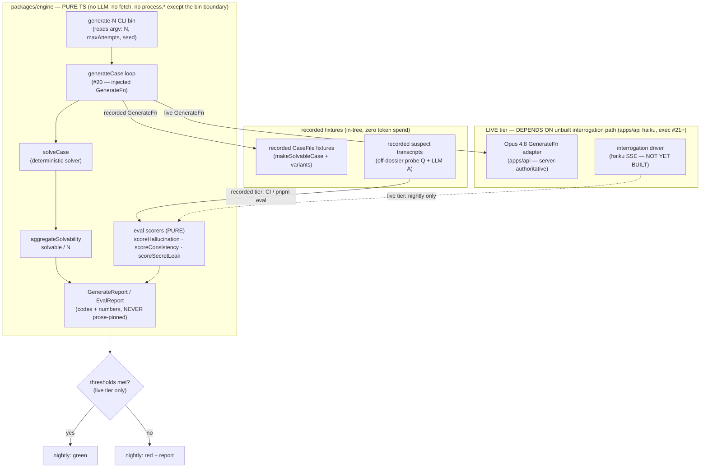

# Plan — packages/engine: hallucination eval harness + generate-N CLI (Issue #4)

> Produced by `/archwd --mode=plan` for GitHub issue [anisha-agarwal/ai-whodunit#4](https://github.com/anisha-agarwal/ai-whodunit/issues/4).
> This is the canonical, adversary-reviewed planning deliverable. It is PLAN ONLY — no production code is written by the plan run.

## What the user asked for (classifier summary)

Produce a detailed implementation plan (Mermaid diagram, type sketches, file list, test strategy) for the `packages/engine` hallucination eval harness and generate-N CLI.

**Signals:** GitHub label `plan`; title contains `[Plan]`; body says "THIS ISSUE IS PLAN ONLY (no code)"; framed as a planning milestone that unblocks execution issue #21; instruction to produce via `/archwd --mode=plan`.

**Mode:** plan · **Complexity:** XL · **Unblocks:** Exec issue #21.

---

# feature-plan — [M1] packages/engine: hallucination eval harness + generate-N CLI (Issue #4)

> One-way build plan. Every row is a net-new **ADD**. Grounded in: the issue prose; `~/Documents/ai-whodunit/README.md`;
> `references/code-quality.md`; `docs/plans/01-shared-schemas.md`, `02-engine-solver.md`, `03-engine-case-generator.md`;
> the real `packages/shared` Zod schemas (`dossier.ts`, `trigger.ts`, `redaction.ts`) + `packages/engine` solver
> (`solve.ts`, `verdict.ts`) on this worktree. Verified this run: **no `apps/` dir exists**, **no interrogation /
> verifier / SSE / prompt-template surface exists**, **`generateCase` does not exist yet** (planned #3 / exec #20,
> unmerged), **no `package.json` defines an `eval` script** (only `turbo.json` has the `eval` task wired),
> **no nightly/cron workflow** (`.github/workflows/{ci,unblock-exec}.yml` only).

---

## 0. Grounding read — what exists vs. what this plan must ASSUME

### 0a. What exists today (this work CONSUMES, never redefines)

- `@ai-whodunit/engine` — `solveCase(caseFile): SolverVerdict` (`packages/engine/src/solve.ts`), pure/total/deterministic;
  `SolverVerdict` carries only booleans + branded ids + enum codes (`verdict.ts`) — **no dossier field / secret /
  `isGuilty` / solution field crosses into it** (the server-authoritative invariant is already honored by the verdict).
- `@ai-whodunit/shared` — `CaseFile` Zod schema + `Dossier`/`Secret`/`Alibi`/`Knowledge`/`Trigger`, the `Public*`
  projection + `toPublicCaseFile`/`redactDossier`/`redactClue` redaction chokepoint, `validateAccusation`, stable
  `CaseIssueCode`. The dossier's runtime grounding boundary is `knowledge.knows` (the closed world); `secrets[].fact`
  ∈ `knows \ knownFacts`, released only on `secrets[].leakTrigger` (`dossier.ts:6-20`, `trigger.ts`).
- `packages/engine/tests/fixtures/cases.ts` — `RawCase` + `makeSolvableCase(overrides?)`: a canonical parse-valid +
  solvable + consistent case, plus one-mutation fail variants. The CLI + harness reuse this as the deterministic
  generator-free fixture source.
- `turbo.json` already declares an `eval` task (`dependsOn: ["^build"]`) — but **no package defines the `eval`
  script body yet**. `pnpm eval` (CMD:eval) currently matches nothing. This plan defines the recorded-tier `eval`
  script that fills it.
- `packages/engine/vitest.config.ts` — 100/100/100/100 thresholds over `src/**` (excludes `src/index.ts`, `*.test.ts`,
  `tests/**`); Stryker `break:100` implied by the deterministic-package bar.

### 0b. What this work must ASSUME / DEPEND ON (not yet built — explicit dependency ordering)

This is the load-bearing dependency reality, and it splits the feature in two:

1. **`generateCase` (the case generator) is planned in #3 / exec #20 and is NOT merged.** The "generate-N CLI"
   drives `generateCase`. **This plan's Phase 1 (CLI) is blocked on #20 merging first.** The case-gen plan
   explicitly scope-fences the CLI OUT as "a downstream consumer of `generateCase` + `solveCase`"
   (`03-engine-case-generator.md` §Scope-fences). The CLI imports the engine barrel's `generateCase` + `solveCase`
   + `GenerationResult`/`GenerationDeps`/`GenerateFn` — all of which #20 adds. **If #20 has not merged when Phase 1
   is dispatched, Phase 1 is BLOCKED — do not stub `generateCase`.**

2. **The interrogation surface (AI suspects answering over haiku, `apps/api` SSE) does NOT exist** (no `apps/api`,
   no prompt template, no verifier, no `messages.stream`). The eval harness's headline job — "probe AI suspects
   with off-dossier questions" — needs a *suspect-response producer*. There are **two tiers**, and they have
   **different dependencies**:
   - **Recorded tier (CI, deterministic, zero token spend)** — replays *recorded suspect-response fixtures*
     through the **pure deterministic eval scorers**. This tier depends on **nothing that is unbuilt**: the
     scorers are pure functions over a recorded transcript + the dossier, and the fixtures are hand-authored
     (or, later, captured from the live tier). **Phase 2 builds this tier in full.**
   - **Live tier (nightly, threshold-gated, real token spend)** — drives the *real* interrogation path against
     freshly generated cases, captures transcripts, scores them with the **same** pure scorers, and gates on
     thresholds. This tier **depends on the not-yet-built interrogation path** (`apps/api` haiku call site,
     exec #21+). **Phase 3 builds the scorer-side + nightly harness scaffold and the fixture-capture seam, but
     the live *driver* is wired only once the interrogation surface lands.** This plan states that dependency
     explicitly rather than assuming the path exists (issue scope-note 4).

3. **`pnpm eval` / `turbo run eval`** is the recorded tier's entry. The live tier runs under a **new nightly
   GitHub workflow** (`.github/workflows/nightly-eval.yml`, `on: schedule`) — there is no nightly workflow today.

### 0c. The deterministic / LLM split (issue scope-note 3 — stated up front)

| Concern | Deterministic (code) | LLM-driven |
|---|---|---|
| Solvability % over N cases | YES — computed by the existing `solveCase` over each generated `CaseFile`. The solver is CODE, never an LLM (prelude). | — |
| Case generation (producing the N candidates) | the generate→solve→regenerate **loop** is pure code | the *candidate prose* per attempt comes from Opus 4.8 **via the injected `GenerateFn`** (recorded fixture in CI; real adapter in `apps/api`) |
| The eval **scorers** (hallucination / consistency / secret-leak-before-trigger) | **YES — pure deterministic functions** over `(recorded transcript, dossier)` → numeric/boolean verdicts. This is the quality-bar requirement: "each LLM behavior change ships a FAIL→PASS eval with a pure deterministic scorer." | — |
| The **suspect responses being scored** | — | LLM-driven (haiku). Captured as recorded fixtures for CI; produced live nightly. |

**Net:** the *only* LLM-driven artifacts are (a) the case-candidate prose (already behind `GenerateFn`, #20's seam)
and (b) the suspect transcripts being probed. Everything this plan ADDS — the CLI control flow, the solvability-%
aggregation, and every eval scorer — is pure deterministic code held to 100% line+branch coverage.

---

## Surface

**`packages/engine` generate-N CLI + the pure deterministic eval-scorer library + the recorded eval tier
(`pnpm eval`), plus the nightly live-tier harness scaffold whose live driver is dependency-gated on the
unbuilt interrogation path.** All net-new, all inside `packages/engine` (pure TS — no React/DB/Next/`fetch`).
The CLI is a Node entry script that imports the pure engine and writes a report to stdout/a file; it reads
`process.argv` only at the bin boundary (the pure library never touches `process.*`).

---

## Mermaid diagram — the two-tier eval architecture + the generate-N CLI data flow



*(Solid edges = built in this plan's phases; dashed `-.->` = the live driver wired only when the interrogation
path lands. Validated as `flowchart TD` with quoted labels and `<br/>` line breaks — the repo's working
convention; avoids the `..|>` token that broke a prior diagram per commit `1da6230`.)*

---

## Build table (one-way — every row is an ADD)

| Behavior to build | whodunit destination (file:symbol) | Pattern anchor | user_visible |
|---|---|---|---|
| **CLI: parse `--n`, `--max-attempts`, `--seed`, `--out` from argv (the ONLY `process.*` touch)** | `packages/engine/src/cli/args.ts:parseGenerateArgs` (new) | `engine/src/verdict.ts` stable-code shape; pure-fn-over-input discipline | false |
| **CLI: generate+validate N cases via `generateCase`, collect each `GenerationResult`** | `packages/engine/src/cli/generate-n.ts:generateN` (new) | `03-engine-case-generator.md` `generateCase` signature; `engine/src/solve.ts` total-fn shape | false |
| **Compute solvability % deterministically (`solveCase` over each accepted case; count `solvable && consistent`)** | `packages/engine/src/cli/generate-n.ts:aggregateSolvability` (new) | `engine/src/solvability.ts` `proveSolvable` (booleans, no prose); `solveCase` verdict | false |
| **`GenerateReport` result type (N, accepted, rejected-by-reason histogram, solvability %, per-case stable codes)** | `packages/engine/src/cli/types.ts:GenerateReport` (new) | `engine/src/verdict.ts:SolverVerdict` (codes+numbers, no prose); `GenerationResult` union | false |
| **CLI bin entry (`#!/usr/bin/env node` shim → `parseGenerateArgs` → `generateN` → write `GenerateReport` JSON to `--out`/stdout)** | `packages/engine/src/cli/bin.ts` (new) + `package.json#bin."wd-generate-n"` | engine `package.json` `exports` shape; pure lib called from a thin bin | true (operator-visible CLI output) |
| **Eval scorer: `scoreHallucination` — a turn's `assertedFacts` containing a string ∉ `knowledge.knows` is a HALLUCINATED_FACT (exact set membership over the closed world — NOT NLU over `answer`); in-character ignorance never flags** | `packages/engine/src/eval/scorers/hallucination.ts:scoreHallucination` (new) | `engine/src/solve.ts` decidable-predicate-over-parsed-input shape; consumes `Dossier`/`Knowledge` without redefining | false |
| **Eval scorer: `scoreConsistency` — SELF_CONTRADICTION via set algebra over per-turn `assertedFacts`/`negatesFacts` + `knowledge.doesNotKnow` (M2: a NOVEL deterministic predicate, NOT the cross-suspect alibi-uniqueness `checkClueCollision`)** | `packages/engine/src/eval/scorers/consistency.ts:scoreConsistency` (new) | `engine/src/solve.ts` decidable-predicate-over-parsed-input shape (NOVEL predicate — no existing contradiction detector to copy) | false |
| **Eval scorer: `scoreSecretLeak` — a turn's `revealedSecretIndices[k]` is a violation unless trigger-index `k` ∈ the cumulative `firedTriggerIndices` of that-or-a-prior turn (C2: identify a fired trigger BY INDEX `k`, not by structural `Trigger` equality — defeats payload-less `contradiction-exposed` / opaque `fact-confronted` aliasing); return leak count** | `packages/engine/src/eval/scorers/secret-leak.ts:scoreSecretLeak` (new) | `shared/src/trigger.ts` `Trigger` union; `dossier.ts:6-20` knows/secrets model (index discipline mirrors `clues[].refersTo` id-keying) | false |
| **`RecordedTurn` (incl. the C1/C2/M2 tag fields `assertedFacts`/`negatesFacts`/`revealedSecretIndices`/`firedTriggerIndices`) / `RecordedTranscript` / `EvalReport` / `EvalIssueCode` types — engine-local fixture contract + aggregated scorer report (stable codes + numbers); NO `shared` schema change** | `packages/engine/src/eval/types.ts` (new) | `RawCase` fixture shape in `tests/fixtures/cases.ts`; `SolverVerdict` codes+numbers; `clues[].refersTo` index-keying discipline | false |
| **`runEvalSuite` — pure aggregator: run all 3 scorers over a set of `RecordedTranscript`s, produce `EvalReport` with hallucination rate / consistency / secret-leak count + per-probe codes** | `packages/engine/src/eval/run-eval.ts:runEvalSuite` (new) | `03` `generateCase` aggregate-history selector (decide from accumulated facts); `validateAccusation` collect shape | false |
| **Threshold gate `evalThresholdsMet(report, thresholds)` — pure boolean: hallucination ≤ max, consistency ≥ min, secret-leak === 0** | `packages/engine/src/eval/run-eval.ts:evalThresholdsMet` (new) | `engine/src/solve.ts` `issues empty ⟺ solvable && consistent` decidable-predicate shape | false |
| **Recorded-tier `eval` entry (loads recorded transcript fixtures → `runEvalSuite` → `evalThresholdsMet` → exit code; the `pnpm eval` body)** | `packages/engine/src/eval/bin.ts` (new) + `package.json#scripts.eval` | `turbo.json` already declares the `eval` task; CMD:eval | true (CI / operator-visible eval output) |
| **Live-tier harness scaffold: `runLiveEval(driver, deps)` — same pure scorers, parameterized over an INJECTED `InterrogationDriver` port (recorded fake in tests; real haiku driver supplied by `apps/api` later)** | `packages/engine/src/eval/live/run-live.ts:runLiveEval`, `:InterrogationDriver` port (new) | `03` `GenerateFn` injected-port pattern (engine stays pure; impure transport injected) | false |
| **Nightly workflow that runs the live tier on a schedule and gates on thresholds** | `.github/workflows/nightly-eval.yml` (new) | `.github/workflows/ci.yml` `verify` job shape | true (CI signal) |
| **Barrel: export the eval scorers + `runEvalSuite` + types + `generateN`/`GenerateReport` from the engine package** | `packages/engine/src/index.ts` (extend) | existing barrel (`export {}` value + `export type {}`) | false |
| **C3: exclude the bin entry scripts from the vitest coverage surface (add `'src/**/bin.ts'` to the `coverage.exclude` array — alongside the existing `'src/index.ts'`)** | `packages/engine/vitest.config.ts` (modify) — `coverage.exclude` | the existing `src/index.ts` exclusion at `vitest.config.ts:18` (same justification: no executable branch beyond the argv/exit shim) | false |
| **C3: exclude the bin entry scripts from the Stryker mutation surface (add `'!src/**/bin.ts'` to `mutate` — alongside the existing `'!src/index.ts'`)** | `packages/engine/stryker.conf.json` (modify) — `mutate` | the existing `'!src/index.ts'` exclusion in `stryker.conf.json` `mutate` (same justification) | false |

> **No REMOVE rows.** Everything is net-new; nothing pre-existing conflicts with this feature.
>
> **C3 note — the bin-exclusion precedent is made REAL.** The current config excludes ONLY the literal
> `src/index.ts` (`vitest.config.ts:18`; `stryker.conf.json` `mutate: [..., "!src/index.ts"]`). `src/**/bin.ts`
> is NOT excluded today, so without the two config rows above the bins would land in the 100%/break:100 surface
> and G2 fails — OR a coder silently widens a gate (a banned band-aid). The two rows authorize the exclusion
> explicitly, in the SAME shape and with the SAME justification as `src/index.ts` (a thin argv/`process.exit`/
> file-write shim with no executable branch; the pure library it calls is 100% covered). This is NOT lowering a
> threshold — coverage/mutation `break` stays at 100; only the non-executable bin shim is scoped out, by config
> the plan authorizes editing.

### Server-authoritative / grounding cross-check (per code.md — done at plan time, not deferred)

- **Every scorer is pure and reads server-only data (`knowledge.knows`, `secrets[].fact`, `leakTrigger`) — and that
  is CORRECT, because the eval harness runs SERVER-SIDE / in CI, never in a client bundle.** The scorers consume the
  full dossier *to judge grounding*; they never emit it. `EvalReport` / `GenerateReport` carry only **codes +
  numbers** (hallucination rate, consistency score, leak count, per-probe stable codes) — no dossier field, secret,
  `isGuilty`, or solution field. This is the same discipline `SolverVerdict` already follows. (See R3 in §Self-audit.)
- **The grounding invariant is what the scorers MEASURE.** `scoreHallucination` operationalizes "no utterance asserts
  a fact absent from the dossier"; `scoreSecretLeak` operationalizes "secrets release only on their trigger." The
  harness is the executable check of the headline reliability claim — exactly the "evals as a feature" goal (README).
- **`packages/engine` stays pure.** The CLI bin and eval bin touch `process.argv`/`process.exit`/file-write **only
  at the `*/bin.ts` boundary** (Node entry scripts). These bins are **NOT excluded today** — the live config
  excludes only the literal `src/index.ts` — so this plan ADDS two config-edit rows (C3 in the build table) to
  exclude `src/**/bin.ts` from both the vitest coverage surface and the Stryker `mutate` surface, in the same
  shape and with the same justification as `src/index.ts`. The pure library (`cli/generate-n.ts`, `cli/args.ts`,
  `eval/**` except `bin.ts`) imports only `@ai-whodunit/shared` + the local engine — never `fetch`,
  `@anthropic-ai/sdk`, React, DB, or Next — and stays in the 100%/break:100 surface. The live interrogation
  transport is reached only through the injected `InterrogationDriver` port (mirrors #20's `GenerateFn`).
- **The solver stays code.** Solvability % is `solveCase` counted over N — no LLM judges solvability.

---

## Phase decomposition (>1 PR — 3 phases, each independently landable)

| Phase | Scope | Landable alone? | Rationale / dependency |
|---|---|---|---|
| **1 — generate-N CLI** | `cli/{args,generate-n,types,bin}.ts` + barrel + `package.json#bin` + `#scripts` for the CLI. Generates+validates N cases via `generateCase`, computes solvability % via `solveCase`, emits `GenerateReport`. | yes | **DEPENDS ON #20 (`generateCase`) being merged.** Pure-TS, no API/web. If #20 is unmerged at dispatch, Phase 1 is BLOCKED — surface it, do not stub the generator. |
| **2 — recorded eval tier** | `eval/scorers/{hallucination,consistency,secret-leak}.ts` + `eval/{types,run-eval,bin}.ts` + recorded transcript fixtures + barrel + `package.json#scripts.eval` + the C3 bin-exclusion config edit. The 3 pure scorers, `runEvalSuite`, `evalThresholdsMet`, and the `pnpm eval` recorded-replay entry. | yes (CONFIRMED) | Depends on `solveCase` + `shared` (both present). **Independence CONFIRMED post-C1 fix (M3):** the determinism-enabling fact-tag fields (`assertedFacts`/`negatesFacts`/`revealedSecretIndices`/`firedTriggerIndices`) live on the ENGINE-LOCAL `RecordedTurn` fixture type — NO `@ai-whodunit/shared` change, NO external dependency. Scorers run over hand-authored recorded transcript fixtures. Deterministic, zero-token-spend CI tier. Independent of Phase 1 and of the interrogation path. |
| **3 — live eval tier scaffold + nightly** | `eval/live/run-live.ts` (`runLiveEval` + `InterrogationDriver` port) + `.github/workflows/nightly-eval.yml`. The live tier reuses Phase-2 scorers behind an injected driver port; the nightly workflow runs it on a schedule and gates on thresholds. | yes (scaffold + nightly with a recorded driver) | Depends on Phase 2's scorers. **The live DRIVER (real haiku interrogation) is supplied by `apps/api` at exec #21+ — NOT in this plan.** Phase 3 ships the pure port + the nightly workflow wired against a recorded driver; the live driver is plugged in when the interrogation surface lands. State this dependency in the PR body's Gaps section. |

**Ordering note for the orchestrator:** Phases 2 and 3 do NOT depend on Phase 1. Phase 1 depends on #20. If #20 is
not yet merged, dispatch Phase 2 first (it unblocks the recorded eval tier and `pnpm eval` immediately), then Phase 3,
and run Phase 1 once #20 lands. This plan unblocks exec #21 by defining the scorer contract the live tier will reuse.

---

## Scope fences — what each phase will NOT touch

*(Fences stop gold-plating; they are not licence to ship something broken. If a fenced row is genuinely required
for correctness, surface a scope-expansion request — do not half-implement.)*

- **The Opus 4.8 / `@anthropic-ai/sdk` transport adapter, the Anthropic key, real network calls** — out of scope
  (all phases). Justified: importing the SDK or `fetch` into `packages/engine` breaks engine purity AND would place
  the Anthropic key in a pure package (double invariant violation). The CLI reaches the LLM only through #20's
  injected `GenerateFn`; the live eval reaches it only through the `InterrogationDriver` port. The real adapters
  live in `apps/api`.
- **`generateCase` itself (the generate→solve→regenerate loop)** — out of scope. It is #3 / exec #20's deliverable;
  Phase 1 CONSUMES it. Justified: re-implementing it here would duplicate #20 and split the contract.
- **The real interrogation path (haiku SSE, prompt templates, the verifier, `apps/api`)** — out of scope (all
  phases). Justified: it does not exist yet (exec #21+). Phase 3 ships the `InterrogationDriver` *port* so the live
  tier is ready to plug it in; building the driver here would invent a surface this plan has no design source for.
- **DB persistence of generated cases / eval results** — out of scope. Justified: a DB client in pure engine breaks
  purity; persistence is an `apps/api` concern. The CLI writes a JSON report to a file/stdout (a bin-boundary side
  effect), not a database.
- **Client-bound redaction / `toPublicCaseFile` wiring** — out of scope. Justified: the eval harness runs
  server-side / in CI and never emits a client payload; redaction is `shared`'s chokepoint, exercised at the
  api/web milestones, not here.
- **The case-generation prompt + JSON-schema contract (`caseGenerationFormat`, `caseGenerationSystemPrompt`)** —
  out of scope. Justified: #20 owns it; Phase 1's CLI passes #20's `GenerationRequest` through unchanged.

---

## Pattern anchors (copy these — all present on this worktree)

- `packages/engine/src/solve.ts` — the **pure, total, deterministic, never-throws** function shape; `safeParse`
  defensively then trust the contract; assemble a codes-only result. Both the CLI aggregator and every scorer mirror
  this (read structural facts → return codes + numbers, never prose).
- `packages/engine/src/verdict.ts` — the **stable `as const` issue-code map + codes-only result type** the
  `GenerateReport` / `EvalReport` and the scorer verdicts copy (tests assert the SPECIFIC code, never a bare boolean).
- `packages/engine/src/consistency.ts` (`checkClueCollision`, `checkCulpritBreakClue`) — **pure id-only structural
  predicate over a parsed case**; the closest shape for `scoreConsistency`'s contradiction check.
- `packages/engine/tests/fixtures/cases.ts` (`RawCase`, `makeSolvableCase(overrides?)`) — the **local
  hand-authored, one-mutation-per-fail fixture builder**; the recorded transcript fixtures and the CLI's
  recorded-`GenerateFn` fixtures follow it 1:1 (deterministic, no network, replayable).
- `docs/plans/03-engine-case-generator.md` (the `GenerateFn` / `StoreFn` injected-port design, §Decisions D1) —
  the **engine-stays-pure / inject-the-impure-transport** pattern the `InterrogationDriver` port copies exactly.
- `packages/engine/{package.json, vitest.config.ts, stryker.conf.json}` + `.github/workflows/ci.yml` — the
  **deterministic-package toolchain** (100/100/100/100 vitest thresholds, Stryker `break:100`, co-located
  `src/**/*.test.ts`) and the **workflow job shape** the nightly workflow copies.

---

## Interface & type sketch

```ts
// ── packages/engine/src/cli/types.ts ──────────────────────────────────────────
import type { CaseFile } from '@ai-whodunit/shared';
import type { GenerationFailureReason, IssueCode } from '../generate/types.js'; // from #20
import type { SuspectId } from '@ai-whodunit/shared';

/** Per-case CLI outcome — codes + ids only, NEVER prose. */
export interface CaseOutcome {
  readonly accepted: boolean;
  readonly attempts: number;
  readonly culpritId: SuspectId | null;           // from the verdict when accepted; null otherwise
  readonly failureReason: GenerationFailureReason | null; // null when accepted
  readonly lastIssues: readonly IssueCode[];       // stable codes on reject; [] on accept
}

/** Aggregate report for `wd-generate-n`. Codes + numbers only — server-authoritative-safe. */
export interface GenerateReport {
  readonly requested: number;                      // N
  readonly accepted: number;
  readonly solvable: number;                       // accepted && verdict.solvable && verdict.consistent
  readonly solvabilityPct: number;                 // solvable / requested, 0..100 (deterministic)
  readonly failuresByReason: Readonly<Record<GenerationFailureReason, number>>;
  readonly outcomes: readonly CaseOutcome[];
}

// ── packages/engine/src/cli/generate-n.ts ─────────────────────────────────────
import type { GenerationDeps, GenerateOptions } from '../generate/types.js'; // from #20

export interface GenerateNOptions extends GenerateOptions {
  readonly n: number;                              // how many cases to generate+validate
}
/** Pure: drives `generateCase` N times, returns the aggregate. NEVER throws (mirrors solveCase). */
export function generateN(deps: GenerationDeps, opts: GenerateNOptions): Promise<GenerateReport>;
/** Pure: solvable / requested as a 0..100 number, computed from per-case verdicts (NOT an LLM). */
export function aggregateSolvability(outcomes: readonly CaseOutcome[], requested: number): number;

// ── packages/engine/src/cli/args.ts ───────────────────────────────────────────
export interface ParsedArgs {
  readonly n: number;
  readonly maxAttempts: number;
  readonly seed?: string;
  readonly out?: string;                           // file path; absent ⇒ stdout
}
/** Pure parse over a string[] (argv slice). Total: invalid input → a typed error result, never throws. */
export function parseGenerateArgs(argv: readonly string[]):
  | { readonly ok: true; readonly args: ParsedArgs }
  | { readonly ok: false; readonly code: 'MISSING_N' | 'INVALID_N' | 'INVALID_MAX_ATTEMPTS' };

// ── packages/engine/src/eval/types.ts ─────────────────────────────────────────
//   ALL types below are ENGINE-LOCAL fixture/report types — NOT a `shared` schema change.
//   The structured tag fields (assertedFacts/negatesFacts/revealedSecretIndices/firedTriggerIndices)
//   live ONLY here (see C1/C2 fix + §Decisions D2). No `@ai-whodunit/shared` edit.
import type { Dossier } from '@ai-whodunit/shared';

/**
 * A recorded probe + the LLM suspect's recorded answer + the STRUCTURED TAGS that make scoring
 * deterministic. The fixture author hand-authors BOTH the `answer` prose AND its structured tags
 * (the honest cost of a pure deterministic scorer — see §Decisions D2). The live tier's driver
 * (apps/api, later) MUST emit this same tagged shape from a real haiku transcript. The fixture unit.
 */
export interface RecordedTurn {
  readonly probe: string;                          // the (possibly off-dossier) question asked
  readonly answer: string;                         // the recorded suspect utterance (audit/readability; NOT scored by NLU)
  // ── structured tags the scorers actually read (set-membership, not NLU) ──
  readonly assertedFacts: readonly string[];       // C1/M2: the dossier-fact strings this answer asserts
  readonly negatesFacts: readonly string[];        // M2: the facts this answer denies/contradicts
  readonly revealedSecretIndices: readonly number[];   // C2: indices into dossier.secrets[] this turn reveals ([] = none)
  readonly firedTriggerIndices: readonly number[];     // C2: indices into dossier.secrets[] whose OWN leakTrigger has
                                                       //      fired AS OF this turn (cumulative). A fired trigger is
                                                       //      identified BY THIS INDEX (secret index k == its trigger's
                                                       //      identifying index), NOT by structural Trigger equality —
                                                       //      so payload-less/opaque trigger kinds cannot alias.
}
/**
 * A recorded transcript for ONE suspect, scored against that suspect's full (server-only) dossier.
 * The k-th secret's `leakTrigger` IS trigger index k — no separate registry object exists; the secret's
 * own position in `dossier.secrets[]` is its trigger's identifying index. This index discipline defeats
 * the C2 hole that `contradiction-exposed` (no payload) and `fact-confronted` (opaque prose) triggers
 * cannot be distinguished by structural equality.
 */
export interface RecordedTranscript {
  readonly dossier: Dossier;                       // server-only; used to JUDGE grounding, never emitted
  readonly turns: readonly RecordedTurn[];
  // A secret reveal (revealedSecretIndices[k]) is gated on trigger-index k appearing in the cumulative
  // firedTriggerIndices of that-or-a-prior turn — never on "some trigger of any kind fired".
}

/** Stable per-probe scorer codes — assert the SPECIFIC code, never a bare boolean. */
export const EvalIssueCode = {
  HALLUCINATED_FACT: 'HALLUCINATED_FACT',          // answer asserts a fact ∉ knowledge.knows
  SELF_CONTRADICTION: 'SELF_CONTRADICTION',        // answer contradicts an earlier turn / knownFacts
  SECRET_LEAKED_BEFORE_TRIGGER: 'SECRET_LEAKED_BEFORE_TRIGGER', // secret.fact surfaced before leakTrigger fired
} as const;
export type EvalIssueCode = (typeof EvalIssueCode)[keyof typeof EvalIssueCode];

export interface ProbeVerdict {
  readonly turnIndex: number;
  readonly codes: readonly EvalIssueCode[];        // [] ⇒ this turn is grounded + leak-clean
}
/** Aggregate eval report — rates + counts + per-probe codes. No dossier/secret field crosses out. */
export interface EvalReport {
  readonly probes: number;
  readonly hallucinationRate: number;              // hallucinated turns / probes, 0..1
  readonly consistencyScore: number;               // 1 - (contradicting turns / probes), 0..1
  readonly secretLeakCount: number;                // turns leaking a secret before its trigger
  readonly verdicts: readonly ProbeVerdict[];
}
export interface EvalThresholds {
  readonly maxHallucinationRate: number;           // e.g. 0.0 for the strict CI tier
  readonly minConsistencyScore: number;            // e.g. 1.0
  // secretLeakCount must always be 0 — no threshold knob (a leak is never acceptable).
}

// ── packages/engine/src/eval/scorers/*.ts (PURE deterministic — set/index predicates) ──
/**
 * HALLUCINATED_FACT ⟺ a turn's `assertedFacts` contains a string ∉ `dossier.knowledge.knows`
 * (exact set membership over the closed world — NOT NLU over `answer`). In-character ignorance
 * (empty `assertedFacts`, or facts ∈ `knows`) never flags.
 */
export function scoreHallucination(t: RecordedTranscript): readonly ProbeVerdict[];
/**
 * SELF_CONTRADICTION ⟺ (ARM 1) a later turn's `assertedFacts` ∩ an earlier turn's `negatesFacts` ≠ ∅,
 * OR (ARM 2) a turn's `assertedFacts` ∩ `dossier.knowledge.doesNotKnow` ≠ ∅. EXACTLY two arms —
 * deterministic set algebra over the tags (see M2). Each arm has a dedicated test-plan + mutation-probe
 * row, so the 100% line+branch gate is satisfiable. (No third "asserted-and-negated within the run" arm —
 * dropped in round-2 MAJOR B as redundant: a single turn that both asserts and negates the same fact is
 * already a same-turn instance of ARM 1, needing no separate branch.)
 */
export function scoreConsistency(t: RecordedTranscript): readonly ProbeVerdict[];
/**
 * SECRET_LEAKED_BEFORE_TRIGGER ⟺ a turn's `revealedSecretIndices` contains a secret index k whose
 * trigger index k is NOT present in the cumulative `firedTriggerIndices` of that turn OR any prior
 * turn. Identified BY INDEX (k), so payload-less `contradiction-exposed` and opaque `fact-confronted`
 * triggers are distinguished — defeating the C2 "any contradiction-exposed satisfies the gate" hole.
 */
export function scoreSecretLeak(t: RecordedTranscript): readonly ProbeVerdict[];

// ── packages/engine/src/eval/run-eval.ts ──────────────────────────────────────
/** Pure aggregator over a set of transcripts → EvalReport. Total, never throws. */
export function runEvalSuite(transcripts: readonly RecordedTranscript[]): EvalReport;
/** Pure boolean gate. secretLeakCount === 0 is mandatory; the other two compare to thresholds. */
export function evalThresholdsMet(report: EvalReport, thresholds: EvalThresholds): boolean;

// ── packages/engine/src/eval/live/run-live.ts (scaffold; live driver injected) ─
/** Port: produces a RecordedTranscript by driving the REAL interrogation path. Supplied by apps/api later. */
export type InterrogationDriver = (dossier: Dossier, probes: readonly string[]) => Promise<RecordedTranscript>;
/** Pure orchestration: drive N suspects via the injected driver, score with the SAME scorers, gate. */
export function runLiveEval(
  driver: InterrogationDriver,
  input: { readonly dossiers: readonly Dossier[]; readonly probes: readonly string[]; readonly thresholds: EvalThresholds },
): Promise<{ readonly report: EvalReport; readonly passed: boolean }>;
```

> **Scorer grounding note (load-bearing for the test author) — and the honest tradeoff it carries.** A pure
> deterministic scorer CANNOT do open-ended NLU. So the determinism is bought by **relocating the grounding
> judgment into the fixture author's hands**: each `RecordedTurn` carries explicit structured tags —
> `assertedFacts`, `negatesFacts`, `revealedSecretIndices`, `firedTriggerIndices` — and the scorers are pure
> set-membership / index predicates over those tags + the dossier's closed world (`knowledge.knows`,
> `knowledge.doesNotKnow`, `secrets[]`). The `answer` prose is kept for audit/readability but is **never parsed**.
>
> This is a real, explicit cost, stated plainly: **the fixture author hand-authors BOTH the LLM `answer` prose AND
> its structured fact tags.** The recorded (CI) tier scores the tags; the live (nightly) tier's `InterrogationDriver`
> (apps/api, exec #21+) MUST produce the SAME tagged shape from a real haiku transcript — i.e. the interrogation
> milestone owns the answer→tags extraction (its own verifier path). Without the tags, the only implementation of
> "does this answer assert a fact ∉ knows" is NLU, which D2 rejects as non-deterministic and un-coverable-to-100%.
> The tag fields live ONLY on the engine-local `RecordedTurn` fixture type — **no `@ai-whodunit/shared` schema
> change** (the dossier facts stay `string[]`; the tags reference them by exact string / by secret index). See
> §Decisions D2 + §Open-questions Q1.

---

## Exact file list

**Phase 1 (CLI):**
- `packages/engine/src/cli/args.ts` (new) — `parseGenerateArgs`, `ParsedArgs`.
- `packages/engine/src/cli/generate-n.ts` (new) — `generateN`, `aggregateSolvability`, `GenerateNOptions`.
- `packages/engine/src/cli/types.ts` (new) — `GenerateReport`, `CaseOutcome`.
- `packages/engine/src/cli/bin.ts` (new) — `#!/usr/bin/env node` entry (the only `process.*` touch).
- `packages/engine/src/index.ts` (modify) — additive barrel re-exports.
- `packages/engine/package.json` (modify) — add `bin: { "wd-generate-n": "./dist/cli/bin.js" }` + a `generate:n` script.
- `packages/engine/vitest.config.ts` (modify, C3) — add `'src/**/bin.ts'` to `coverage.exclude`.
- `packages/engine/stryker.conf.json` (modify, C3) — add `'!src/**/bin.ts'` to `mutate`.
- co-located specs: `packages/engine/src/cli/{args,generate-n}.test.ts` (test-author).
- `packages/engine/tests/fixtures/generate-n.ts` (new fixtures: recorded `GenerateFn` scripts; test-author).

> **M1 — `tsconfig.build.json` emits the new dirs (verified, no build-table row needed).**
> `packages/engine/tsconfig.build.json` has `include: ["src/**/*.ts"]` (and excludes only `*.test.ts`/`*.test-d.ts`/
> `tests/**`). `src/cli/**` and `src/eval/**` therefore emit to `dist/cli/**` and `dist/eval/**`, so
> `bin: "./dist/cli/bin.js"` and `scripts.eval: "node ./dist/eval/bin.js"` resolve at runtime. No tsconfig edit
> required; this is a confirmed note, not a build row.

**Phase 2 (recorded eval tier):**
- `packages/engine/src/eval/scorers/hallucination.ts` (new) — `scoreHallucination`.
- `packages/engine/src/eval/scorers/consistency.ts` (new) — `scoreConsistency`.
- `packages/engine/src/eval/scorers/secret-leak.ts` (new) — `scoreSecretLeak`.
- `packages/engine/src/eval/types.ts` (new) — `RecordedTranscript`, `RecordedTurn`, `EvalReport`, `EvalIssueCode`, `EvalThresholds`, `ProbeVerdict`.
- `packages/engine/src/eval/run-eval.ts` (new) — `runEvalSuite`, `evalThresholdsMet`.
- `packages/engine/src/eval/bin.ts` (new) — the `pnpm eval` recorded-replay entry (bin boundary).
- `packages/engine/src/index.ts` (modify) — additive barrel re-exports.
- `packages/engine/package.json` (modify) — add `"eval": "node ./dist/eval/bin.js"` script (fills the `turbo.json` `eval` task).
- `packages/engine/vitest.config.ts` + `packages/engine/stryker.conf.json` (modify, C3) — ensure the `src/**/bin.ts` glob is present in `coverage.exclude` / `mutate` so `eval/bin.ts` is excluded. **Idempotent:** the `src/**/bin.ts` glob covers both `cli/bin.ts` and `eval/bin.ts`. If Phase 1 already landed it, Phase 2 verifies it is present (no-op); if Phase 2 lands first, it adds the glob. Either phase that introduces a `bin.ts` MUST own the exclusion — never ship a bin into the 100%/break:100 surface.
- co-located specs: `packages/engine/src/eval/scorers/{hallucination,consistency,secret-leak}.test.ts`, `packages/engine/src/eval/run-eval.test.ts` (test-author).
- `packages/engine/tests/fixtures/transcripts.ts` (new recorded transcript fixtures; test-author).

**Phase 3 (live tier scaffold + nightly):**
- `packages/engine/src/eval/live/run-live.ts` (new) — `runLiveEval`, `InterrogationDriver`.
- `packages/engine/src/index.ts` (modify) — additive barrel re-export of the port + `runLiveEval`.
- `packages/engine/src/eval/live/run-live.test.ts` (new; recorded-driver fake) (test-author).
- `.github/workflows/nightly-eval.yml` (new) — `on: schedule`, runs the live tier, gates on thresholds.

---

## Test plan

> Coder ≠ test-author split (code.md). The coder ships production code + `coverage-handoff.md` and **zero tests**;
> the test author writes ALL specs + fixtures. Specs are **co-located at `src/**/*.test.ts`** (engine convention);
> fixtures live under `packages/engine/tests/fixtures/`. Deterministic package → **100% line+branch** + Stryker
> `break:100`. The `*/bin.ts` Node entry scripts are the only `process.*`/file-write surface; they are coverage- and
> mutation-excluded by the **C3 config rows this plan ADDS** (`'src/**/bin.ts'` — NOT excluded today; only
> `src/index.ts` is) — an explicit, justified bin-boundary exclusion per code.md; the pure library they call is
> fully covered. LLM call sites use **recorded tagged-fixture replay** (assert structure + codes + closed-world
> set/index wiring, never exact LLM strings). Each scorer is the **FAIL→PASS eval with a pure deterministic scorer**
> the quality bar mandates.

| Behavior | Level | Destination | Mutation-probe target |
|---|---|---|---|
| `parseGenerateArgs` parses `--n/--max-attempts/--seed/--out`; missing/invalid `--n` → typed error code | unit | `src/cli/args.test.ts` | flip the `MISSING_N` guard → invalid argv parses as valid |
| `generateN` drives `generateCase` N times via a recorded `GenerateFn`, collects N outcomes | unit (recorded fake) | `src/cli/generate-n.test.ts` | change the loop bound `N` → wrong outcome count |
| `aggregateSolvability` = solvable/requested×100, computed from verdicts (NOT an LLM) | unit | `src/cli/generate-n.test.ts` | swap the numerator (accepted vs. solvable) → wrong % on a mixed batch |
| `GenerateReport.failuresByReason` histograms each reject's stable reason | unit (mixed recorded batch) | `src/cli/generate-n.test.ts` | drop a reason bucket → histogram undercounts |
| `generateN` is total — a rejecting `GenerateFn` batch never throws, reports `accepted:0` | unit (always-reject fake) | `src/cli/generate-n.test.ts` | remove the total-fn guard → throw escapes |
| `scoreHallucination` flags a turn asserting a fact ∉ `knowledge.knows`; passes a grounded turn | unit (recorded transcript) | `src/eval/scorers/hallucination.test.ts` | **revert the `∉ knows` check → an off-dossier fact passes (FAIL→PASS eval anchor)** |
| `scoreHallucination` does NOT flag in-character ignorance (answer references only `doesNotKnow`/no new fact) | unit | `src/eval/scorers/hallucination.test.ts` | invert the membership test → ignorance falsely flagged |
| `scoreConsistency` ARM 1 (M2) — flags a later turn whose `assertedFacts` ∩ an earlier turn's `negatesFacts` ≠ ∅ | unit (multi-turn tagged transcript) | `src/eval/scorers/consistency.test.ts` | revert the later-asserts ∩ earlier-negates intersection check → the contradicting turn passes |
| `scoreConsistency` ARM 2 (M2) — flags a turn whose `assertedFacts` ∩ `knowledge.doesNotKnow` ≠ ∅ | unit (tagged transcript) | `src/eval/scorers/consistency.test.ts` | drop the `doesNotKnow` arm → an explicit-ignorance violation passes |
| `scoreConsistency` clean pass — a consistent run (neither arm fires) yields no SELF_CONTRADICTION | unit (consistent tagged transcript) | `src/eval/scorers/consistency.test.ts` | invert either arm's guard → a consistent run falsely flags |
| `scoreSecretLeak` (C2) flags `revealedSecretIndices[k]` when trigger-index `k` has NOT fired in a prior-or-equal turn; passes a reveal after `firedTriggerIndices` includes `k` | unit (ordered tagged transcript) | `src/eval/scorers/secret-leak.test.ts` | **revert the cumulative-trigger-ordering check → a pre-trigger leak passes (grounding-invariant anchor)** |
| `scoreSecretLeak` (C2 — the wrong-evidence hole) gates secret `k` on trigger-index `k` SPECIFICALLY: a DIFFERENT trigger having fired (incl. another `contradiction-exposed`) does NOT unlock secret `k` | unit (two secrets, only the OTHER trigger fired) | `src/eval/scorers/secret-leak.test.ts` | **change the gate from "index k fired" to "any trigger fired" / structural `Trigger.includes` → the wrong (payload-less) evidence satisfies the gate, a pre-trigger leak PASSES** |
| `runEvalSuite` aggregates rates/counts + per-probe codes across transcripts | unit | `src/eval/run-eval.test.ts` | source a rate from the wrong numerator → value assertion fails |
| `evalThresholdsMet` — secretLeakCount>0 ALWAYS fails regardless of other thresholds | unit | `src/eval/run-eval.test.ts` | make leak-count threshold-tunable → a leak passes |
| `evalThresholdsMet` — hallucination > max fails; ≤ max passes (boundary) | unit (boundary fixtures) | `src/eval/run-eval.test.ts` | flip `<=` to `<` → boundary mis-gates |
| `runLiveEval` drives the injected `InterrogationDriver`, scores with the SAME scorers, gates | unit (recorded-driver fake) | `src/eval/live/run-live.test.ts` | swap the injected driver call → scorers run on stale/empty input |
| Barrel re-exports the scorers + `runEvalSuite` + `generateN` + types | unit (smoke import) | `src/index.test.ts` (extend) | covered transitively |

**Not directly tested (cited + flagged for the PR body Gaps section):**
- `cli/bin.ts` + `eval/bin.ts` (Node entry scripts) — coverage- and mutation-excluded via the C3 config rows
  (`'src/**/bin.ts'` added to `vitest.config.ts` `coverage.exclude` + `'!src/**/bin.ts'` added to `stryker.conf.json`
  `mutate`), in the SAME shape as the existing `src/index.ts` exclusion. **The current config does NOT exclude
  `bin.ts` — this plan ADDS that exclusion explicitly (see C3 build rows); it is NOT a silent gate widening.** The
  pure libraries the bins call (`generateN`, `runEvalSuite`, every scorer) stay in the 100%/break:100 surface and
  are 100% covered. Flagged: explicit, justified bin-boundary exclusion per code.md.
- `.github/workflows/nightly-eval.yml` (YAML, no unit surface) — validated by a smoke/lint of the workflow, not a
  vitest spec. Flagged.
- **The LIVE interrogation driver** — NOT tested here because it is NOT built here (exec #21+). Flagged as the
  headline dependency gap: Phase 3 tests `runLiveEval` against a *recorded* driver fake only; the real haiku driver
  ships with the interrogation milestone, which must add its own recorded-fixture replay + FAIL→PASS eval.

---

## Blast radius

- **Symbols to change:** none existing — net-new module set. New symbols: `parseGenerateArgs`, `ParsedArgs`,
  `generateN`, `aggregateSolvability`, `GenerateNOptions`, `GenerateReport`, `CaseOutcome`, `scoreHallucination`,
  `scoreConsistency`, `scoreSecretLeak`, `RecordedTranscript`, `RecordedTurn`, `EvalReport`, `EvalIssueCode`,
  `EvalThresholds`, `ProbeVerdict`, `runEvalSuite`, `evalThresholdsMet`, `runLiveEval`, `InterrogationDriver`.
  Plus additive `index.ts` re-exports.
- **Existing-symbol impact:** `engine/src/index.ts` extended (additive); `engine/package.json` gains a `bin` + 2
  scripts (`generate:n`, `eval`). `rg "generateN|scoreHallucination|runEvalSuite|InterrogationDriver"` across
  `packages/**` returns nothing today — no downstream caller exists.
- **Dependency on #20:** Phase 1 imports `generateCase` + `GenerationResult`/`GenerationDeps`/`GenerateFn` from the
  engine barrel — added by #20. `rg "generateCase"` across `packages/**` = 0 hits this run (unmerged). **Hard
  dependency; Phase 1 BLOCKS until #20 merges.**
- **No new workspace dependency** added to `packages/engine` (no `@anthropic-ai/sdk`, no `fetch` lib). Only
  `@ai-whodunit/shared` (already a dep) + the local engine.
- **CI:** `turbo run test/typecheck/lint/test:mutation` auto-pick up the new specs (tasks by-name). The recorded
  `eval` script fills the existing `turbo.json` `eval` task — `pnpm eval` (CMD:eval) goes from no-match to running
  the recorded tier. **New nightly workflow** (`.github/workflows/nightly-eval.yml`) is the only workflow addition.
- **Known affected tests already in tree:** none (net-new). `index.test.ts` is extended with a smoke import.

---

## Open questions

- **Q1 — recorded-turn structured-tag shape (C1/C2/M2).** The pure scorers need each recorded turn carrying its
  structured claim/leak tags (so every judgment is a set/index check, not NLU). The dossier today carries facts as
  `string[]` (`knows`, `knownFacts`), not id-keyed. **Decision (RESOLVED, see §Decisions D2):** the engine-local
  `RecordedTurn` fixture type carries four tag fields — `assertedFacts: string[]` (membership-checked against
  `knowledge.knows`), `negatesFacts: string[]` (the contradiction relation), `revealedSecretIndices: number[]`
  (which `dossier.secrets[]` a turn reveals), `firedTriggerIndices: number[]` (which trigger indices have fired,
  cumulative). The scorers are exact set-membership / index predicates over these — **no `@ai-whodunit/shared`
  schema change** (facts stay `string[]`; tags reference them by exact string / by secret index). A future id-keyed
  fact catalog in `shared` is a separate enhancement, explicitly deferred (§Acknowledged-deferred).
- **Q2 — live-tier driver dependency.** The live tier needs the real interrogation path, which is unbuilt.
  **DEFERRED (see §Acknowledged-deferred):** Phase 3 ships the `InterrogationDriver` port + a recorded-driver
  nightly; the live driver plugs in at the interrogation milestone (exec #21+). This is a defensible deferral —
  the port is the seam, and building the driver here has no design source.

## Decisions

### D1 — Where the CLI + eval harness live: `packages/engine`, pure, with bin-boundary side effects

The issue says "packages/engine: ... CLI ... eval harness." Both go in `packages/engine`. The purity invariant is
preserved by confining `process.argv`/`process.exit`/file-write to the two `*/bin.ts` Node entry scripts, which the
plan excludes from the coverage + mutation surface via the C3 config rows (`'src/**/bin.ts'` — the current config
excludes only the literal `src/index.ts`, so the exclusion is ADDED here, not assumed). The pure library — `generateN`,
`aggregateSolvability`, every scorer, `runEvalSuite` — imports only `@ai-whodunit/shared` + the local engine.
**Alternative compared:** a separate `packages/eval` package. Rejected — the issue scopes this to `packages/engine`,
the scorers consume the engine's `solveCase` + `shared` dossier directly, and a new package adds toolchain overhead
for no boundary benefit (the LLM transport is already fenced behind the injected ports).

### D2 — Scorers are closed-world set/index predicates over fixture-author tags, not NLU — and the explicit tradeoff

A pure, 100%-coverable, mutation-probeable scorer cannot do open-ended language understanding. It operates on the
dossier's finite closed world + the recorded turn's structured tags (C1/C2/M2):
- `scoreHallucination` = "`turn.assertedFacts` ⊄ `knowledge.knows`" (exact set membership).
- `scoreConsistency` = EXACTLY two arms — "(ARM 1) a later turn's `assertedFacts` ∩ an earlier turn's `negatesFacts`
  ≠ ∅, OR (ARM 2) a turn's `assertedFacts` ∩ `knowledge.doesNotKnow` ≠ ∅" (M2 — a NOVEL deterministic predicate;
  the previously-cited `checkClueCollision` is a cross-suspect alibi-uniqueness check and is NOT a contradiction
  detector — re-anchored). Each arm has its own test-plan row + mutation probe so the 100% branch gate is
  satisfiable. (Round-2 MAJOR B: a third "asserted-and-negated within the run" arm was dropped as redundant — a
  single turn doing both is a same-turn instance of ARM 1, no separate branch.)
- `scoreSecretLeak` = "for each `k` ∈ `turn.revealedSecretIndices`, trigger-index `k` ∈ the cumulative
  `firedTriggerIndices` of that-or-a-prior turn" (C2 — identified BY INDEX `k`, so payload-less
  `contradiction-exposed` and opaque `fact-confronted` triggers cannot alias each other; structural `Trigger`
  equality is NOT used).

**The honest tradeoff, stated explicitly:** determinism is bought by **relocating the grounding judgment into the
fixture author's hands.** The fixture author hand-authors BOTH the LLM `answer` prose AND its structured tags
(`assertedFacts`/`negatesFacts`/`revealedSecretIndices`/`firedTriggerIndices`); the recorded (CI) tier scores the
tags; the live (nightly) tier's `InterrogationDriver` (apps/api, exec #21+) MUST emit the SAME tagged shape from a
real haiku transcript (the answer→tags extraction is the interrogation milestone's own verifier responsibility).
The tag fields live ONLY on the engine-local `RecordedTurn` — **no `@ai-whodunit/shared` schema change.**
**Alternative compared:** embedding-similarity / an LLM-judge scorer. Rejected — non-deterministic, un-coverable to
100%, and would falsify "the scorer is a pure deterministic function" (the quality bar).

## Acknowledged-deferred

- **The live interrogation driver (real haiku path)** — deferred to the interrogation milestone (exec #21+). Phase 3
  ships the `InterrogationDriver` port + a recorded-driver nightly. Defensible: the port is the integration seam;
  the driver has no design source in this issue. (Closes Q2.)
- **An id-keyed fact catalog in `shared`** — deferred. The scorers use string-set membership against `knowledge.knows`
  today; an id-keyed catalog is a future `shared` enhancement, not required for the eval bar. (Relates to Q1.)

---

## Complexity budget (pre-estimate)

| Axis | Estimate |
|---|---|
| Production LOC added | ~345 (Phase 1: args ~40 + generate-n ~70 + types ~30 + bin ~20 = ~160; Phase 2: 3 scorers ~125 [+~5 for the index/set predicates] + run-eval ~45 + types ~40 [+tag fields] + bin ~20 = ~230 → minus overlap; Phase 3: run-live ~30) + ~4 LOC config-array edits — across 3 PRs |
| Test LOC added | ~520 (17 behavior rows across 6 spec files, recorded tagged-fixture replay — +2 rows for the C2 wrong-evidence hole + the M2 doesNotKnow arm) |
| E2E LOC added | 0 (no `apps/web`) |
| Fixture LOC added | ~180 (recorded `GenerateFn` scripts + recorded TAGGED transcripts incl. per-trigger-index leak fixtures, reusing `makeSolvableCase`) |
| Files modified | 4 distinct (`engine/src/index.ts` additive barrel [touched in all 3 phases — one file]; `engine/package.json` bin+scripts [P1+P2]; `engine/vitest.config.ts` + `engine/stryker.conf.json` — the C3 bin-exclusion glob [P1; verified idempotently in P2]) |
| Files added (new) | 21 (11 prod `.ts` + 7 test `.ts` co-located + 2 fixture files + 1 workflow yml — recounted from §Exact file list, m3) |
| Distinct-Edit-Patterns | 6 (argv-parse pure fn; N-iteration aggregate over `generateCase`; pure closed-world set/index scorer predicate ×3-as-one-shape; suite-aggregate + threshold-gate; injected-driver port scaffold; **C3 bin-exclusion config-array edit**) |
| Distinct-Edit-Patterns / files-touched ratio (shim-discriminator) | 6 / 25 = 0.24 (below 0.33 floor; files-touched = 21 new + 4 modified — see R7) |
| Net LOC delta | +~1045 (no deletions; net-new module set + ~4 LOC config edits across 3 phases) |

---

## Self-audit

| Rule | Verdict | Evidence | Suggested alternative |
|---|---|---|---|
| R1 — Signature-Widening with Caller-Cost (SWC) | OK | No new required arg added to any **existing** function. All new functions (`generateN`, the 3 scorers, `runEvalSuite`, `runLiveEval`) are net-new with their own params; the engine barrel gains additive re-exports only. `rg "generateN\|scoreHallucination\|runEvalSuite"` = 0 caller sites this run. In-function use: N/A (no widened arg). | N/A |
| R2 — Test-Shim Predominance (TSP) | OK | `TSP` = shim_only / total = 0 / 6 = 0.00. All 6 spec files (`cli/args.test.ts`, `cli/generate-n.test.ts`, 3 scorer specs, `eval/run-eval.test.ts`, `eval/live/run-live.test.ts`, + `index.test.ts` extension) ADD `it()`/`describe()` blocks (behavior-adding). Zero signature-thread-only shim files. Below the >0.4 ∧ ≥4 trigger. | N/A |
| R3 — Cross-Boundary Reactive-Amendment guard (CBA) | OK | No trigger fires. **No dossier/secret/`isGuilty`/solution field is moved across a client `boundary`:** the scorers READ the server-only dossier (`knowledge.knows`, `secrets[].fact`, `leakTrigger`) to JUDGE grounding, but the harness runs server-side / in CI, and `EvalReport`/`GenerateReport` emit only codes + numbers (the same discipline `SolverVerdict` follows). No `packages/engine` edit reaches React/DB/Next/`fetch`: the LLM transport is reached only through injected ports (`GenerateFn` from #20; the new `InterrogationDriver`), the **server-authoritative alternative** — impure transport stays OUT of engine, supplied by `apps/api`. No retroactive Zod default. The `server-authoritative` posture is the chosen design, not merely compared. | N/A — impure transport injected via ports; engine pure; only codes+numbers leave the harness |
| R4 — Helper-Call-site Multiplicity (HCM) | OK | `HCM` not triggered: no scope-fence dictates a ≥4-line comment block repeated at ≥3 call sites. The one load-bearing explanation (the closed-world-scorer rationale) lives once in §Decisions D2 + the scorer-grounding note, referenced — not copy-pasted. | N/A |
| R5 — Mid-pipeline Plan Amendment pre-score (MPA-pre) | OK | `MPA-pre`: 2 §Open questions. Q1 (recorded-turn structured-tag shape — touches `schema`/`type-narrowing`) is **RESOLVED** in §Decisions D2: the C1/C2/M2 fix puts the four tag fields on the engine-local `RecordedTurn` (no `shared` schema change), with the NLU-vs-set/index-predicate alternative compared and committed. Q2 (live driver — touches the interrogation `boundary`) is **DEFERRED** in §Acknowledged-deferred with a defensible rationale (the port is the seam; the driver has no design source here). **Neither is WAVED.** No runtime-boundary question left WAVED. | N/A |
| R6 — §Decisions Over-Justification (OJ) | OK | `Over-Justification`: `§Decisions` has **2** sub-sections (D1, D2) — below the ≥4 trigger. Longest (D2, now carrying the C1/C2/M2 set/index predicate definitions + the explicit fixture-author tradeoff) ~22 lines — below the 50-line trigger. | N/A |
| R7 — Diff-Cost Pre-Estimate / Complexity Budget (DEP) | BUDGET-FLAG | `DEP`: `Distinct-Edit-Patterns` / files = 6 / 25 = **0.24** — `shim-discriminator` below the 0.33 floor, and there is no `-200 LOC cleanup bonus` (net +1045, no deletions). **Also: files-touched = 25 (21 new + 4 modified) exceeds the 20 trigger** (recounted honestly from §Exact file list per m3 — the prior "20, at-limit" was an undercount). BOTH sub-criteria flag. The sub-floor ratio + the file count are an artifact of a 3-phase net-new module set spread across many small, single-purpose co-located files (each load-bearing: a scorer, a type module, a bin, a fixture, a gate-config exclusion), NOT shim padding. Production LOC ~345 (< 1500). | Surface the budget at G0; the low ratio + 25-file count reflect a finely-decomposed 3-phase build (each PR small + independently landable), not mechanical shims. The 3-phase split is the mitigation — each phase touches only ~8 files. Confirm the split is preferred over one mega-PR. No rewrite needed. |

**One BUDGET-FLAG (R7 DEP — 0.24 shim-discriminator + 25 files-touched > 20), zero BLOCK findings.** The flag is an
honest artifact of a net-new, finely-decomposed 3-phase module set (21 new + 4 modified cohesive files), surfaced
for G0 visibility per the rule; it does not gate, and the 3-phase split (each phase ~8 files, independently landable)
is the mitigation. R1/R3/R5 (the BLOCK-capable rules) are all OK. **Round-1 adversary BLOCK closed:** C1
(asserted-fact tag added to `RecordedTurn`), C2 (per-turn revealed-secret + by-index trigger gating), C3
(bin-exclusion config rows added; precedent made real), M1 (tsconfig emit confirmed — no row needed), M2
(scoreConsistency re-anchored to a novel set-algebra predicate; `negates` relation defined), M3 (Phase-2
independence confirmed post-C1, no external dep). **Round-2 cleanups closed:** MAJOR A (phantom `SecretTriggerRef`/
`triggerRegistry` scrubbed from the type-sketch docstrings), MAJOR B (`scoreConsistency` fixed to EXACTLY two arms
across the docstring + D2 + per-arm test rows — 100% branch gate satisfiable), m3 (file counts recounted honestly
from §Exact file list: 21 new + 4 modified = 25 files-touched, shim-discriminator 6/25 = 0.24).

STATUS=FEATURE_PLAN_COMPLETE

---

## How to implement this plan

This plan decomposes into 3 independently-landable phases (see §Phase decomposition). Phases 2 and 3 do NOT depend on Phase 1; Phase 1 depends on #20 (`generateCase`) being merged first.

To implement, run feature mode against this approved plan (once this plan PR is merged the Exec issue auto-resolves `--plan`):

```
/archwd #21
```

Or explicitly:

```
/archwd --mode=feature --plan=docs/plans/04-engine-eval-harness.md "packages/engine: hallucination eval harness + generate-N CLI (issue #4 / exec #21)"
```

For the phased rollout, run one PR per phase (feature mode honors `--phase=N`). Recommended order when #20 is unmerged: Phase 2 (recorded eval tier) → Phase 3 (live scaffold + nightly) → Phase 1 (generate-N CLI, once #20 lands).
